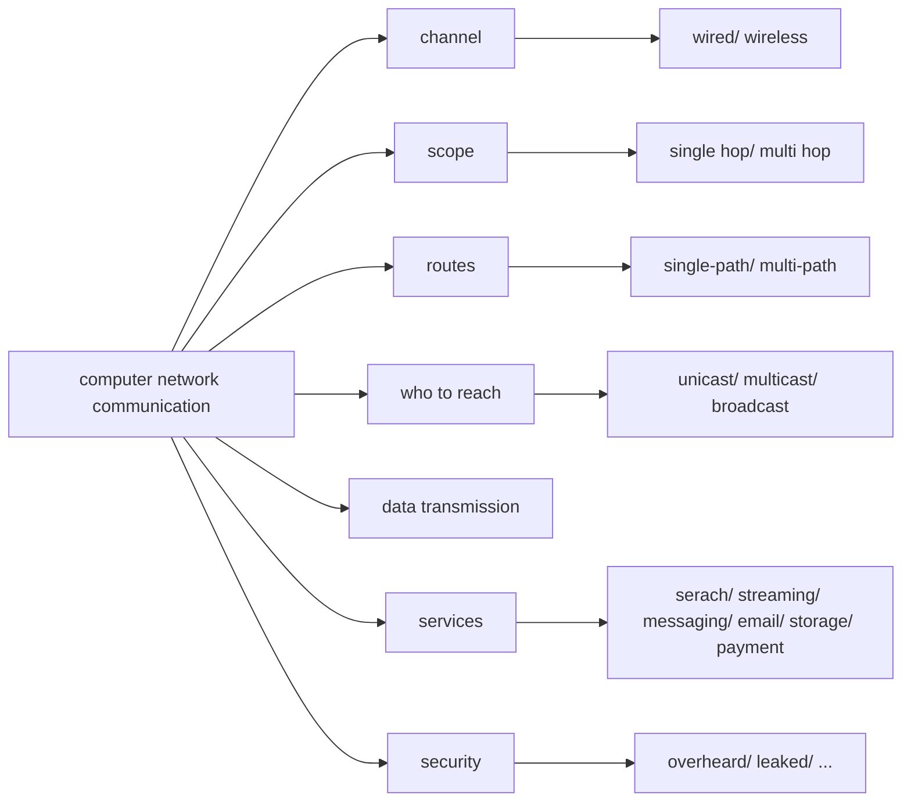

### What is Computer Networks?

- many devices  $\rightarrow$ distributed systems
- talk to each other  $\rightarrow$ commmunication
> computer networks focus on the communication of the distributed systems

#### Overview

#### Overview from another side

#### Recommend textbook

### Protocol Layering
#### Protocol Definition
- *Protocol*: an **aggreement** between the **comunicating parties** on how communication is to proceed
- *Layer n protocol*: **rules** and **conventions** used in a conversation between layer n’s on **two machines**
#### 5-Layer Network model (some concepts and terminology)

- *peers*: the **entities** comprising the corresponding **layers** on machine (software, hardware or even human beings)
- *virtual communication*: no data are **directly transferred** from layer n on one machine to layer n on another machine, each layer passes data and control information to the layer immediately below it
- *actual communication*: occurs through the **Physical medium** below layer 1
- *interface*: defines which **primitive operations and services** the lower level makes **available** to the upper level
- *protocol stack*: a list of protocols used by a certain system (**one protocol per layer**)

#### 5-Layer Hybrid Model (used in refernece books)
The table below will show the layer's name and its duty 

| No. |    Layer    | Duty of the layer                                                                                                                                   |
| :-: | :---------: | :-------------------------------------------------------------------------------------------------------------------------------------------------- |
|  1  |  Physical   | Transmit bits with **electrical or other analog signal**                                                                                            |
|  2  |    Link     | send **fixed length** message between **directly** connected computers                                                                              |
|  3  |   Network   | combine links into networks and networks of networks into internetworks facilitating **sending packets** between **indirectly** connceted computers |
|  4  |  Transport  | strengthen the delivery **guarantees** of network layer (reliability and delivery abstraction etc.)                                                 |
|  5  | Application | programs that make use of networks                                                                                                                  |

### Cyber Security
3 Principle to protect your device from cyber attck
- *Confidentiality*: denfends against eavesdropping on communications
- *Authentication*: prevent from imperonating someone else
- *Integrity*: prevent from surrepitious changes to messages

### 6 Labs of the course
- from TA's PPT

---
HAPPY LEARNING, COMPUTER NETWORKS！