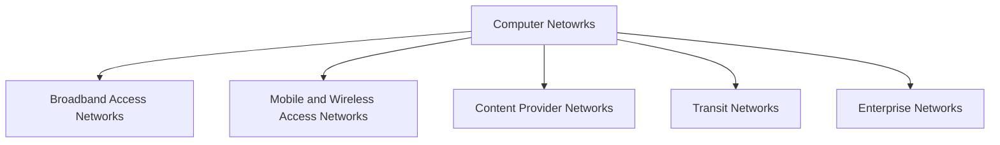

> [!NOTE]
> 本系列是完全自学
### Uses of Computer Neteorks

When Computer Tech is at a young age, the idea of a powerful big machine gathering, computing tasks was  deeply roored in everyone's mind.But days wounld change, nobody would expect many years later we are able to vastly produce those powerful machines in the stamp-size materials.

The old model of **a single computer serving all** of the organization’s computational needs has been replaced by one in which **a large number of separate but interconnected computers** do the job. 

These systems are called **computer networks**.

Then, there is the Network's Age. Many small networks are connected into a bigger one, so-called **Internet**.

#### Access to Information

Much Information is accessed using **Client-Server Model**. It's widely used and form the basis of much network usage.

Then, we dive into the model to see details. **Communication** happens on both sides, so we see two **processes** to our first approximation.

Another model is **peer-to-peer** communication. A great example is **BitTorrent**.

We do not have **a centralized database** in this model, instead, each user maintain **a local database of pieces of the content**.

 
#### Person-to-person Communication

> Person-to-person communication is the 21st century’s answer to the 19th century’s telephone.

This kind of communication is devided into **Instant messaging** and **Twitter** services. Former focus on **one-to-one**, while the latter provides **multi-person** capabilities.

Between person-to-person communications and accessing information are **social network applications**. For example, Facebook.

More loosely, communication can take the form of co-created content,like **WIKI**.

#### Other Usage

- E-commerce

- Entertainment

**IPTV**, **Eletronic Games**

- IoT

> **Ubiquitous computing** entails computing that is embedded in everyday life, as in the vision of Mark Weiser (1991).

**IoT, Internet of Things**

### Types of Computer Networks

```mermaid
graph TD
A[Computer Netowrks] --> B[Broadband Access Networks]
A --> C[Mobile and Wireless Access Networks]
A --> D[Content Provider Networks]
A --> E[Transit Networks]
A --> F[Enterprise Networks]
```

#### Broadband Access Network

