> [!NOTE]
> 本系列是完全自学
### Uses of Computer Neteorks

When Computer Tech is at a young age, the idea of a powerful big machine gathering, computing tasks was  deeply roored in everyone's mind.But days wounld change, nobody would expect many years later we are able to vastly produce those powerful machines in the stamp-size materials.

The old model of **a single computer serving all** of the organization’s computational needs has been replaced by one in which **a large number of separate but interconnected computers** do the job. 

These systems are called **computer networks**.

Then, there is the Network's Age. Many small networks are connected into a bigger one, so-called **Internet**.

#### Access to Information

Much Information is accessed using **Client-Server Model**. It's widely used and form the basis of much network usage.


Then, we dive into the model to see details. **Communication** happens on both sides, so we see two **processes** to our first approximation.


Another model is **peer-to-peer** communication. A great example is **BitTorrent**.

We do not have **a centralized database** in this model, instead, each user maintain **a local database of pieces of the content**.


 
#### Person-to-person Communication

> Person-to-person communication is the 21st century’s answer to the 19th century’s telephone.

This kind of communication is devided into **Instant messaging** and **Twitter** services. Former focus on **one-to-one**, while the latter provides **multi-person** capabilities.

Between person-to-person communications and accessing information are **social network applications**. For example, Facebook.

More loosely, communication can take the form of co-created content,like **WIKI**.

#### Other Usage

- E-commerce


- Entertainment

**IPTV**, **Eletronic Games**

- IoT

> **Ubiquitous computing** entails computing that is embedded in everyday life, as in the vision of Mark Weiser (1991).

**IoT, Internet of Things**

### Types of Computer Networks

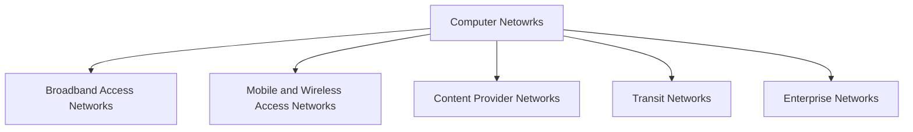

#### Broadband Access Network
>[!NOTE]
>**Metcalfe's Law** : the value of a network is proportional to the **square** of the number of users

Today, Broadband access Network is **proliferating**.

The mian media of Broadband Access  Network is as followed.

| Texture       | Example        |
| ------------- | -------------- |
| copper        | telephone line |
| coaxial cable | cable          |
| optical fiber | optical fiber  |

#### Mobile and Wireless Access Networks
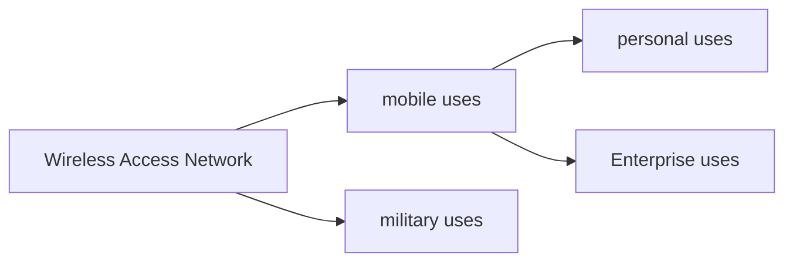
- For personal uses
	- **Cellular networks**, a wireless network operated by telephone companies
	- **Wireless hotspots**, **802.11 Standard** 
- For Enterprises uses
	- run process of DiDi 
	- boost "sharing economy", like Uber 
- For military uses
	- troops-owned network

> [!IMPORTANT]
> Wireless networking and mobile computing are often **related**, but **not identical**.

| Wireless | Mobile | Typical applications                     |
| -------- | ------ | ---------------------------------------- |
| No       | No     | Desktop computers in offices             |
| No       | Yes    | A laptop coputer used in a hotel room    |
| Yes      | No     | Networks in unwired buildings            |
| Yes      | Yes    | Store inventory with a handheld computer |

#### Content Delivery Network
- In tha past days, networks are designed in a tree topology facing a chanllenge of "**cross-section bandwidth**"
- To deal with this, many sites and services on the Internet use a CDN which is a large collection of servers that are **geographically distributed** in such a way that content is placed **as close as possible** to the users that are requesting it.

#### Transit Network
- When the content provider and your ISP (Internet Service Provider) are **not directly connected**, they often **rely on a transit network** to carry the traffic between them.
- Transit Network, now traditionally called **backbone networks**, becasue they have had the role of carrying traffic between two endpoints, and the trend is ISP and content provider are relying less on them.

#### Enterprise Network
- **Virtual Private Network**(VPN):  connect the individual networks **at different sites** into one **logical** network.
- Email
- IP telephony/ VoIP
- Desktop Sharing


### Network Technology
#### Personal Area Network (PAN)

>[!Definition]
> PAN(Perosonal Area Network) lets devices communicate over the **range of a person**

- Examples:
	- network that connects your wireless headphones and your watch to your smartphone.
	- a wireless network connects computer to the printer


> [!Tech]
> Bluetooth is a short-range wireless network used to connect devices with easy operation

#### Local Area Network
> [!Definition]
> LAN (Local Area Network) is a private network that operates within and nearby a single **location**.
> we have both wireless LAN and wired LAN.
> 


- **What form does wireless LAN take?**
	- computer talks to a device called an **AP** (Access Point), **wireless router**, or **base station**
	- devices relaying packets for one another in a so-called **mesh network** configuration

> [!Tech]
> A popuar standrad for wireless LAN is **IEEE 802.11**, commonly called **WiFi**.

- **What's the kind of wired LAN?**
	- use physical transmission medium, like copper, coaxial cable, optical fiber.
	- running at speeds ranging from 100 Mbps to 40 Gbps.
	- physically implemented with **switch** which has multiple ports

> [!Tech]
> wired LAN mostly uses **IEEE 802.3**, usually called Ethernet

- To build larger LANs, switches can be **plugged into each other**(no ) using their ports.It is also possible to **divide** one large physical LAN into two smaller logical LANs.
- For some management use,  a large physical LAN is devided into 2 smaller logical LANs, using a technology called **VLAN(Virtual LAN)**.

> [!Tech]
> Both wireless and wired broadcast LANs can allocate resources **statically** or **dynamically**.

- Static allocation is implemented with **time slot division** and **round-robin algorithm**.
	- leads to a waste of channel capacity, so we prefer DYNAMIC stategy.
- Dynamic allocation methods for a common channel are either **centralized** or **decentralized**.

#### Home Networks

home network is a type of LAN

- main charcteristics:
	- must be **easy to use** for non-techical users and capabale to hold **a diverse branch of devices**
	- high stakes for security and reliability
	- **organic evolution + interoperabiity**
	- low cost
	
**Powerline Network** --> provide power and network signal within the only  power line


####  Metropolitan Area Networks

> [!Tech]
> MAN usually cocers a city. The best example is cable television network.

- cable televison network is first a locally designed,ad hoc system.
- Then, the time internet came, they realize they can use unused spectrum to internet services.
- So,the cable TV system began to morph from simply a way to distribute television to a metropolitan area network.


But,Cable television is not the only MAN. We have wide range of techs including **WiMAX**, **LTE** and **5G**.

#### Wide Area Networks

> [!Tech]
> A WAN (Wide Area Network) spans a **large geographical area**, often a country, a continent, or even multiple continents.

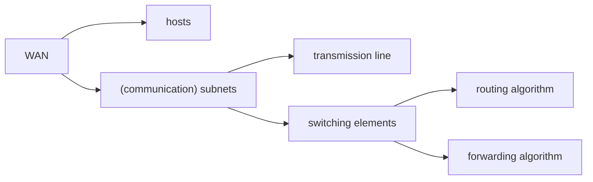

- Difference between WAN and LAN?
	- Usually in a WAN, the hosts and subnet are owned and operated by different people.
	- A second difference is that the routers will usually connect different kinds of networking technology.
	- A final difference is in what is connected to the subnet.

#### Internetworks

> [!Definition]
> An **internetwork** (or **internet**) is a collection of **interconnected networks**.

Here we must be careful with a confusing convention.

- **internet** (lowercase): the generic concept, any interconnection of networks
- **Internet** (capitalized): one specific internet, the global one

- Why do we need it?
	- Many networks exist, and they often use **different hardware and software technologies**.
	- People connected to one network often want to communicate with people attached to **a different one**.
	- So the fulfillment of this desire requires that different, and frequently **incompatible**, networks be **connected**.

- When do we call it an internetwork?
	- A network = a subnet + its hosts.
	- If two or more **independently operated** networks **pay to interconnect**, or
	- if two or more networks use **fundamentally different underlying technology** (e.g., broadcast versus point-to-point, wired versus wireless),
	- then we probably have an internetwork.

> [!WARNING]
> The word "network" is often used in a **loose and confusing** sense. A subnet might be called a network (the "ISP network"), and an internetwork might also be called a network (the WAN). We stick with the original definition: **a collection of computers interconnected by a single technology**.

**Gateway** is the device that makes a connection between two or more networks and provides the necessary translation, both in terms of **hardware and software**.

Gateways are distinguished by **the layer at which they operate**.

- too **low-level** a gateway -> unable to connect different kinds of networks
- too **high-level** a gateway -> the connection only works for particular applications
- the level in the middle that is "just right" -> the **network layer**

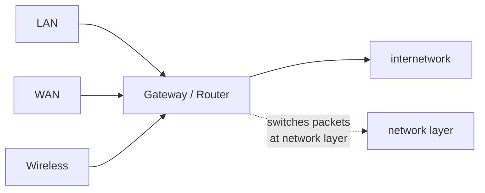

> [!Tech]
> A **router** is a gateway that switches packets at the **network layer**. Generally speaking, an internetwork will be connected by network-layer gateways, i.e. routers, though even a single large network often contains many routers.

### Examples of Networks

The subject of computer networking covers many different kinds of networks, large and small, with different **goals, scales, and technologies**.

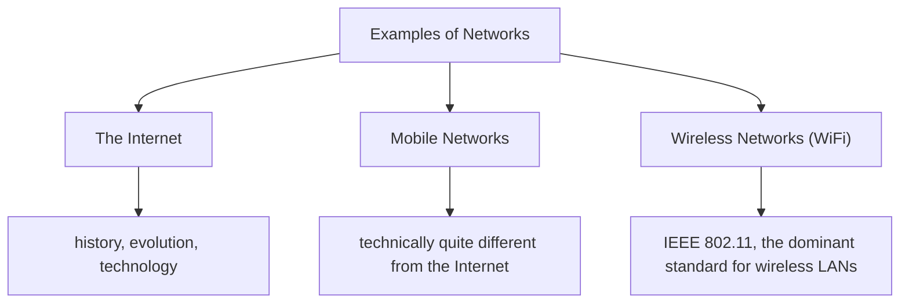

#### The Internet

> [!Definition]
> The Internet is a **vast collection of different networks** that use certain **common protocols** and provide certain **common services**.

It is an unusual system in that it was **not planned by any single organization**, and it is **not controlled by any single organization**, either.

##### The ARPANET

The story begins in the **late 1950s**, at the height of the Cold War.

- The U.S. **DoD** wanted a **command-and-control network** that could survive a nuclear war.
- At that time, all military communications used the **public telephone network**, which was considered **vulnerable**.

Why vulnerable? Look at the structure of the telephone system.

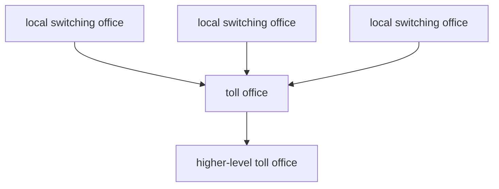

- The telephone system was a **national hierarchy with only a small amount of redundancy**.
- So the destruction of a few key **toll offices** could fragment it into many isolated islands.

Around **1960**, the DoD awarded a contract to the **RAND Corporation** to find a solution.

- **Paul Baran** came up with a highly **distributed and fault-tolerant** design.
- Since the paths between two switching offices were now much longer than analog signals could travel without distortion, Baran proposed using **digital packet-switching** technology.
- Officials at the Pentagon liked the concept and asked **AT&T** to build a prototype.
- **AT&T dismissed Baran's ideas out of hand** and said the network could not be built. The idea was killed.

Then the story takes a detour.

- In **October 1957**, the Soviet Union beat the U.S. into space with **Sputnik**.
- President Eisenhower found the Army, Navy, and Air Force squabbling over the Pentagon's research budget.
- His response was to create a single defense research organization, **ARPA** (Advanced Research Projects Agency).
- ARPA had no scientists or laboratories, just an office and a small budget. It did its work by **issuing grants and contracts** to universities and companies.

In **1967**, **Larry Roberts**, a program manager at ARPA, turned his attention to networking.

- **Wesley Clark** suggested building a **packet-switched subnet**, connecting **each host to its own router**.
- Roberts presented a somewhat vague paper about it at the ACM SIGOPS Symposium in Gatlinburg.
- Much to his surprise, **Donald Davies** at the National Physical Laboratory in England described a similar system that had **already been fully implemented**.
- The NPL system was not a national system by any means, it just connected several computers on campus. Nevertheless it convinced Roberts that **packet switching could be made to work**.

The plan for the **ARPANET**:

- The subnet would consist of minicomputers called **IMPs** (Interface Message Processors).
- They were connected by then-state-of-the-art **56-kbps** transmission lines.
- For high reliability, each IMP would be connected to **at least two other IMPs**.
- Each packet contained the **full destination address**, so if some lines and IMPs were destroyed, subsequent packets could be **automatically rerouted**.

Each node consisted of an **IMP and a host** in the same room, connected by a short wire.

- A host could send messages of up to **8063 bits** to its IMP.
- The IMP broke these up into packets of at most **1008 bits** and forwarded them independently.
- Each packet was received **in its entirety before being forwarded**.
- So the subnet was the first electronic **store-and-forward packet-switching** network.

ARPA put out a tender, twelve companies bid, and **BBN** won the contract in **December 1968**.

- BBN used specially modified **Honeywell DDP-316** minicomputers with **12K 16-bit words** of magnetic core memory as the IMPs.
- The IMPs had **no disks**, since moving parts were considered unreliable.
- The IMPs were interconnected by **56-kbps** lines leased from telephone companies.
- Although 56 kbps is now often the only choice of people in rural areas, back then it was the **best money could buy**.

The software was split into two parts: **subnet** and **host**.

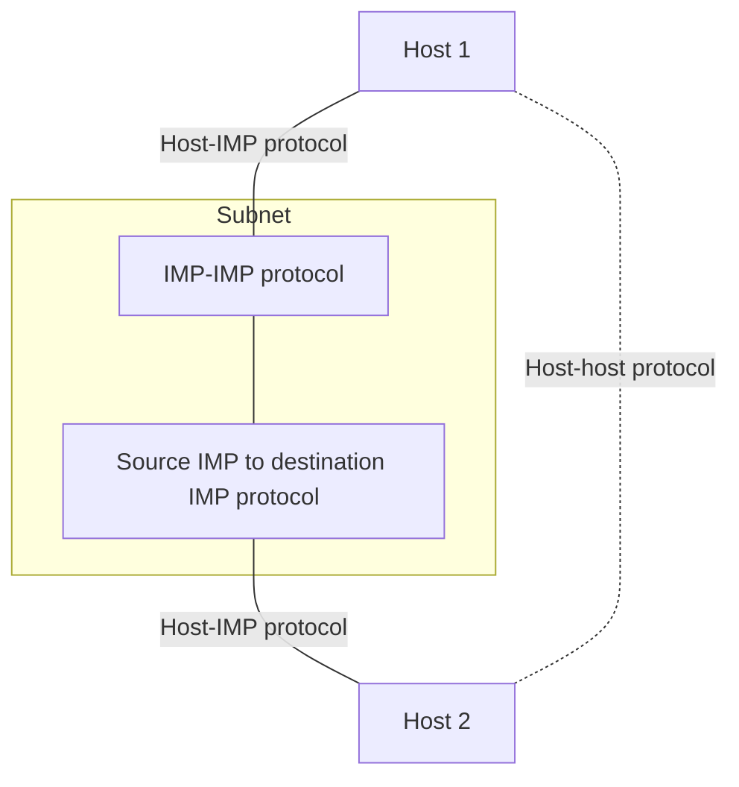

- **Subnet software**: the IMP end of the host-IMP connection, the IMP-IMP protocol, and a source IMP to destination IMP protocol designed to improve reliability.
- **Host software**: the host end of the host-IMP connection, the host-host protocol, and the application software.

> [!NOTE]
> It soon became clear that BBN was of the opinion that when it had accepted a message on a host-IMP wire and placed it on the host-IMP wire at the destination, **its job was done**.

Roberts had a problem: the hosts needed software too.

- He convened a meeting of network researchers, mostly **graduate students**, at **Snowbird, Utah**, in the summer of **1969**.
- The graduate students expected some network expert to explain the grand design and then assign each of them a part to write.
- They were astounded when there was **no network expert and no grand design**. They had to figure out what to do on their own.

Nevertheless, an experimental network went online in **December 1969** with four nodes.

- **UCLA**, **UCSB**, **SRI**, and the **University of Utah**.
- These four were chosen because all had a large number of ARPA contracts, and all had **different and completely incompatible host computers**.
- The first host-to-host message had been sent two months earlier from the UCLA node by a team led by **Len Kleinrock** to the SRI node.

The ARPANET then grew quickly, spanning the United States within a few years.

- ARPA also funded research on **satellite networks** and **mobile packet radio networks**.
- In one now-famous demonstration, a big truck driving around in California used the packet radio network to send messages to SRI, forwarded over the ARPANET to the East Coast, then shipped to **University College in London** over the satellite network.
- This allowed a researcher in the truck to use a computer in London **while driving around in California**.
- This experiment also demonstrated that the existing ARPANET protocols were **not suitable for running over different networks**.

That observation led to more research on protocols, culminating with the invention of **TCP/IP** (Cerf and Kahn, 1974).

> [!IMPORTANT]
> TCP/IP was specifically designed to handle communication over **internetworks**, something becoming increasingly important as more and more networks were hooked up to the ARPANET.

To encourage adoption, ARPA awarded several contracts to implement TCP/IP on different platforms, including IBM, DEC, and HP systems, as well as for Berkeley UNIX.

- Researchers at UC Berkeley rewrote TCP/IP with a new programming interface called **sockets** for the upcoming **4.2BSD** release of Berkeley UNIX.
- They also wrote many **application, utility, and management programs** to show how convenient it was to use the network with sockets.

>The timing was perfect.

- Many universities had just acquired a second or third VAX computer and a LAN to connect them, but they had **no networking software**.
- When 4.2BSD came along, with TCP/IP, sockets, and many network utilities, the **complete package was adopted immediately**.
- With TCP/IP, it was easy for the LANs to connect to the ARPANET, and many did, so TCP/IP use grew rapidly during the mid-1970s.

##### NSFNET

By the late 1970s, **NSF** (the U.S. National Science Foundation) saw the enormous impact the ARPANET was having on university research.

- But to get on the ARPANET a university had to have a **research contract with the DoD**, and many did not.
- NSF's initial response was to fund **CSNET** (Computer Science Network) in **1981**, connecting computer science departments and industrial research labs to the ARPANET via **dial-up and leased lines**.
- In the late 1980s, NSF went further and decided to design a **successor to the ARPANET** open to all university research groups.

NSF decided to build a backbone network to connect its **six supercomputer centers** in San Diego, Boulder, Champaign, Pittsburgh, Ithaca, and Princeton.

- Each supercomputer was given a little brother, an LSI-11 microcomputer called a **fuzzball**.
- The fuzzballs were connected with **56-kbps** leased lines and formed the subnet, the same hardware technology the ARPANET used.
- But the software technology was different: the fuzzballs **spoke TCP/IP right from the start**, making it the **first TCP/IP WAN**.

NSF also funded about 20 **regional networks** that connected to the backbone.

- This allowed users at thousands of universities, research labs, libraries, and museums to access any of the supercomputers and to communicate with one another.
- The complete network, including backbone and regional networks, was called **NSFNET**.
- It connected to the ARPANET through a link between an IMP and a fuzzball in the Carnegie-Mellon machine room.

NSFNET was an **instantaneous success** and was overloaded from the word go.

| Version | Links | Routers |
| ------- | ----- | ------- |
| v1 | 56 kbps leased lines | fuzzballs |
| v2 | 448 kbps fiber optic from MCI | IBM PC-RTs, run by MERIT |
| v2 upgraded (1990) | 1.5 Mbps | - |
| ANSNET (1990) | 45 Mbps | run by ANS |

- As growth continued, NSF realized that the **government could not continue financing networking forever**.
- Furthermore, commercial organizations wanted to join but were **forbidden by NSF's charter** from using networks NSF paid for.
- So NSF encouraged MERIT, MCI, and IBM to form a nonprofit corporation, **ANS** (Advanced Networks and Services), as the first step along the road to commercialization.
- In 1990, ANS took over NSFNET and upgraded the 1.5-Mbps links to **45 Mbps** to form **ANSNET**. This network operated for 5 years and was then sold to America Online.

To ease the transition, NSF awarded contracts to four different network operators to establish a **NAP** (Network Access Point).

- **PacBell** (San Francisco), **Ameritech** (Chicago), **MFS** (Washington, D.C.), and **Sprint** (New York City, where for NAP purposes, Pennsauken, New Jersey counts as New York City).
- Every network operator that wanted to provide backbone service to the NSF regional networks had to **connect to all the NAPs**.

> [!IMPORTANT]
> This arrangement meant that a packet originating on any regional network had a **choice of backbone carriers** to get from its NAP to the destination's NAP. Consequently, the backbone carriers were forced to **compete on the basis of service and price**, which was the idea, of course. As a result, the concept of a **single default backbone** was replaced by a **commercially driven competitive infrastructure**.

- Many people like to criticize the federal government for not being innovative, but in the area of networking, it was **DoD and NSF that created the infrastructure** that formed the basis for the Internet, and then **handed it over to industry to operate**.
- This happened because when DoD asked AT&T to build the ARPANET, it saw **no value** in computer networks and refused to do it.

During the 1990s, many other countries and regions also built national research networks, often patterned on the ARPANET and NSFNET.

- These included **EuropaNET** and **EBONE** in Europe, which started out with 2-Mbps lines and then upgraded to 34-Mbps lines.
- Eventually, the network infrastructure in Europe was handed over to industry as well.

The Internet has changed a great deal since those early days.

- It **exploded in size** with the emergence of the **World Wide Web** in the early 1990s.
- Recent data from the Internet Systems Consortium puts the number of visible Internet hosts at **over 600 million**.
- The way we use the Internet has also changed radically:

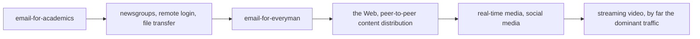

> [!NOTE]
> These developments brought **richer kinds of media** to the Internet and hence **much more traffic**, which have also had implications for the **Internet architecture itself**.

##### The Internet Architecture

The architecture of the Internet has also changed a great deal as it has grown explosively.

- The picture is complicated by continuous upheavals in the businesses of telephone companies (**telcos**), cable companies, and ISPs that often make it hard to tell **who is doing what**.
- One driver of these upheavals is **convergence** in the telecommunications industry, in which **one network is used for previously different uses**.
- For example, in a **"triple play,"** one company sells you telephony, TV, and Internet service over the same network connection for a lower price than the three services would cost individually.

Fig. 1-16 shows a high-level overview. Let us examine it piece by piece, starting with a computer at home (at the edges).

To join the Internet, the computer is connected to an **ISP** from whom the user purchases Internet access.

- There are many kinds of Internet access, usually distinguished by **how much bandwidth** they provide and **how much they cost**.
- But the most important attribute is **connectivity**.

**Last-mile technologies:**

| Technology | Description |
| ---------- | ----------- |
| cable (HFC) | signals over the cable television infrastructure |
| DOCSIS | the packet-based transport used over HFC to transmit television channels, high-speed data, and voice |
| FTTH | Fiber To The Home, running optical fiber to residences |
| leased line | a dedicated high-speed transmission line from offices to the nearest ISP, e.g. a T3 line at roughly 45 Mbps |
| wireless/mobile | in developing regions with neither cable nor fiber, regions **jump straight to** higher-speed wireless or mobile networks |

> [!Tech]
> - **modem** is short for "**mo**dulator **dem**odulator" and refers to any device that converts between **digital bits and analog signals**.
> - The device at the home end is called a **cable modem**, and the device at the cable headend is called the **CMTS** (Cable Modem Termination System).

> [!NOTE]
> Access networks are limited by the bandwidth of the **"last mile"** or last leg of transmission. Over the last decade, the DOCSIS standard has advanced to enable significantly higher throughput to home networks. The most recent standard, **DOCSIS 3.1 full duplex**, introduces support for **symmetric** upstream and downstream data rates, with a maximum capacity of **10 Gbps**.

**Inside the ISP:**

- The location at which customer packets enter the ISP network for service is the ISP's **POP** (Point of Presence).
- From this point on, the system is **fully digital and packet switched**.
- The long-distance transmission lines that interconnect routers at POPs in the different cities that the ISPs serve is called the **backbone** of the ISP.
- If a packet is destined for a host served directly by the ISP, that packet is routed over the backbone and delivered to the host. Otherwise, it must be handed over to another ISP.

ISPs connect their networks to exchange traffic at **IXPs** (Internet eXchange Points).

- The connected ISPs are said to **peer** with each other.
- Basically, an IXP is a **building full of routers**, at least one per ISP, connected by a very fast **optical LAN** in the room.
- IXPs can be large and independently owned facilities that compete with each other for business.
- One of the largest is the **Amsterdam Internet Exchange (AMS-IX)**, to which over **800 ISPs** connect and through which they exchange over **4000 gigabits (4 terabits)** worth of traffic every second.

Peering at IXPs depends on the **business relationships** between ISPs.

- A small ISP might **pay a larger ISP for Internet connectivity** to reach distant hosts. In this case, the small ISP is said to **pay for transit**.
- Alternatively, two large ISPs might decide to exchange traffic so that each ISP can deliver some traffic to the other **without having to pay for transit**.

> [!IMPORTANT]
> One of the many paradoxes of the Internet is that ISPs who **publicly compete** with one another for customers often **privately cooperate** to do peering (Metz, 2001).

The path a packet takes through the Internet depends on the **peering choices** of the ISPs.

- If the ISP that is delivering a packet peers with the destination ISP, it might deliver the packet **directly to its peer**.
- Otherwise, it might route the packet to the nearest place at which it connects to a **paid transit provider**.
- Often, the path a packet takes will **not be the shortest path** through the Internet. It could be the **least congested** or the **cheapest** for the ISPs.

**Tier-1 ISPs:**

- A small handful of transit providers, including **AT&T** and **Level 3**, operate large international backbone networks with thousands of routers connected by high-bandwidth fiber-optic links.
- These ISPs **do not pay for transit**. They are usually called **tier-1 ISPs** and are said to form the **backbone of the Internet**, since everyone else must connect to them to be able to reach the entire Internet.

**Data centers:**

- Companies that provide lots of content, such as Facebook and Netflix, locate their servers in **data centers** that are well-connected to the rest of the Internet.
- These data centers are designed for computers, not humans, and may be filled with **rack upon rack of machines**. Such an installation is called a **server farm**.
- **Colocation or hosting** data centers let customers put equipment such as servers at ISP POPs so that **short, fast connections** can be made between the servers and the ISP backbones.
- The Internet hosting industry has become increasingly **virtualized**, so that it is now common to **rent a virtual machine** that is run on a server farm instead of installing a physical computer.
- These data centers are so large (hundreds of thousands or millions of machines) that **electricity is a major cost**, so data centers are sometimes built in areas where electricity is cheap.
- For example, Google built a **$2 billion data center in The Dalles, Oregon**, because it is close to a huge hydroelectric dam on the mighty Columbia River that supplies it with cheap green electric power.

**The hierarchy, and its flattening:**

Conventionally, the Internet architecture has been viewed as a **hierarchy**, with the tier-1 providers at the top and other networks further down, depending on whether they are large regional networks or smaller access networks.

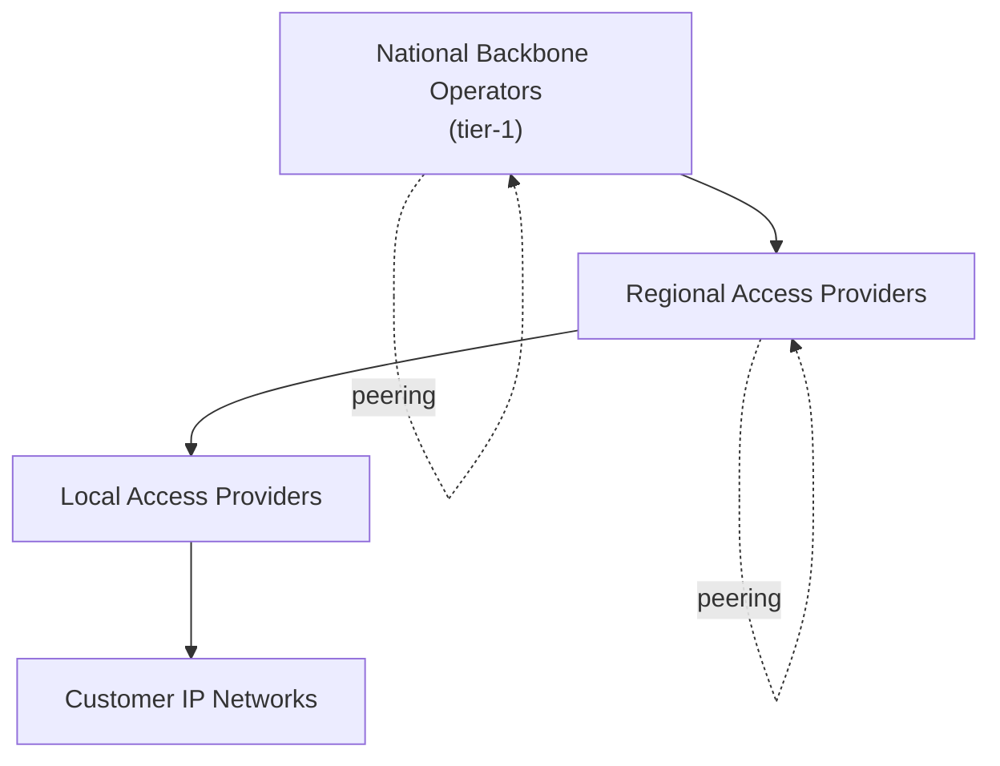

Over the past decade, however, this hierarchy has evolved and **"flattened" dramatically**.

- The impetus for this shakeup has been the rise of **"hyper-giant" content providers**, including Google, Netflix, Twitch, and Amazon.
- As well as large, globally distributed **CDNs** such as Akamai, Limelight, and Cloudflare.
- Whereas in the past, these content providers would have had to **rely on transit networks** to deliver content to local access ISPs, both the access ISPs and the content providers have proliferated and become so large that they often **connect directly to one another** in many distinct locations.
- In many cases, the common Internet path will be **directly from your access ISP to the content provider**.
- In some cases, the content provider will even **host servers inside the access ISP's network**.

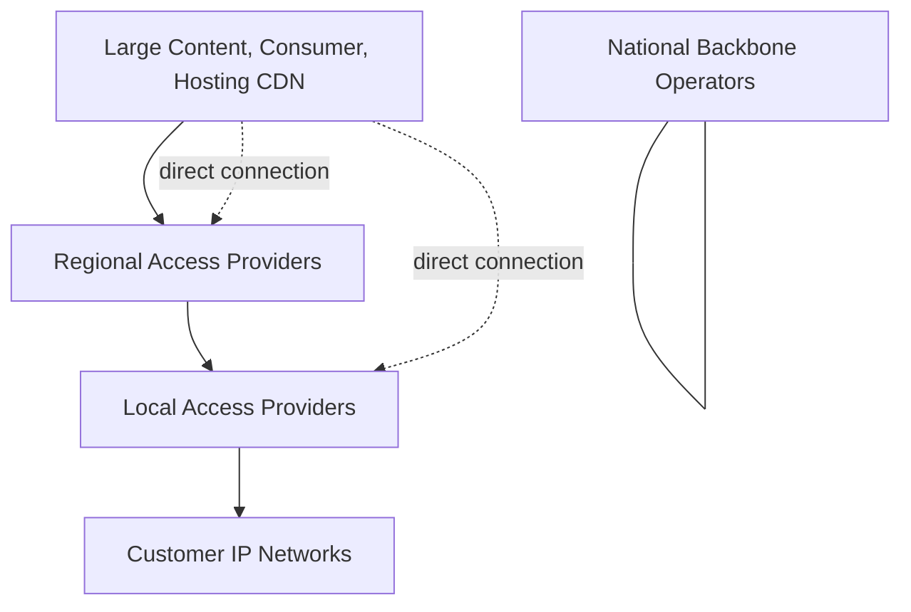

#### Mobile Networks

> [!NOTE]
> Mobile networks have more than **five billion subscribers** worldwide. To put this number in perspective, it is roughly **65% of the world's population**. In **2018**, mobile Internet traffic became **more than half of global online traffic**.

##### Mobile Network Architecture

The architecture of the mobile phone network is **very different** than that of the Internet.

Consider the simplified version of the **4G LTE** architecture, one of the more common mobile network standards, which will continue to be until it is replaced by **5G**.

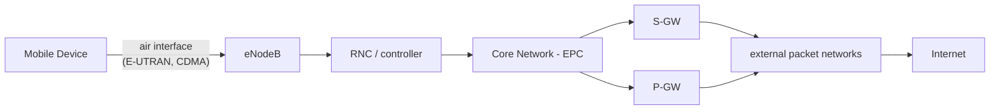

- First, there is the **E-UTRAN** (Evolved UMTS Terrestrial Radio Access Network), which is a fancy name for the **radio communication protocol** used over the air between the mobile device and the cellular base station, now called an **eNodeB**.
- **UMTS** (Universal Mobile Telecommunications System) is the formal name for the cellular phone network.
- The air interface is based on **CDMA** (Code Division Multiple Access), a technique we will study in Chap. 2.

The cellular base station together with its controller forms the **radio access network**. This part is the **wireless side** of the mobile phone network.

- The controller node or **RNC** (Radio Network Controller) controls how the **spectrum** is used.
- The base station implements the **air interface**.

The rest of the mobile phone network carries the traffic for the radio access network. It is called the **core network**.

- In 4G networks, the core network became **packet-switched**, and is now called the **EPC** (Evolved Packet Core).
- The 3G UMTS core network evolved from the core network used for the 2G GSM system; the 4G EPC **completed the transition** to a fully packet-switched core network.
- The 5G system is also fully digital, too.

> [!NOTE]
> There is no going back now. **Analog is as dead as the dodo.**

Data services have become a much more important part of the mobile phone network than they used to be.

- Starting with text messaging and early packet data services such as **GPRS** (General Packet Radio Service) in the GSM system.
- These older data services ran at tens of kbps, but users wanted even higher speeds. Newer mobile phone networks support rates of multiple Mbps.
- For comparison, a **voice call** is carried at a nominal rate of **64 kbps**, typically 3-4x less with compression.

To carry all of this data, the UMTS core network nodes connect directly to a packet-switched network.

> [!Tech]
> The **S-GW** (Serving Network Gateway) and the **P-GW** (Packet Data Network Gateway) deliver data packets to and from mobiles and interface to external packet networks such as the Internet.

- Internet protocols are even used on mobiles to set up connections for voice calls over a packet data network, in the manner of **voice over IP**.
- **IP and packets are used all the way from the radio access through to the core network.**
- Of course, the way that IP networks are designed is also changing to support better **quality of service**. If it did not, then problems with **chopped-up audio and jerky video** would not impress paying customers.

##### Mobility

Another difference between mobile phone networks and the conventional Internet is **mobility**.

- When a user moves out of the range of one cellular base station and into the range of another one, the flow of data must be **re-routed** from the old to the new cell base station.
- This technique is known as **handover** or **handoff**.

Either the mobile device or the base station may request a handover when the **quality of the signal drops**.

| Type | Behavior |
| ---- | -------- |
| **soft handover** | connect to the new base station **before** disconnecting from the old one; there is **no break in service**, the mobile is actually connected to two base stations for a short while |
| **hard handover** | the mobile **disconnects** from the old base station before connecting to the new one |

> [!NOTE]
> Soft handover is usually found in cell networks based on **CDMA** technology. This improves the connection quality for the mobile because there is no break in service.

A related issue is **how to find a mobile in the first place** when there is an incoming call.

> [!Tech]
> Each mobile phone network has a **HSS** (Home Subscriber Server) in the core network that knows the **location of each subscriber**, as well as other profile information that is used for **authentication and authorization**. In this way, each mobile can be found by contacting the HSS.

##### Security in Mobile Networks

Historically, phone companies have taken security much more seriously than Internet companies because they needed to **bill for service** and avoid **(payment) fraud**. Unfortunately, that is not saying much.

Starting with the **2G GSM** system, the mobile phone was divided into a **handset** and a **removable chip** containing the subscriber's identity and account information.

> [!Definition]
> The chip is informally called a **SIM card**, short for **Subscriber Identity Module**.

- SIM cards can be **switched to different handsets** to activate them, and they provide a basis for security.
- When GSM customers travel to other countries, they often bring their handsets but **buy a new SIM card** for few dollars upon arrival in order to make **local calls with no roaming charges**.
- To reduce fraud, information on SIM cards is also used by the mobile phone network to **authenticate subscribers** and check that they are allowed to use the network.
- With **UMTS**, the mobile also uses the information on the SIM card to check that it is talking to a **legitimate network**.

**Privacy** is another important consideration.

- Wireless signals are **broadcast to all nearby receivers**, so to make it difficult to eavesdrop on conversations, **cryptographic keys on the SIM card** are used to encrypt transmissions.
- This approach provides much better privacy than in 1G systems, which were easily tapped, but is **not a panacea** due to weaknesses in the encryption schemes.

##### Packet Switching and Circuit Switching

> Since the beginning of networking, a war has been going on between the people who support **packet-switched networks** (which are **connectionless**) and the people who support **circuit-switched networks** (which are **connection-oriented**).

| Aspect          | Packet Switching                                                                                                                                                   | Circuit Switching                                                                                                                          |
| --------------- | ------------------------------------------------------------------------------------------------------------------------------------------------------------------ | ------------------------------------------------------------------------------------------------------------------------------------------ |
| Camp            | the Internet community                                                                                                                                             | the world of telephone companies                                                                                                           |
| Routing         | every packet is routed **independently** of every other packet                                                                                                     | a **connection setup** establishes a route that is maintained until the call is terminated; all words or packets follow the **same route** |
| Fault tolerance | **higher**: if some routers go down, no harm is done as long as the system can **dynamically reconfigure** itself so that subsequent packets find some other route | **lower**: if a line or switch on the path goes down, the **call is aborted**                                                              |
| Overload        | if too many packets arrive at a router, the router will **choke and probably lose packets**; the sender resends, but the quality of service may be poor            | insufficient resources -> the call is **rejected** and the caller gets a kind of **busy signal**                                           |
| QoS             | hard, unless the applications account for this variability                                                                                                         | **easier**: the subnet can **reserve** link bandwidth, switch buffer space, and CPU time in advance                                        |

> [!IMPORTANT]
> There is **both packet- and circuit-switched equipment** in the 4G core network. This shows that the mobile phone network is in **transition**, with mobile phone companies able to implement one or sometimes both of the alternatives.

- Older mobile phone networks used a **circuit-switched core** in the style of the traditional phone network to carry voice calls.
- This legacy is seen in the UMTS network with the **MSC** (Mobile Switching Center), **GMSC** (Gateway Mobile Switching Center), and **MGW** (Media Gateway) elements that set up connections over a circuit-switched core network such as the **PSTN** (Public Switched Telephone Network).

##### Early Generation Mobile Networks: 1G, 2G, and 3G

| Generation | Key idea | Standard | Notes |
| ---------- | -------- | -------- | ----- |
| **1G** | voice calls as **continuously varying (analog) signals** rather than sequences of (digital) bits | **AMPS** (Advanced Mobile Phone System), deployed in the U.S. in **1982** | easily tapped |
| **2G** | switched to transmitting voice calls in **digital form** to increase **capacity**, improve **security**, and offer **text messaging** | **GSM** (Global System for Mobile communications), deployed starting in **1991**, widely used worldwide | SIM card introduced |
| **3G** | offers both **digital voice and broadband digital data** services | **UMTS**, initially deployed in **2001** | up to 14 Mbps downlink, almost 6 Mbps uplink |
| **4G** | **packet switching**, mobile broadband applications | **LTE** (Long Term Evolution), emerged in the late 2000s | outpaced 802.16/WiMAX |
| **5G** | faster speeds, **up to 10 Gbps** | set for large-scale deployment in the early 2020s | operates in much higher frequency bands, up to 6 GHz |

> [!NOTE]
> **3G** is loosely defined by the **ITU** as providing rates of at least **2 Mbps** for stationary or walking users and **384 kbps** in a moving vehicle.

The scarce resource in 3G systems, as in 2G and 1G systems before them, is **radio spectrum**.

- Governments **license** the right to use parts of the spectrum to the mobile phone network operators, often using a **spectrum auction** in which network operators submit bids.
- Having a piece of licensed spectrum makes it easier to design and operate systems, since no one else is allowed to transmit on that spectrum, but it often **costs a serious amount of money**.
- In the United Kingdom in 2000, for example, five 3G licenses were auctioned for a total of about **$40 billion**.

It is the **scarcity of spectrum** that led to the **cellular network design** now used for mobile phone networks.

- To manage the **radio interference** between users, the coverage area is divided into **cells**.
- Within a cell, users are assigned **channels that do not interfere** with each other and do not cause too much interference for adjacent cells.
- This allows for good reuse of the spectrum, or **frequency reuse**, in the neighboring cells, which **increases the capacity** of the network.
- In **1G** systems, which carried each voice call on a specific frequency band, the frequencies were carefully chosen so that they did not conflict with neighboring cells. In this way, a given frequency might only be **reused once in several cells**.
- Modern **3G** systems allow each cell to use **all frequencies**, but in a way that results in a **tolerable level of interference** to the neighboring cells.
- There are variations on the cellular design, including the use of **directional or sectored antennas** on cell towers to further reduce interference, but the basic idea is the same.

##### Modern Mobile Networks: 4G and 5G

Mobile phone networks are destined to play a big role in future networks.

- They are now more about **mobile broadband applications** (e.g., accessing the Web from a phone) than voice calls, and this has major implications for the **air interfaces, core network architecture, and security** of future networks.
- **4G LTE** networks very quickly became the **predominant mode** of mobile Internet access in the late 2000s, outpacing competitors like 802.16, sometimes called **WiMAX**.
- **5G** technologies are promising faster speeds (up to **10 Gbps**) and are now set for large-scale deployment in the early 2020s.

One of the main distinctions between these technologies is the **frequency spectrum** that they rely on.

| Generation | Frequency bands |
| --- | --- |
| 4G | up to **20 MHz** |
| 5G | designed to operate in much higher frequency bands, of up to **6 GHz** |

> [!WARNING]
> The challenge when moving to higher frequencies is that the higher frequency signals **do not travel as far** as lower frequencies, so the technology must account for **signal attenuation, interference, and errors** using newer algorithms and technologies, including **MIMO** (multiple input multiple output) antenna arrays. The short microwaves at these frequencies are also **absorbed easily by water**, requiring special efforts to have them work when it is raining.

#### Wireless Networks (WiFi)

> Almost as soon as laptops appeared, many people dreamed of walking into an office and magically having their laptop computer be connected to the Internet.

The most practical approach is to equip both the office and the laptop computers with **short-range radio transmitters and receivers** to allow them to talk.

- Work in this field rapidly led to wireless LANs being marketed by a variety of companies.
- The trouble was that **no two of them were compatible**. The proliferation of standards meant that a computer equipped with a brand X radio would not work in a room equipped with a brand Y base station.
- In the mid 1990s, the industry decided that a wireless LAN standard might be a good idea.
- A common slang name for it is **WiFi**, but we will call it by its more formal name, **802.11**.

##### Unlicensed Spectrum

The first problem was to find a suitable frequency band that was available, **preferably worldwide**.

> [!IMPORTANT]
> The approach taken was the **opposite** of that used in mobile phone networks. Instead of expensive, **licensed** spectrum, 802.11 systems operate in **unlicensed bands** such as the **ISM** (Industrial, Scientific, and Medical) bands defined by **ITU-R** (e.g., 902-928 MHz, 2.4-2.5 GHz, 5.725-5.825 GHz).

- All devices are allowed to use this spectrum **provided that they limit their transmit power** to let different devices coexist.
- Of course, this means that 802.11 radios may find themselves competing with **cordless phones, garage door openers, and microwave ovens**.

##### Two Modes

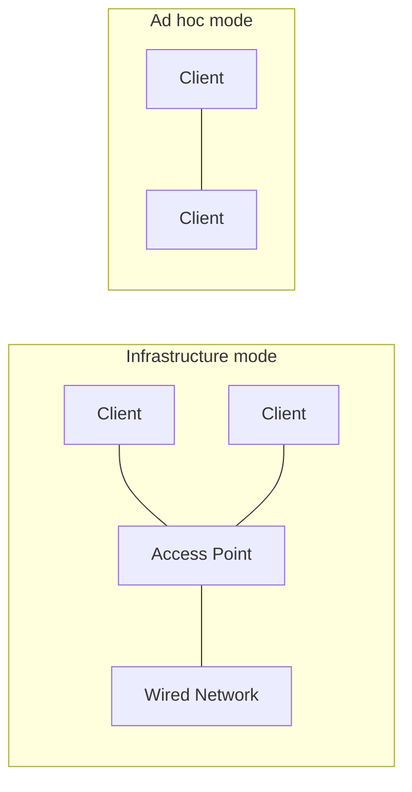

- **802.11 networks have clients**, such as laptops and mobile phones, as well as infrastructure called **APs** (access points) that is installed in buildings. Access points are sometimes called **base stations**.
- The access points connect to the **wired network**, and all communication between clients goes **through an access point**.
- It is also possible for clients that are in radio range to talk **directly**, such as two computers in an office without an access point. This arrangement is called an **ad hoc network**. It is used much less often than the access point mode.

##### Multipath Fading and Path Diversity

802.11 transmission is complicated by **wireless conditions that vary with even small changes in the environment**.

- At the frequencies used for 802.11, radio signals can be **reflected off solid objects** so that **multiple echoes** of a transmission may reach a receiver along different paths.
- The echoes can **cancel or reinforce** each other, causing the received signal to fluctuate greatly.

> [!Definition]
> This phenomenon is called **multipath fading**.

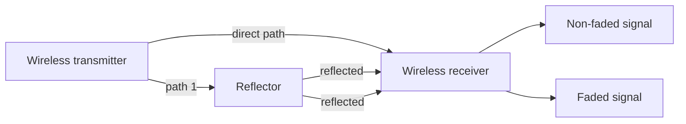

> [!IMPORTANT]
> The key idea for overcoming variable wireless conditions is **path diversity**, or the sending of information along **multiple, independent paths**. In this way, the information is likely to be received even if one of the paths happens to be poor due to a fade.

These independent paths are typically built into the **digital modulation scheme** used in the hardware. Options include:

- using **different frequencies** across the allowed band
- following **different spatial paths** between different pairs of antennas
- **repeating bits** over different periods of time

##### Evolution of 802.11

| Standard | Year | Rate | Technique |
| -------- | ---- | ---- | --------- |
| initial | 1997 | 1 or 2 Mbps | hopping between frequencies or spreading the signal across the allowed spectrum |
| **802.11b** | 1999 | up to 11 Mbps | extended spread spectrum design |
| **802.11a** / **802.11g** | 1999 / 2003 | up to 54 Mbps | **OFDM** (Orthogonal Frequency Division Multiplexing) |
| **802.11ac** | - | 3.5 Gbps | commonly deployed |
| **802.11ad** | - | 7 Gbps | only **indoors within a single room**, since the radio waves at the frequencies it uses do not penetrate walls very well |

> [!Tech]
> **OFDM** divides a wide band of spectrum into **many narrow slices** over which different bits are sent **in parallel**. This improved scheme boosted the 802.11a/g bit rates up to 54 Mbps.

##### CSMA and Collisions

Since wireless is inherently a **broadcast medium**, 802.11 radios also have to deal with the problem that **multiple transmissions that are sent at the same time will collide**.

> [!Tech]
> To handle this problem, 802.11 uses a **CSMA** (Carrier Sense Multiple Access) scheme that draws on ideas from classic wired Ethernet, which, ironically, drew from an early wireless network developed in Hawaii called **ALOHA**.
> - Computers wait for a **short random interval** before transmitting.
> - And **defer** their transmissions if they hear that someone else is already transmitting.
> - After any collision, the sender then waits another, **longer, random delay** and retransmits the packet.

Why does it not work as well as in the case of wired networks?

- Suppose that computer **A** is transmitting to computer **B**, but the radio range of A's transmitter is **too short to reach computer C**.
- If **C** wants to transmit to B, it can **listen before starting**, but the fact that it does not hear anything **does not mean** that its transmission will succeed.
- The **inability of C to hear A** before starting causes some collisions to occur.

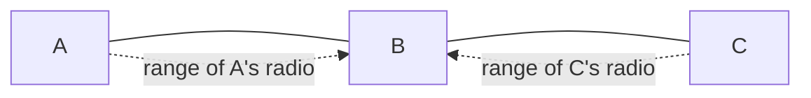

##### Mobility and Security

**Mobility** presents another challenge.

- If a mobile client is moved away from the access point it is using and into the range of a different access point, some way of **handing it off** is needed.
- The solution is that an 802.11 network can consist of **multiple cells**, each with its own access point, and a **distribution system** that connects the cells, often **switched Ethernet**, but it can use any technology.
- As the clients move, they may find another access point with a **better signal** than the one they are currently using and change their **association**.
- From the outside, the entire system looks like a **single wired LAN**.

> [!NOTE]
> Mobility in 802.11 has been of **limited value** so far compared to mobility in the mobile phone network. Typically, 802.11 is used by **nomadic clients** that go from one fixed location to another, rather than being used **on-the-go**. Mobility is not really needed for nomadic usage. Even when 802.11 mobility is used, it extends over a **single 802.11 network**, which might cover at most a large building. Future schemes will need to provide mobility across different networks and across different technologies (e.g., **802.21**, which deals with the handover between wired and wireless networks).

Finally, there is the problem of **security**.

- Since wireless transmissions are broadcast, it is easy for nearby computers to receive packets of information that were **not intended for them**.
- To prevent this, the 802.11 standard included an encryption scheme known as **WEP** (Wired Equivalent Privacy). The idea was to make wireless security **like that of wired security**.

> [!WARNING]
> It is a good idea, but unfortunately, the scheme was **flawed and soon broken** (Borisov et al., 2001).

It has since been replaced with newer schemes that have different cryptographic details in the **802.11i** standard:

| Scheme | Description |
| ------ | ----------- |
| **WPA** | WiFi Protected Access |
| **WPA2** | now replaced WPA |
| **802.1X** | allows **certificated-based authentication** of the access point to the client, as well as a variety of different ways for the client to authenticate itself to the access point |

> [!NOTE]
> 802.11 has caused a **revolution** in wireless networking that is set to continue. Beyond buildings, it is now prevalent in **trains, planes, boats, and automobiles**. Mobile phones and all manner of consumer electronics, from game consoles to digital cameras, can communicate with it. There is even a **convergence** of 802.11 with other types of mobile technologies; a prominent example is **LTE-Unlicensed (LTE-U)**, which is an adaptation of 4G LTE cellular network technology that would allow it to operate in the **unlicensed spectrum**, as an alternative to ISP-owned WiFi "hotspots."

### Network Protocols

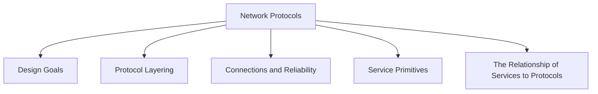

#### Design Goals

Network protocols often share a common set of design goals:

- **reliability**: the ability to recover from errors, faults, or failures
- **resource allocation**: sharing access to a common, limited resource
- **evolvability**: allowing for incremental deployment of protocol improvements over time
- **security**: defending the network against various types of attacks

##### Reliability

> [!Definition]
> **Reliability** is the design issue of making a network that operates correctly **even though it is comprised of a collection of components that are themselves unreliable**.

Think about the bits of a packet traveling through the network.

- There is a chance that some of these bits will be received **damaged (inverted)** due to fluke electrical noise, random wireless signals, hardware flaws, software bugs, and so on.
- How is it possible that we find and fix these errors?

| Mechanism | How it works |
| --------- | ------------ |
| **error detection** | uses codes to find errors in received information; information that is incorrectly received can then be **retransmitted** until it is received correctly |
| **error correction** | more powerful codes where the **correct message is recovered** from the possibly incorrect bits that were originally received |

> [!IMPORTANT]
> Both of these mechanisms work by adding **redundant information**. They are used at **low layers**, to protect packets sent over individual links, and **high layers**, to check that the right contents were received.

Another reliability issue is **finding a working path** through a network.

- Often, there are **multiple paths** between a source and destination, and in a large network, there may be some links or routers that are **broken**.
- Suppose, for example, that the network is down in Berlin. Packets sent from London to Rome via Berlin will not get through, but we could instead send packets **via Paris**.
- The network should **automatically** make this decision.

> [!Tech]
> This topic is called **routing**.

##### Resource Allocation

When networks get large, new problems arise.

> Cities can have traffic jams, a shortage of telephone numbers, and it is easy to get lost. Not many people have these problems in their own neighborhood, but citywide they may be a big issue.

> [!Definition]
> Designs that continue to work well when the network gets large are said to be **scalable**.

Networks provide a service to hosts using their underlying resources, such as the capacity of transmission lines. To do this well, they need mechanisms that **divide their resources** so that one host does not interfere with another too much.

| Concept | Idea |
| ------- | ---- |
| **statistical multiplexing** | sharing network bandwidth **dynamically**, according to the **short-term needs** of hosts (based on the **statistics of demand**), rather than giving each host a fixed fraction of the bandwidth that it may or may not use. Can be applied at **low layers** for a single link, or at **high layers** for a network or even applications. |
| **flow control** | how to keep a **fast sender** from swamping a **slow receiver** with data. Feedback from the receiver to the sender is often used. |
| **congestion** | the network is **oversubscribed** because too many computers want to send too much traffic, and the network cannot deliver it all. One strategy is for each computer to **reduce its demand** for resources when it experiences congestion. Can be used in **all layers**. |
| **quality of service** | the name given to mechanisms that **reconcile competing demands**, e.g. carrying live video where **timeliness** matters a great deal, at the same time as serving applications that want **high throughput** |

> [!NOTE]
> It is interesting to observe that the network has **more resources to offer than simply bandwidth**.

##### Evolvability

Another design issue concerns the **evolution** of the network. Over time, networks grow larger and new designs emerge that need to be connected to the existing network.

- The key structuring mechanism used to support change is **protocol layering**: dividing the overall problem and hiding implementation details.
- There are many other strategies available to designers as well.

Since there are many computers on the network, **every layer** needs a mechanism for identifying the senders and receivers that are involved in a particular message.

> [!Tech]
> This mechanism is called **addressing** or **naming**, in the low and high layers, respectively.

An aspect of growth is that different network technologies often have **different limitations**.

| Limitation | Solution |
| ---------- | -------- |
| not all communication channels **preserve the order** of messages sent on them | solutions that **number messages** |
| differences in the **maximum size** of a message that the networks can transmit | mechanisms for **disassembling, transmitting, and then reassembling** messages |

> [!Definition]
> This overall topic is called **internetworking**.

##### Security

The last major design issue is to **secure the network** by defending it against different kinds of threats.

| Mechanism | Defends against |
| --------- | --------------- |
| **confidentiality** | **eavesdropping** on communications; used in multiple layers |
| **authentication** | someone **impersonating** someone else; e.g. telling fake banking Web sites from the real one, or letting the cellular network check that a call is really coming from your phone so that you will pay the bill |
| **integrity** | **surreptitious changes** to messages, such as altering "debit my account $10" to "debit my account $1000" |

> [!NOTE]
> All of these designs are based on **cryptography**, which we shall study in Chap. 8.

#### Protocol Layering

To reduce their design complexity, most networks are organized as a **stack of layers** or levels, each one built upon the one below it.

- The **number** of layers, the **name** of each layer, the **contents** of each layer, and the **function** of each layer differ from network to network.
- The purpose of each layer is to **offer certain services to the higher layers** while **shielding** those layers from the details of how the offered services are actually implemented.
- In a sense, each layer is a kind of **virtual machine**, offering certain services to the layer above it.

> [!NOTE]
> This concept is actually a familiar one and is used throughout computer science, where it is variously known as **information hiding, abstract data types, data encapsulation**, and **object-oriented programming**. The fundamental idea is that a particular piece of software (or hardware) provides a service to its users but keeps the details of its **internal state and algorithms hidden** from them.

> [!Definition]
> When **layer n** on one machine carries on a conversation with **layer n** on another machine, the rules and conventions used in this conversation are collectively known as the **layer n protocol**. Basically, a protocol is an **agreement between the communicating parties on how communication is to proceed**.

An analogy: when a woman is introduced to a man, she may choose to stick out her hand. He, in turn, may decide to either **shake it or kiss it**, depending, for example, on whether she is an American lawyer at a business meeting or a European princess at a formal ball. **Violating the protocol will make communication more difficult, if not completely impossible.**

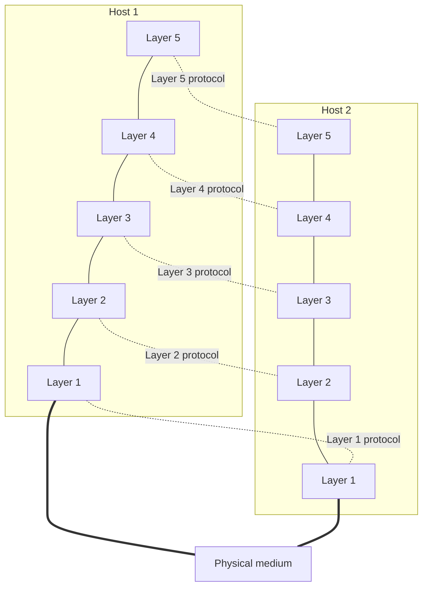

- The entities comprising the corresponding layers on different machines are called **peers**.
- The peers may be **software processes, hardware devices, or even human beings**.
- In other words, it is the **peers** that communicate by using the protocol to talk to each other.

> [!IMPORTANT]
> In reality, **no data are directly transferred** from layer n on one machine to layer n on another machine. Instead, each layer **passes data and control information to the layer immediately below it**, until the lowest layer is reached. Below layer 1 is the **physical medium** through which actual communication occurs.

> [!Definition]
> Between each pair of adjacent layers is an **interface**. The interface defines which **primitive operations and services** the lower layer makes available to the upper one.

When network designers decide how many layers to include and what each one should do, one of the most important considerations is **defining clean interfaces** between the layers.

- Doing so requires that each layer performs a specific collection of **well-understood functions**.
- In addition to **minimizing the amount of information** that must be passed between layers, clear interfaces also make it simpler to **replace one layer with a completely different protocol or implementation**.
- For example, imagine replacing all the telephone lines by satellite channels. All that is required of the new protocol or implementation is that it offers **exactly the same set of services** to its upstairs neighbor as the old one did.
- It is common that different hosts use **different implementations of the same protocol** (often written by different companies). In fact, the protocol itself can change in some layer **without the layers above and below it even noticing**.

> [!Definition]
> A set of layers and protocols is called a **network architecture**.

- The specification of an architecture must contain enough information to allow an implementer to write the program or build the hardware for each layer so that it will **correctly obey the appropriate protocol**.
- However, **neither the details of the implementation nor the specification of the interfaces is part of the architecture**, because these are hidden away inside the machines and not visible from the outside.
- It is not even necessary that the interfaces on all machines in a network be the same, provided that each machine can correctly use all the protocols.
- A list of the protocols used by a certain system, **one protocol per layer**, is called a **protocol stack**.

##### The Philosopher-Translator-Secretary Example

Imagine two philosophers (peer processes in **layer 3**), one of whom speaks **Urdu and English** and one of whom speaks **Chinese and French**.

- Since they have no common language, they each engage a **translator** (peer processes at **layer 2**), each of whom in turn contacts a **secretary** (peer processes in **layer 1**).
- Philosopher 1 wishes to convey his affection for *oryctolagus cuniculus* to his peer.
- He passes a message (in English) across the **2/3 interface** to his translator, saying **"I like rabbits."**
- The translators have agreed on a neutral language known to both of them, **Dutch**, so the message is converted to **"Ik vind konijnen leuk."** The choice of the language **is the layer 2 protocol** and is up to the layer 2 peer processes.
- The translator then gives the message to a secretary for transmission, for example, by **fax** (the layer 1 protocol).
- When the message arrives at the other secretary, it is passed to the local translator, who translates it into **French** ("J'aime bien les lapins") and passes it across the 2/3 interface to the second philosopher.

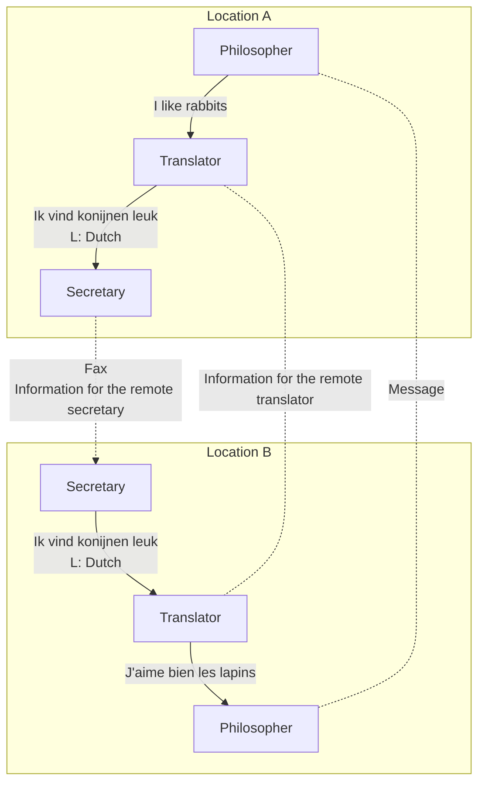

> [!IMPORTANT]
> Note that **each protocol is completely independent** of the other ones as long as the **interfaces are not changed**.
> - The translators can switch from Dutch to, say, Finnish, at will, provided that they both agree and neither changes his interface with either layer 1 or layer 3.
> - Similarly, the secretaries can switch from email to telephone without disturbing (or even informing) the other layers.
> - Each process may add some information intended **only for its peer**. This information is **not passed up to the layer above**.

##### A Technical Example: How Headers Accumulate

Now consider how to provide communication to the **top layer of the five-layer network**.

- A message, **M**, is produced by an application process running in **layer 5** and given to **layer 4** for transmission.
- **Layer 4** puts a **header** in front of the message to identify the message and then passes the result to **layer 3**.
- The header includes **control information**, such as **addresses**, to allow layer 4 on the destination machine to deliver the message. Other examples of control information are **sequence numbers** (in case the lower layer does not preserve message order), **sizes**, and **times**.
- In many networks, **no limit is placed on the size of messages** transmitted in the layer 4 protocol, but there is nearly always a **limit imposed by the layer 3 protocol**.
- Consequently, **layer 3 must break up the incoming messages into smaller units, packets**, prepending a layer 3 header to each packet. In this example, M is split into two parts, **M1** and **M2**, that will be transmitted separately.
- **Layer 3** decides which of the outgoing lines to use and passes the packets to **layer 2**.
- **Layer 2** adds to each piece not only a **header** but also a **trailer** and gives the resulting unit to **layer 1** for physical transmission.
- At the receiving machine, the message moves **upward**, from layer to layer, with headers being **stripped off** as it progresses. **None of the headers for layers below n are passed up to layer n.**

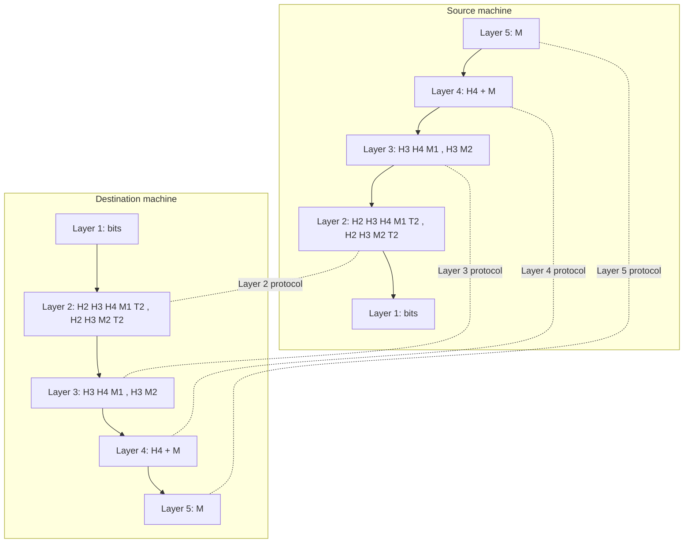

> [!IMPORTANT]
> The important thing to understand is the relation between the **virtual and actual communication** and the difference between **protocols and interfaces**.
> - The peer processes in layer 4, for example, **conceptually think** of their communication as being "**horizontal**," using the layer 4 protocol.
> - Each one is likely to have procedures called something like **SendToOtherSide** and **GetFromOtherSide**, even though these procedures actually communicate with **lower layers** across the 3/4 interface, and **not with the other side**.

> [!NOTE]
> The **peer process abstraction** is crucial to all network design. Using it, the unmanageable task of designing the complete network can be **broken into several smaller, manageable design problems**, namely, the design of the individual layers. As a consequence, **all real networks use layering**.
>
> It is worth pointing out that the lower layers of a protocol hierarchy are frequently implemented in **hardware or firmware**. Nevertheless, complex protocol algorithms are involved, even if they are embedded (in whole or in part) in hardware.

#### Connections and Reliability

Layers offer **two types of service** to the layers above them: **connection-oriented** and **connectionless**. They may also offer various levels of **reliability**.

##### Connection-Oriented Service

> [!Definition]
> **Connection-oriented service** is modeled after the **telephone system**. To talk to someone, you pick up the phone, key in the number, talk, and then hang up. Similarly, to use a connection-oriented network service, the service user first **establishes** a connection, **uses** the connection, and then **releases** the connection.

- The essential aspect of a connection is that it acts like a **tube**: the sender pushes objects (bits) in at one end, and the receiver takes them out at the other end.
- In most cases, the **order is preserved** so that the bits arrive in the order they were sent.
- In some cases when a connection is established, the sender, receiver, and subnet conduct a **negotiation** about the parameters to be used, such as **maximum message size, quality of service required**, and other issues. Typically, one side makes a proposal and the other side can **accept it, reject it, or make a counterproposal**.

> [!Tech]
> A **circuit** is another name for a connection **with associated resources**, such as a fixed bandwidth. This dates from the telephone network in which a circuit was a path over copper wire that carried a phone conversation.

##### Connectionless Service

> [!Definition]
> In contrast to connection-oriented service, **connectionless service** is modeled after the **postal system**. Each message (letter) carries the **full destination address**, and each one is routed through the intermediate nodes inside the system **independent of all the subsequent messages**.

- There are different names for messages in different contexts; a **packet** is a message at the **network layer**.

| Switching | Behavior |
| --------- | -------- |
| **store-and-forward switching** | the intermediate nodes receive a message **in full** before sending it on to the next node |
| **cut-through switching** | the onward transmission of a message at a node starts **before it is completely received** by the node |

- Normally, when two messages are sent to the same destination, the first one sent will be the first one to arrive. However, it is possible that the first one sent can be **delayed** so that the second one arrives first.
- Not all applications require connections. For example, **spammers** send electronic junk mail to many recipients.

> [!Tech]
> Unreliable (meaning **not acknowledged**) connectionless service is often called **datagram service**, in analogy with telegram service, which also does not return an acknowledgement to the sender.

##### Reliability

Connection-oriented and connectionless services can each be characterized by their **reliability**.

- Some services are **reliable** in the sense that they **never lose data**.
- Usually, a reliable service is implemented by having the receiver **acknowledge the receipt** of each message so the sender is sure that it arrived.
- The acknowledgement process introduces **overhead and delays**, which are often worth it but sometimes the price that has to be paid for reliability is too high.

> [!NOTE]
> A typical situation when a **reliable connection-oriented service** is appropriate is **file transfer**. The owner of the file wants to be sure that all the bits arrive correctly and in the same order they were sent. Very few file transfer customers would prefer a service that occasionally scrambles or loses a few bits, even if it were much faster.

Reliable connection-oriented service has **two minor variations**:

| Variation | Behavior |
| --------- | -------- |
| **message sequences** | the **message boundaries are preserved**. When two 1024-byte messages are sent, they arrive as two distinct 1024-byte messages, never as one 2048-byte message. |
| **byte streams** | the connection is simply a **stream of bytes, with no message boundaries**. When 2048 bytes arrive at the receiver, there is no way to tell if they were sent as one 2048-byte message, two 1024-byte messages, or 2048 1-byte messages. |

- If the **pages of a book** are sent over a network to a photo-typesetter as separate messages, it might be important to **preserve the message boundaries**.
- On the other hand, to **download a movie**, a byte stream from the server to the user's computer is all that is needed. Message boundaries (different scenes) within the movie are not relevant.

In some situations, the convenience of **not having to establish a connection** to send one message is desired, but **reliability is essential**.

> [!Definition]
> The **acknowledged datagram service** can be provided for these applications. It is like sending a **registered letter and requesting a return receipt**. When the receipt comes back, the sender is absolutely sure that the letter was delivered to the intended party and not lost along the way. **Text messaging** on mobile phones is an example.

> [!IMPORTANT]
> The concept of using **unreliable communication** may be confusing at first. After all, why would anyone actually prefer unreliable communication to reliable communication?
> 1. First of all, reliable communication (in our sense, that is, acknowledged) may **not be available in a given layer**. For example, **Ethernet** does not provide reliable communication. Packets can occasionally be damaged in transit. It is up to higher protocol levels to recover from this problem. In particular, many reliable services are built **on top of an unreliable datagram service**.
> 2. Second, the **delays inherent in providing a reliable service may be unacceptable**, especially in real-time applications such as multimedia. For these reasons, both reliable and unreliable communication coexist.

- In some applications, the transit delays introduced by acknowledgements are **unacceptable**. One such application is **digitized voice traffic (VoIP)**.
- It is less disruptive for VoIP users to hear a bit of noise on the line from time to time than to experience a **delay waiting for acknowledgements**.
- Similarly, when transmitting a **video conference**, having a few pixels wrong is no problem, but having the image **jerk along** as the flow stops and starts to correct errors, or having to wait longer for a perfect video stream to arrive, is irritating.

Still another service is the **request-reply service**.

> [!Definition]
> In the **request-reply service**, the sender transmits a **single datagram** containing a request; the reply contains the answer.

- Request-reply is commonly used to implement communication in the **client-server model**: the client issues a request and then the server responds to it.
- For example, a mobile phone client might send a query to a map server asking for a list of nearby Chinese restaurants, with the server sending the list.

**Six different types of service:**

| Service | Example |
| ------- | ------- |
| Reliable message stream | Sequence of pages |
| Reliable byte stream | Movie download |
| Unreliable connection | Voice over IP |
| Unreliable datagram | Electronic junk mail |
| Acknowledged datagram | Text messaging |
| Request-reply | Database query |

#### Service Primitives

> [!Definition]
> A **service** is formally specified by a set of **primitives** (operations) available to user processes to access the service. These primitives tell the service to perform some action or report on an action taken by a peer entity.

- If the protocol stack is located in the **operating system**, as it often is, the primitives are normally **system calls**.
- These calls cause a **trap to kernel mode**, which then turns control of the machine over to the operating system to send the necessary packets.
- The set of primitives available depends on the **nature of the service** being provided. The primitives for connection-oriented service are different from those of connectionless service.

**Six service primitives that provide a simple connection-oriented service:**

| Primitive | Meaning |
| --------- | ------- |
| **LISTEN** | Block waiting for an incoming connection |
| **CONNECT** | Establish a connection with a waiting peer |
| **ACCEPT** | Accept an incoming connection from a peer |
| **RECEIVE** | Block waiting for an incoming message |
| **SEND** | Send a message to the peer |
| **DISCONNECT** | Terminate a connection |

> [!NOTE]
> They will be familiar to fans of the **Berkeley socket interface**, as the primitives are a **simplified version** of that interface.

##### A Simple Client-Server Interaction

These primitives might be used for a **request-reply interaction** in a client-server environment. To illustrate how, we sketch a simple protocol that implements the service using **acknowledged datagrams**.

1. First, the **server executes LISTEN** to indicate that it is prepared to accept incoming connections. A common way to implement LISTEN is to make it a **blocking system call**. After executing the primitive, the server process is **blocked (suspended)** until a request for connection appears.
2. Next, the **client process executes CONNECT** to establish a connection with the server. The CONNECT call needs to specify who to connect to, so it might have a parameter giving the **server's address**. The operating system then typically sends a packet to the peer asking it to connect, as shown by **(1)**. The client process is **suspended** until there is a response.
3. When the packet arrives at the server, the operating system sees that the packet is requesting a connection. It checks to see if there is a **listener**, and if so, it **unblocks** the listener. The server process can then establish the connection with the **ACCEPT** call. This sends a response **(2)** back to the client process to accept the connection. The arrival of this response then releases the client. At this point, the client and server are both running and they have a connection established.
4. The next step is for the server to execute **RECEIVE** to prepare to accept the first request. Normally, the server does this **immediately upon being released from the LISTEN**, before the acknowledgement can get back to the client. The RECEIVE call **blocks** the server.
5. Then the client executes **SEND** to transmit its request **(3)** followed by the execution of **RECEIVE** to get the reply. The arrival of the request packet at the server machine unblocks the server so it can handle the request.
6. After it has done the work, the server uses **SEND** to return the answer to the client **(4)**. The arrival of this packet unblocks the client, which can now inspect the answer. If the client has additional requests, it can make them now.
7. When the client is done, it executes **DISCONNECT** to terminate the connection **(5)**. Usually, an initial DISCONNECT is a **blocking call**, suspending the client, and sending a packet to the server saying that the connection is no longer needed.
8. When the server gets the packet, it also issues a **DISCONNECT** of its own, acknowledging the client and releasing the connection **(6)**. When the server's packet gets back to the client machine, the client process is released and the connection is **broken**.

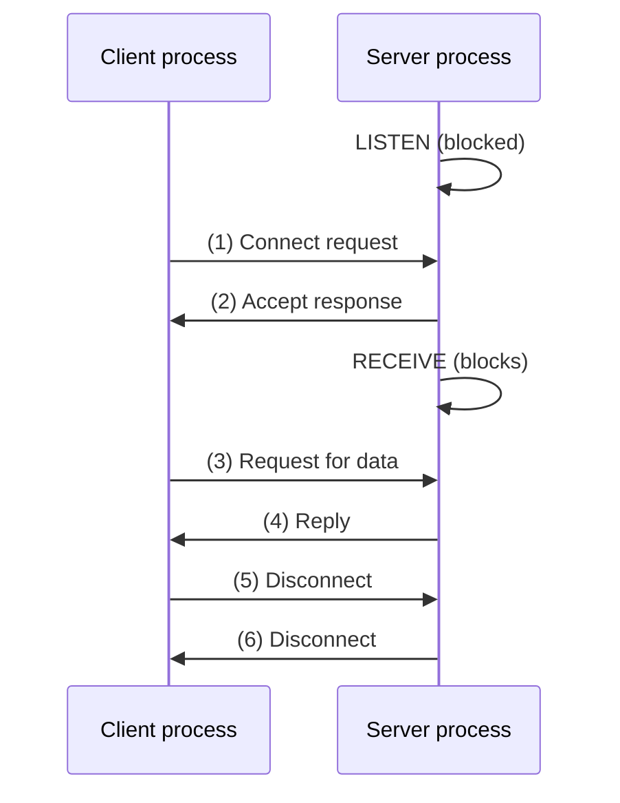

> [!NOTE]
> An obvious analogy between this protocol and real life is a **customer (client) calling a company's customer service manager**. At the start of the day, the service manager sits next to her telephone in case it rings. Later, a client places a call. When the manager picks up the phone, the connection is established.

> [!WARNING]
> Of course, life is not so simple. Many things can go wrong here. The timing can be wrong (e.g., the CONNECT is done **before** the LISTEN), packets can get lost, and much more.

##### Why Not Just Use a Connectionless Protocol?

Given that **six packets** are required to complete this protocol, one might wonder why a connectionless protocol is not used instead.

- The answer is that in a **perfect world** it could be, in which case only **two packets** would be needed: one for the request and one for the reply.
- However, in the face of **large messages in either direction** (e.g., a megabyte file), **transmission errors**, and **lost packets**, the situation changes.

Consider the questions that arise if the reply consisted of hundreds of packets, some of which could be lost during transmission:

- How would the client know if some pieces were **missing**?
- How would the client know whether the last packet actually received was really the **last packet sent**?
- Suppose the client wanted a **second file**. How could it tell packet 1 from the second file from a **lost packet 1 from the first file** that suddenly found its way to the client?

> [!IMPORTANT]
> In short, in the real world, a simple **request-reply protocol over an unreliable network is often inadequate**. For the moment, suffice it to say that having a **reliable, ordered byte stream between processes is sometimes very convenient**.

#### The Relationship of Services to Protocols

> [!IMPORTANT]
> **Services and protocols are distinct concepts.** This distinction is so important that we emphasize it again here.

| Aspect | Service | Protocol |
| --- | ------- | -------- |
| Definition | a set of **primitives (operations)** that a layer provides to the layer above it | a set of **rules governing the format and meaning** of the packets, or messages, that are exchanged by the **peer entities within a layer** |
| Says | **what** operations the layer is able to perform on behalf of its users | **how** the peers talk to each other |
| Relates to | the **interface between two layers**, with the lower layer being the service **provider** and the upper layer being the service **user** | the **packets sent between peer entities on different machines** |
| Freedom | - | entities are free to **change their protocols at will**, provided they do not change the service visible to their users |

> [!NOTE]
> In this way, the **service and the protocol are completely decoupled**. This is a key concept that any network designer should understand well.

**An analogy with programming languages:**

- A **service** is like an **abstract data type** or an **object** in an object-oriented language. It defines operations that can be performed on an object but does **not specify how** these operations are implemented.
- In contrast, a **protocol** relates to the **implementation** of the service and as such is **not visible to the user of the service**.

> [!WARNING]
> Many older protocols **did not distinguish the service from the protocol**. In effect, a typical layer might have had a service primitive **SEND PACKET** with the user providing a pointer to a **fully assembled packet**. This arrangement meant that **all changes to the protocol were immediately visible to the users**. Most network designers now regard such a design as a **serious blunder**.

### Reference Models

Layered protocol design is one of the key abstractions in network design. One of the main questions is **defining the functionality of each layer and the interactions between them**.

Two prevailing models:

- the **TCP/IP reference model**
- the **OSI reference model**

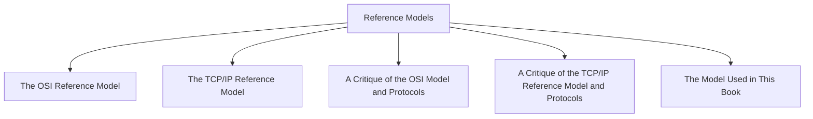

#### The OSI Reference Model

This model is based on a proposal developed by the **International Standards Organization (ISO)** as a first step toward international standardization of the protocols used in the various layers (Day and Zimmermann, 1983). It was revised in 1995 (Day, 1995).

> [!Definition]
> It is called the **ISO OSI (Open Systems Interconnection) Reference Model** because it deals with connecting **open systems** -- that is, systems that are **open for communication with other systems**.

```mermaid
graph TD
A7["7 Application - APDU"] --- A6["6 Presentation - PPDU"]
A6 --- A5["5 Session - SPDU"]
A5 --- A4["4 Transport - TPDU"]
A4 --- A3["3 Network - Packet"]
A3 --- A2["2 Data link - Frame"]
A2 --- A1["1 Physical - Bit"]
A7 -.-|Application protocol| B7["7 Application"]
A6 -.-|Presentation protocol| B6["6 Presentation"]
A5 -.-|Session protocol| B5["5 Session"]
A4 -.-|Transport protocol| B4["4 Transport"]
A3 -.-|"Internal subnet protocol"| R3["3 Network (router)"]
A2 -.-|"Data link layer host-router protocol"| R2["2 Data link (router)"]
A1 -.-|"Physical layer host-router protocol"| R1["1 Physical (router)"]
```

> [!NOTE]
> The dashed line between Transport and Network is the **communication subnet boundary**. Below it, the network, data link, and physical layers are also present in the **routers**.

**The principles that were applied to arrive at the seven layers:**

1. A layer should be created where a **different abstraction** is needed.
2. Each layer should perform a **well-defined function**.
3. The function of each layer should be chosen with an eye toward defining **internationally standardized protocols**.
4. The layer boundaries should be chosen to **minimize the information flow across the interfaces**.
5. The number of layers should be **large enough** that distinct functions need not be thrown together in the same layer out of necessity and **small enough** that the architecture does not become unwieldy.

**Three concepts are central to the OSI model:**

1. **Services**
2. **Interfaces**
3. **Protocols**

> [!IMPORTANT]
> Probably, the **biggest contribution of the OSI model** is that it makes the distinction between these three concepts **explicit**. Each layer performs some services for the layer above it. The service definition tells **what** the layer does, **not how** entities above it access it or how the layer works.

> [!NOTE]
> The TCP/IP model did **not originally clearly distinguish** between services, interfaces, and protocols, although people have tried to retrofit it after the fact to make it more OSI-like.

#### The TCP/IP Reference Model

The TCP/IP reference model is used in the grandparent of all wide area computer networks, the **ARPANET**, and its successor, the worldwide **Internet**.

- The ARPANET was a research network sponsored by the **DoD**. It eventually connected hundreds of universities and government installations, using leased telephone lines.
- When **satellite and radio networks** were added later, the existing protocols had trouble interworking with them, so a **new reference architecture was needed**.
- Thus, from nearly the beginning, the ability to **connect multiple networks in a seamless way** was one of the major design goals.
- This architecture later became known as the **TCP/IP Reference Model**, after its two primary protocols. It was first described by Cerf and Kahn (1974), and later refined and defined as a standard in the Internet community (Braden, 1989).

> [!IMPORTANT]
> Given the DoD's worry that some of its precious hosts, routers, and internetwork gateways might get blown to pieces at a moment's notice by an attack from the Soviet Union, another major goal was that the network be able to **survive the loss of subnet hardware, without existing conversations being broken off**. In other words, the DoD wanted connections to remain intact as long as the **source and destination machines were functioning**, even if some of the machines or transmission lines in between were suddenly put out of operation.
>
> Furthermore, since applications with **divergent requirements** were envisioned, ranging from transferring files to real-time speech transmission, a **flexible architecture** was needed.

These requirements led to the choice of a **packet-switching network based on a connectionless layer** that runs across different networks.

##### The Link Layer

> [!Definition]
> The lowest layer in the model, the **link layer**, describes what links such as **serial lines and classic Ethernet** must do to meet the needs of this connectionless internet layer.

> [!WARNING]
> It is **not really a layer at all**, in the normal sense of the term, but rather an **interface between hosts and transmission links**. Early material on the TCP/IP model **ignored it**.

##### The Internet Layer

> [!IMPORTANT]
> The **internet layer** is the **linchpin** that holds the whole architecture together.

- Its job is to permit hosts to **inject packets into any network** and have them travel **independently** to the destination (potentially on a different network).
- They may even arrive in a **completely different order** than they were sent, in which case it is the job of **higher layers** to rearrange them, if in-order delivery is desired.
- Note that "internet" is used here in a **generic sense**, even though this layer is present in the Internet.

> [!NOTE]
> The analogy here is with the **(snail) mail system**. A person can drop a sequence of international letters into a mailbox in one country, and with a little luck, most of them will be delivered to the correct address in the destination country. The letters will probably travel through one or more **international mail gateways** along the way, but this is **transparent to the users**. Furthermore, the fact that each country (i.e., each network) has its own **stamps, preferred envelope sizes, and delivery rules** is hidden from the users.

- The internet layer defines an official packet format and protocol called **IP** (Internet Protocol), plus a companion protocol called **ICMP** (Internet Control Message Protocol) that helps it function.
- The job of the internet layer is to **deliver IP packets where they are supposed to go**.
- **Packet routing** is clearly a major issue here, as is **congestion management**. The routing problem has largely been solved, but congestion can only be handled with **help from higher layers**.

##### The Transport Layer

The layer above the internet layer in the TCP/IP model is now usually called the **transport layer**.

- It is designed to allow **peer entities on the source and destination hosts** to carry on a conversation, just as in the OSI transport layer.
- Two end-to-end transport protocols have been defined here:

| Protocol | Type | Description |
| -------- | ---- | ----------- |
| **TCP** (Transmission Control Protocol) | reliable **connection-oriented** | allows a **byte stream** originating on one machine to be delivered **without error** on any other machine in the internet. It **segments** the incoming byte stream into discrete messages and passes each one on to the internet layer. At the destination, the receiving TCP process **reassembles** the received messages into the output stream. TCP also handles **flow control** to make sure a fast sender cannot swamp a slow receiver. |
| **UDP** (User Datagram Protocol) | **unreliable, connectionless** | for applications that do **not** want TCP's sequencing or flow control and wish to provide their own (if any). Also widely used for **one-shot, client-server-type request-reply** queries and applications in which **prompt delivery is more important than accurate delivery**, such as transmitting speech or video. |

> [!NOTE]
> Since the model was developed, **IP has been implemented on many other networks**.

```mermaid
graph TD
subgraph Application
H[HTTP] --- SM[SMTP] --- RT[RTP] --- DN[DNS]
end
subgraph Transport
T[TCP] --- U[UDP]
end
subgraph Internet
I[IP] --- IC[ICMP]
end
subgraph Link
D[DSL] --- SO[SONET] --- W[802.11] --- E[Ethernet]
end
H --- T
T --- I
I --- D
```

##### The Application Layer

> [!IMPORTANT]
> The TCP/IP model **does not have session or presentation layers**. No need for them was perceived. Instead, applications simply include any session and presentation functions that they require. **Experience has proven this view correct**: these layers are of little use to most applications so they are basically gone forever.

On top of the transport layer is the **application layer**. It contains all the higher-level protocols.

| Era | Protocols |
| --- | --------- |
| early | virtual terminal (**TELNET**), file transfer (**FTP**), and electronic mail (**SMTP**) |
| later | **DNS** (Domain Name System), for mapping host names onto their network addresses; **HTTP**, the protocol for fetching pages on the World Wide Web; **RTP**, the protocol for delivering real-time media such as voice or movies |

**Comparing the two models:**

| OSI | TCP/IP | Note |
| --- | ------ | ---- |
| 7 Application | Application | - |
| 6 Presentation | *not present in the model* | - |
| 5 Session | *not present in the model* | - |
| 4 Transport | Transport | - |
| 3 Network | Internet | - |
| 2 Data link | Link | - |
| 1 Physical | *not present* | - |

#### A Critique of the OSI Model and Protocols

At the time the second edition of this book was published (1989), it appeared to many experts in the field that the OSI model and its protocols were going to **take over the world**. This did not happen.

**The reasons can be summarized as: bad timing, bad design, bad implementations, and bad politics.**

##### Bad Timing

> [!IMPORTANT]
> The time at which a **standard** is established is absolutely critical to its success.

**David Clark's "apocalypse of the two elephants":**

```mermaid
graph LR
A[Research activity] -->|burst of research, papers, meetings| B[The trough]
B -->|billion-dollar investment wave| C[Corporate investment]
B --> D[Standards should be written HERE]
```

- When the subject is first discovered, there is a **giant burst of research activity** in the form of research, discussions, papers, and meetings.
- After a while this activity subsides, **corporations discover the subject**, and the **billion-dollar wave of investment** hits.
- It is essential that the standards be written **in the trough in between the two "elephants."**

| Timing | Result |
| ------ | ------ |
| too **early** (before the research results are well established) | the subject may still be poorly understood; the result is a **bad standard** |
| too **late** | so many companies may have already made major investments in different ways of doing things that the standards are **effectively ignored** |
| very **short interval** between the two elephants | the people developing the standards may get **crushed** |

> [!NOTE]
> It now appears that the standard OSI protocols **got crushed**. The competing TCP/IP protocols were already in widespread use by research universities by the time the OSI protocols appeared. While the billion-dollar wave of investment had not yet hit, the **academic market was large enough** that many vendors had begun cautiously offering TCP/IP products. When OSI came around, they did not want to support a **second protocol stack** until they were forced to, so there were no initial offerings. **With every company waiting for every other company to go first, no company went first and OSI never happened.**

##### Bad Design

The second reason that OSI never caught on is that both the model and the protocols are **flawed**.

- The choice of seven layers was more **political than technical**.
- Two of the layers (**session and presentation**) are **nearly empty**, whereas two other ones (**data link and network**) are **overfull**.
- The OSI model, along with its associated service definitions and protocols, is **extraordinarily complex**. When piled up, the printed standards occupy a significant fraction of a meter of paper. They are also **difficult to implement and inefficient in operation**.

> [!QUOTE]
> In this context, a riddle posed by Paul Mockapetris and cited by Rose (1993) comes to mind:
> Q: What do you get when you cross a mobster with an international standard?
> A: Someone who makes you an offer you can't understand.

> [!WARNING]
> Another problem with OSI is that some functions, such as **addressing, flow control, and error control**, **reappear again and again in each layer**. Saltzer et al. (1984), for example, have pointed out that to be effective, **error control must be done in the highest layer**, so that repeating it over and over in each of the lower layers is often **unnecessary and inefficient**.

##### Bad Implementations

- Given the enormous complexity of the model and the protocols, it will come as no surprise that the initial implementations were **huge, unwieldy, and slow**. Everyone who tried them **got burned**.
- It did not take long for people to associate **"OSI" with "poor quality."** Although the products improved in the course of time, **the image stuck**. Once people think something is bad, its goose is cooked.
- In contrast, one of the first implementations of TCP/IP was part of **Berkeley UNIX** and was quite good (not to mention, **free**). People began using it quickly, which led to a large user community, which led to improvements and which led to an even larger community.

> [!IMPORTANT]
> Here, the spiral was **upward** instead of **downward**.

##### Bad Politics

- On account of the initial implementation, many people, especially in academia, thought of **TCP/IP as part of UNIX**, and UNIX in the 1980s in academia was not unlike parenthood and apple pie.
- OSI, on the other hand, was widely thought to be the creature of the **European telecommunication ministries, the European Community**, and later the **U.S. Government**.
- This belief was only partly true, but the very idea of a bunch of **government bureaucrats** trying to shove a technically inferior standard down the throats of the poor researchers and programmers down in the trenches actually developing computer networks **did not aid OSI's cause**.

#### A Critique of the TCP/IP Reference Model and Protocols

The TCP/IP model and protocols also have their problems.

| # | Criticism |
| - | --------- |
| 1 | The model does **not clearly distinguish** the concepts of **services, interfaces, and protocols**. Good software engineering practice requires differentiating between the **specification and the implementation**, something that OSI does very carefully, but TCP/IP does not. Consequently, the TCP/IP model is **not much of a guide for designing new networks using new technologies**. |
| 2 | The TCP/IP model is **not at all general** and is **poorly suited to describing any protocol stack other than TCP/IP**. Trying to use the TCP/IP model to describe **Bluetooth**, for example, is completely impossible. |
| 3 | The **link layer is not really a layer at all** in the normal sense of the term as used in the context of layered protocols. It is an **interface** (between the network and data link layers). The distinction between an interface and a layer is crucial, and one should not be sloppy about it. |
| 4 | The TCP/IP model **does not distinguish between the physical and data link layers**. These are completely different. The **physical layer** has to do with the **transmission characteristics** of copper wire, fiber optics, and wireless communication. The **data link layer's** job is to **delimit the start and end of frames** and get them from one side to the other with the desired degree of reliability. A proper model should include both as separate layers. |
| 5 | Although the **IP and TCP protocols** were carefully thought out and well implemented, many of the **other early protocols were ad hoc**, generally produced by a couple of graduate students hacking away until they got tired. The protocol implementations were then distributed **free**, which resulted in them becoming **widely used, deeply entrenched, and thus hard to replace**. |

> [!NOTE]
> Some of them are a bit of an embarrassment now. For example, the virtual terminal protocol, **TELNET** was designed for a **ten-character-per-second mechanical Teletype terminal**. It knows nothing of graphical user interfaces and mice. Nevertheless, it is still in use **50 years later**.

#### The Model Used in This Book

> [!IMPORTANT]
> The strength of the **OSI** reference model is the **model itself** (minus the presentation and session layers), which has proven to be exceptionally useful for discussing computer networks. In contrast, the strength of the **TCP/IP** reference model is the **protocols**, which have been widely used for many years. Since computer scientists like to **have their cake and eat it, too**, we will use a **hybrid model** as the framework for this book.

```mermaid
graph TD
A5["5 Application"] --- A4["4 Transport"]
A4 --- A3["3 Network"]
A3 --- A2["2 Link"]
A2 --- A1["1 Physical"]
```

| Layer | Concern | Example protocols |
| ----- | ------- | ----------------- |
| **5 Application** | contains programs that make use of the network. Many, but not all, networked applications have user interfaces, such as a Web browser. Our concern, however, is with the **portion of the program that uses the network**. There are also important **support programs** in the application layer, such as the **DNS**, that are used by many applications. These form the **glue** that makes the network function. | HTTP, DNS |
| **4 Transport** | **strengthens the delivery guarantees** of the Network layer, usually with increased reliability, and provides **delivery abstractions**, such as a reliable byte stream, that match the needs of different applications | TCP |
| **3 Network** | deals with how to **combine multiple links into networks, and networks of networks, into internetworks** so that we can send packets between distant computers. This includes the task of **finding the path** along which to send the packets. | IP |
| **2 Link** | concerned with how to send **finite-length messages between directly connected computers** with specified levels of reliability | Ethernet, 802.11 |
| **1 Physical** | specifies how to **transmit bits across different kinds of media** as electrical (or other analog) signals | - |

> [!NOTE]
> Our chapter sequence is based on this model. In this way, we retain the value of the OSI model for understanding network architectures, but concentrate primarily on **protocols that are important in practice**, from TCP/IP and related protocols to newer ones such as 802.11, SONET, and Bluetooth.

### Standardization

> [!IMPORTANT]
> Innovation in Internet technology often depends **as much on policy and legal issues as it does on the technology itself**. Traditionally, Internet protocols have advanced through a **standardization process**.

#### Standardization and Open Source

Many network vendors and suppliers exist, each with its own ideas of how things should be done. Without coordination, there would be **complete chaos**, and users would get nothing done. The only way out is to **agree on some network standards**.

- Not only do good standards allow different computers to **communicate**, but they also **increase the market** for products adhering to the standards.
- A larger market leads to **mass production, economies of scale in manufacturing, better implementations**, and other benefits that **decrease price and further increase acceptance**.

> [!IMPORTANT]
> A reasonable person might assume that a standard tells you how a protocol should work so that you can do a good job of implementing it. **That person would be wrong.**
>
> Standards define what is needed for **interoperability: no more, no less.** That lets the larger market emerge and also lets companies **compete on the basis of how good their products are**.

- For example, the 802.11 standard defines **many transmission rates** but **does not say when a sender should use which rate**, which is a key factor in good performance. That is up to whoever makes the product.
- Often getting to interoperability this way is **difficult**, since there are many implementation choices and standards that usually define **many options**.
- For 802.11, there were so many problems that, in a strategy that has become common practice, a trade group called the **WiFi Alliance** was started to work on interoperability within the 802.11 standard.
- In the context of software-defined networking, the **ONF** (Open Networking Foundation) aims to develop both standards and **open-source software implementations** of those standards to ensure the interoperability of protocols to control programmable network switches.

> [!WARNING]
> A protocol standard defines the protocol **over the wire** but **not the service interface inside the box**, except to help explain the protocol. **Real service interfaces are often proprietary.**
> - For example, the way **TCP interfaces to IP within a computer does not matter** for talking to a remote host. It only matters that the **remote host speaks TCP/IP**. In fact, TCP and IP are commonly implemented together **without any distinct interface**.
> - That said, good service interfaces, like good **APIs** (Application Programming Interfaces), are valuable for getting protocols used, and the best ones (such as **Berkeley sockets**) can become very popular.

**Standards fall into two categories:**

| Category | Meaning | Examples |
| -------- | ------- | -------- |
| **de facto** | Latin for "from the fact". Standards that have **just happened, without any formal plan**. | **HTTP**, the protocol on which the Web runs, started life as a de facto standard. It was part of early WWW browsers developed by **Tim Berners-Lee** at CERN, and its use took off with the growth of the Web. **Bluetooth** is another example: it was originally developed by Ericsson but now everyone is using it. |
| **de jure** | Latin for "by law". Standards **adopted through the rules of some formal standardization body**. | International standardization authorities are generally divided into two classes: those **established by treaty** among national governments and those comprising **voluntary, non-treaty organizations**. In the area of computer network standards, there are several organizations of each type, notably **ITU, ISO, IETF, and IEEE**. |

> [!NOTE]
> In practice, the relationships between standards, companies, and standardization bodies are **complicated**.
> - **De facto standards often evolve into de jure standards**, especially if they are successful. This happened in the case of HTTP, which was quickly picked up by IETF.
> - Standards bodies often **ratify each others' standards**, in what looks like patting one another on the back, to increase the market for a technology.
> - These days, many **ad hoc business alliances** that are formed around particular technologies also play a significant role in developing and refining network standards. For example, **3GPP** (Third Generation Partnership Project) was a collaboration among telecommunications associations that drives the UMTS 3G mobile phone standards.

#### Who's Who in the Telecommunications World

The legal status of the world's telephone companies varies considerably from country to country.

| Extreme | Description |
| ------- | ----------- |
| the **United States** | has many (mostly very small) **privately owned** telephone companies. A few more were added with the breakup of **AT&T** in **1984** (which was then the world's largest corporation, providing telephone service to about **80 percent** of America's telephones), and the **Telecommunications Act of 1996** that overhauled regulation to foster competition. The idea of fostering competition **didn't turn out as planned** though: large telephone companies bought up smaller ones until in most areas there was only one (or at most, two) left. |
| **government monopoly** | countries in which the national government has a complete legal monopoly on all communication, including the mail, telegraph, telephone, and often radio and television. In some cases the telecommunication authority is a **nationalized company**, and in others it is simply a branch of the government, usually known as the **PTT** (Post, Telegraph & Telephone administration). |

> [!NOTE]
> Worldwide, the trend is toward **liberalization and competition** and away from government monopoly. Most European countries have now (partially) **privatized** their PTTs, but elsewhere the process is still only slowly gaining steam.

**ITU** (International Telecommunication Union):

- In **1865**, representatives from many European governments met to form the predecessor to today's ITU. Its job was to **standardize international telecommunications**, which in those days meant **telegraphy**.
- Even then it was clear that if half the countries used **Morse code** and the other half used some other code, there was going to be a problem.
- When the telephone was put into international service, ITU took over the job of standardizing telephony as well. In **1947**, ITU became an agency of the **United Nations**.
- ITU has about **200 governmental members**, including almost every member of the United Nations. Since the United States does not have a PTT, somebody else had to represent it in ITU. This task fell to the **State Department**.
- ITU also has more than **700 sector and associate members**: telephone companies (e.g., AT&T, Vodafone, Sprint), telecom equipment manufacturers (e.g., Cisco, Nokia, Nortel), computer vendors (e.g., Microsoft, Dell, Toshiba), chip manufacturers (e.g., Intel, Motorola, TI), and other interested companies (e.g., Boeing, CBS, VeriSign).

| Sector | Concern |
| ------ | ------- |
| **ITU-T** | the **Telecommunications Standardization Sector**, concerned with **telephone and data communication systems**. Before 1993, this sector was called **CCITT**, an acronym for its French name, *Comité Consultatif International Télégraphique et Téléphonique*. |
| **ITU-R** | the **Radiocommunications Sector**, concerned with coordinating the use by competing interest groups of **radio frequencies** worldwide. |
| **ITU-D** | the **Development Sector**. It promotes the development of information and communication technologies in order to narrow the **"digital divide"** among countries with effective access to the information technologies and countries with limited access. |

**ITU-T's task** is to make **technical recommendations** about telephone, telegraph, and data communication interfaces.

> [!IMPORTANT]
> These often become internationally recognized standards, though **technically the recommendations are only suggestions** that governments can adopt or ignore, as they wish.
>
> In practice, a country that wishes to adopt a telephone standard different from that used by the rest of the world is free to do so, but **at the price of cutting itself off from everyone else** so no one can call in and no one can call out.

- The real work of ITU-T is done in its **Study Groups**. There are currently **11 Study Groups**, often as large as 400 people, that cover topics ranging from telephone billing to multimedia services to security.
- **SG 15**, for example, standardizes **fiber-optic connections to the home**. This makes it possible for manufacturers to produce products that work anywhere.
- To make it possible to get anything at all done, the Study Groups are divided into **Working Parties**, which are in turn divided into **Expert Teams**, which are in turn divided into **ad hoc groups**.

> [!NOTE]
> Once a bureaucracy, always a bureaucracy. **Despite all this, ITU-T actually does get things done.** Since its inception, it has produced more than **3000 recommendations**, many of which are widely used in practice.
> - **Recommendation H.264** (also an ISO standard known as MPEG-4 AVC) is widely used for **video compression**.
> - **X.509** public key certificates are used for **secure Web browsing and digitally signed email**.

#### Who's Who in the International Standards World

International standards are produced and published by **ISO** (International Standards Organization), a **voluntary non-treaty organization** founded in **1946**.

- Its members are the national standards organizations of the **161 member countries**. These members include **ANSI** (U.S.), **BSI** (Great Britain), **AFNOR** (France), **DIN** (Germany), and 157 others.
- ISO issues standards on a truly **vast number of subjects**, ranging from nuts and bolts (literally) to telephone pole coatings.
- On issues of telecommunication standards, **ISO and ITU-T often cooperate** (ISO is a member of ITU-T) to avoid the irony of **two official and mutually incompatible international standards**.

**Structure:**

```mermaid
graph TD
A[ISO] --> B["Technical Committees (TCs), 200+"]
B --> C[Subcommittees - SCs]
C --> D["Working Groups - WGs, 100,000+ volunteers"]
B -.->|JTC1| E["information technology:<br/>networks, computers, software"]
```

- Over **21,000 standards** have been issued, including the **OSI standards**.
- ISO has over **200 Technical Committees (TCs)**, numbered in the order of their creation, each dealing with some specific subject.
- **TC1** literally deals with the **nuts and bolts** (standardizing screw thread pitches).
- **JTC1** deals with **information technology**, including networks, computers, and software. It is the first (and so far only) **Joint Technical Committee**, created in 1987 by merging TC97 with activities in **IEC**, yet another standardization body.
- The real work is done largely in the **WGs** by over **100,000 volunteers** worldwide. Many of these "volunteers" are **assigned to work on ISO matters by their employers**, whose products are being standardized. Others are **government officials** keen on having their country's way of doing things become the international standard. **Academic experts** also are active in many of the WGs.

**The ISO procedure for adopting standards** has been designed to achieve as broad a **consensus** as possible:

```mermaid
graph LR
A["a national standards<br/>organization feels the need"] --> B["Working Group<br/>formed"]
B --> C["CD (Committee Draft)<br/>circulated, 6 months to criticize"]
C --> D["DIS (Draft International Standard)<br/>comments and voting"]
D --> E["IS (International Standard)<br/>prepared, approved, published"]
D -.->|"areas of great controversy"| C
```

> [!WARNING]
> In areas of great controversy, a **CD or DIS may have to go through several versions** before acquiring enough votes. The whole process can take **years**.

| Organization | Concern |
| ------------ | ------- |
| **NIST** (National Institute of Standards and Technology) | part of the U.S. Department of Commerce. It used to be called the National Bureau of Standards. It issues standards that are **mandatory for purchases made by the U.S. Government**, except for those of the **Department of Defense**, which defines its own standards. |
| **IEEE** (Institute of Electrical and Electronics Engineers) | the **largest professional organization in the world**. In addition to publishing scores of journals and running hundreds of conferences each year, IEEE has a standardization group that develops standards in the area of electrical engineering and computing. IEEE's **802 committee** has standardized many kinds of LANs. |

**The 802 working groups:**

| Number | Topic |
| ------ | ----- |
| 802.1 | Overview and architecture of LANs |
| 802.2 | Logical link control |
| **802.3** * | Ethernet |
| 802.4 † | Token bus (was briefly used in manufacturing plants) |
| 802.5 † | Token ring (IBM's entry into the LAN world) |
| 802.6 † | Dual queue dual bus (early metropolitan area network) |
| 802.9 † | Isochronous LANs (for real-time applications) |
| 802.10 † | Virtual LANs and security |
| **802.11** * | Wireless LANs (WiFi) |
| 802.12 † | Demand priority (Hewlett-Packard's AnyLAN) |
| 802.13 | Unlucky number; nobody wanted it |
| 802.14 † | Cable modems (defunct: an industry consortium got there first) |
| **802.15** * | Personal area networks (Bluetooth, Zigbee) |
| 802.16 † | Broadband wireless (WiMAX) |
| 802.17 † | Resilient packet ring |
| 802.18 | Technical advisory group on radio regulatory issues |
| 802.19 | Technical advisory group on coexistence of all these standards |
| 802.20 | Mobile broadband wireless (similar to 802.16e) |
| 802.21 | Media independent handoff (for roaming over technologies) |
| 802.22 | Wireless regional area network |

> [!NOTE]
> The important ones are marked with **\***. The ones marked with **†** **gave up and stopped**. The success rate of the various 802 working groups has been **low**; having an 802.x number is no guarantee of success. Still, the impact of the success stories (especially **802.3** and **802.11**) on the industry and the world has been **enormous**.

#### Who's Who in the Internet Standards World

The worldwide Internet has its own standardization mechanisms, **very different** from those of ITU-T and ISO.

> [!QUOTE]
> The difference can be crudely summed up by saying that the people who come to **ITU or ISO** standardization meetings **wear suits**, while the people who come to **Internet** standardization meetings **wear jeans** (except when they meet in San Diego, when they wear shorts and T-shirts).

- ITU-T and ISO meetings are populated by **corporate officials and government civil servants** for whom standardization is their job. They regard standardization as **a Good Thing** and devote their lives to it.
- Internet people, on the other hand, prefer **anarchy as a matter of principle**. However, with hundreds of millions of people all doing their own thing, little communication can occur. Thus, standards, however regrettable, are sometimes needed.

> [!QUOTE]
> In this context, **David Clark** of M.I.T. once made a now-famous remark about Internet standardization consisting of **"rough consensus and running code."**

**History of Internet standardization:**

| Year | Event |
| ---- | ----- |
| when the ARPANET was set up | DoD created an **informal committee** to oversee it |
| **1983** | the committee was renamed the **IAB** (Internet Activities Board) and was given a slightly broader mission, namely, to keep the researchers involved with the ARPANET and the Internet pointed more or less in the same direction, an activity **not unlike herding cats**. The meaning of the acronym was later changed to **Internet Architecture Board**. |
| - | Each of the approximately **ten members** of the IAB headed a **task force** on some issue of importance. When a standard was needed (e.g., a new routing algorithm), the IAB members would **thrash it out** and then announce the change so the **graduate students** (who were the heart of the software effort) could implement it. |
| **1989** | The Internet had grown so large that this highly informal style **no longer worked**. Many vendors by then offered TCP/IP products and did **not want to change them** just because ten researchers had thought of a better idea. |
| summer **1989** | The IAB was **reorganized again**. The researchers were moved to the **IRTF** (Internet Research Task Force), which was made subsidiary to IAB, along with the **IETF** (Internet Engineering Task Force). The IAB was populated with people representing a **broader range of organizations** than just the research community. |
| later | The **Internet Society** was created, populated by people interested in the Internet. It is thus in a sense comparable to **ACM** or **IEEE**. It is governed by **elected trustees** who appoint the IAB's members. |

> [!Definition]
> **RFCs** (Request For Comments) are a series of technical reports where communication was done. RFCs are stored online and can be fetched by anyone interested in them from **www.ietf.org/rfc**. They are numbered in **chronological order of creation**. Over **8000** now exist.

**The IRTF / IETF split:**

- The idea was to have the **IRTF concentrate on long-term research** while the **IETF dealt with short-term engineering issues**. That way they would stay out of each other's way.
- The IETF was divided up into **working groups**, each with a specific problem to solve. The chairs of these working groups initially met as a **steering committee** to direct the engineering effort.
- The working group topics include **new applications, user information, OSI integration, routing and addressing, security, network management, and standards**.
- Eventually, so many working groups were formed (**more than 70**) that they were grouped into **areas** and the **area chairs** met as the steering committee.

**The formal standardization process**, patterned after ISO's:

```mermaid
graph LR
A["Proposed Standard<br/>basic idea explained in an RFC,<br/>sufficient interest in the community"] --> B["Draft Standard<br/>a working implementation rigorously tested<br/>by at least 2 independent sites<br/>for at least 4 months"]
B --> C["Internet Standard<br/>declared by the IAB<br/>if the idea is sound and the software works"]
C -.-> D["DoD standards (MIL-STD)<br/>mandatory for DoD suppliers"]
```

> [!Tech]
> For Web standards, the **World Wide Web Consortium (W3C)** develops protocols and guidelines to facilitate the long-term growth of the Web. It is an industry consortium led by **Tim Berners-Lee** and set up in **1994** as the Web really began to take off. W3C now has almost **500** companies, universities, and other organizations as members and has produced well over **100 W3C Recommendations**, as its standards are called, covering topics such as **HTML** and **Web privacy**.

### Policy, Legal, and Social Issues

> [!QUOTE]
> Like the printing press 500 years ago, computer networks allow ordinary citizens to **distribute and view content in ways that were not previously possible**.

But along with the good comes the bad, as these new capabilities are accompanied by many **unsolved social, political, and ethical issues**.

```mermaid
graph TD
A[Policy, Legal, and Social Issues] --> B[Online Speech]
A --> C[Net Neutrality]
A --> D[Security]
A --> E[Privacy]
A --> F[Disinformation]
B -.-> B1[traffic prioritization]
C -.-> B1
D -.-> D1[data collection]
E -.-> D1
F -.-> F1[control over free speech online]
B -.-> F1
```

#### Online Speech

Social networks, message boards, content sharing sites, and a host of other applications allow people to **share their views** with like-minded individuals.

- As long as the subjects are restricted to **technical topics or hobbies like gardening**, not too many problems will arise.
- The trouble comes with topics that **people actually care about**, like politics, religion, or sex. Views that are publicly posted may be **deeply offensive** to some people.
- Furthermore, opinions need not be limited to text; people can easily share **high-resolution color photographs and video clips** on these platforms.
- In some cases, such as **child pornography or incitement to terrorism**, the speech may also be **illegal**.

> [!IMPORTANT]
> The ability of social media and so-called **user-generated content platforms** to act as a conduit for illegal or offensive speech has raised important questions concerning the role of these platforms in **moderating the content** that is hosted on these platforms.

- For a long time, platforms such as Facebook, Twitter, YouTube, and other user-generated content platforms have enjoyed **considerable immunity from prosecution** when this content is hosted on their sites.
- In the United States, for example, **Section 230 of the Communications Decency Act** protects these platforms from federal criminal prosecution should any illegal content be found on their sites.
- For many years, these social media platforms have claimed that they are **merely a platform for information, akin to a printing press**, and should not be held liable for the content that they host.
- As these platforms have increasingly **curated, prioritized, and personalized** the content that they show to individual users, however, the argument that these sites are merely "platforms" has begun to **erode**.

> [!WARNING]
> The rise of automated, **machine-learning-based content classification algorithms** is also leading some advocates to hold the social media platforms accountable for a wider range of content, since these algorithms purport to be able to automatically detect unwanted content, from copyright violations to hate speech. The reality, however, is more complicated because these algorithms can generate **false positives**.
>
> - If a platform's algorithm **falsely** classifies content as offensive or illegal and automatically takes it down, this action may be considered **censorship** or an affront to free speech.
> - If the laws mandate that the platforms take these types of automated actions, then they may ultimately be **automating censorship**.

**DMCA takedown notices:**

- The recording and film industries often advocate for laws that would require the use of automated content moderation technologies.
- In the United States, representatives from these industries regularly issue **DMCA** takedown notices (after the **Digital Millennium Copyright Act**), which threaten legal action if the party in question does not take action and remove the content.
- Importantly, the ISP or content provider is **not held liable** for copyright infringement if they **pass on the takedown notice** to the person who infringed.
- The ISP or content provider **does not actively have to seek out** content that violates copyright -- that onus falls on the **copyright holder** (e.g., the record label or movie producer).
- Because it is challenging to find and identify copyrighted content, the copyright holders understandably continue to push for laws that would **shift the onus back to the ISPs and content providers**.

#### Net Neutrality

> [!Definition]
> The notion that ISPs should provide **equal quality of service** to a given type of application traffic, **regardless of who is sending that content**, is often referred to as **network neutrality** (Wu, 2003).

**The basic tenets of net neutrality amount to the following four rules:**

1. **No blocking**
2. **No throttling**
3. **No paid prioritization**
4. **Transparency** about reasonable network management practices that might be seen as violating any of the first three rules

> [!IMPORTANT]
> Note that net neutrality **does not prevent an ISP from prioritizing any traffic**. In some cases it may make sense for an ISP to prioritize **real-time traffic** (e.g., gaming and video conferencing) over other **non-interactive traffic** (e.g., a large file backup). The rules typically make exception for such **"reasonable network management practices."** What is a "reasonable" network management practice may be **arguable**, of course.
>
> What the rules are intended to prevent are situations where an ISP **blocks or throttles traffic as an anti-competitive practice**. Specifically, the rules are intended to prevent an ISP from blocking or throttling VoIP traffic if it competes with its **own Internet telephony** offering (as occurred when **AT&T blocked Apple's FaceTime**), or when a video service (e.g., **Netflix**) competes with its **own video-on-demand** offering.

Although at first the principle of net neutrality may appear straightforward, the legal and policy nuances are **significantly more complicated**, especially given how laws and networks differ between countries.

- One of the legal questions in the United States concerns **who has the authority to enforce** net neutrality rules.
- Various court rulings over the past decade have **granted and subsequently revoked** the authority of the **FCC** (Federal Communications Commission) to enforce net neutrality rules on ISPs.
- Much of the debate in the United States centers on whether an ISP should be classified as a **"common carrier"** service, akin to a public utility, or whether it should be considered an **information service**, with the likes of Google and Facebook.
- As many of these companies offer products in an increasingly diverse set of markets, it is becoming **harder to classify a company into one category or another**.
- On **June 11, 2018**, net neutrality was **abolished in the entire United States** by order of the FCC. However, some states may adopt their own net neutrality rules statewide.

**Zero rating:**

> [!Definition]
> A topic that relates to network neutrality and is prominent in many countries around the world is the practice of **zero rating**, whereby an ISP might charge its subscribers according to data usage but grant an **exemption** (i.e., "zero rate") for a **particular service**.

- For example, the ISP might charge its subscribers for streaming **Netflix**, but allow **unlimited streaming** of other video services that it wants to promote.
- In some countries, mobile carriers use zero rating as a **differentiator**: a mobile carrier might zero rate **Twitter** as a promotion to try to attract subscribers from other carriers.
- Another example is Facebook's **"Free Basics"** service, which allows ISP subscribers free, unmetered access to a **bundle of sites and services** that Facebook packages as part of a free offering.

> [!WARNING]
> Many parties see these offerings as **running afoul of net neutrality**, since they offer **preferential access** to some services and applications over others.

#### Security

> [!IMPORTANT]
> The Internet was designed so that **anyone could easily connect to it and begin sending traffic**. This open design not only spurred a wave of innovation, but it also has made the Internet a platform for **attacks of unprecedented scale and scope**.

**DDoS attacks:**

> [!Definition]
> One of the most prevalent and pernicious type of attack is a **DDoS** (Distributed Denial of Service) attack, whereby **many machines on the network send traffic towards a victim machine** in an attempt to **exhaust its resources**.

- The simplest form of DDoS attack is one where a large number of **compromised machines**, sometimes referred to as a **botnet**, all send traffic towards a single victim.
- DDoS attacks have typically been launched from compromised **general-purpose machines** (e.g., laptops and servers), but the proliferation of **insecure IoT devices** has now created a **brand-new vector** for launching DDoS attacks.
- Can a coordinated attack by a million Internet-connected **smart toasters** take down Google?
- Unfortunately, much of the **IoT industry** in particular is unconcerned with software security, and so defending against attacks coming from these highly insecure devices currently falls on **network operators**.
- New **incentive or regulatory structures** may be necessary to discourage users from connecting insecure IoT devices to the network.

> [!NOTE]
> In general, many Internet security problems are related to **incentives**.

**Spam:**

- Spam email (or unwanted electronic mail) now constitutes **more than 90%** of all email traffic because spammers have collected millions of email addresses and would-be marketers can cheaply send computer-generated messages to them.
- Fortunately, **filtering software** is able to read and discard the spam generated by other computers.
- Early spam filtering software relied largely on the **contents** of email messages to differentiate unwanted spam from legitimate emails, but spammers quickly found their way around those filters, since it is relatively easy to generate **100 ways of spelling Viagra**.
- On the other hand, properties of the email message such as the **IP address of the sender and receiver**, as well as **email sending patterns**, turn out to be useful distinguishing characteristics that are **much more robust to evasion**.

**Phishing and identity theft:**

- Some email spam is simply **annoying**. Other email messages, on the other hand, may be attempts to launch **large-scale scams** or **steal your personal information**, such as your passwords or bank account information.
- **Phishing** messages masquerade as originating from a **trustworthy party**, for example, your bank, to try to trick you into revealing sensitive information, for example, credit card numbers.
- **Identity theft** is becoming a serious problem as thieves collect enough information about a victim to **obtain credit cards and other documents in the victim's name**.

#### Privacy

> [!IMPORTANT]
> As computer networks and the devices that we connect to them proliferate, it is becoming increasingly easier for various parties to **collect data about how each of us uses the network**. Computer networks make it very easy to communicate, but they also make it easy for **the people who run the network to snoop on the traffic**.

A wide range of parties can collect data about your Internet use:

```mermaid
graph TD
A[Who can collect your data] --> B[your Internet service provider]
A --> C[your mobile phone carrier]
A --> D[applications]
A --> E[Web sites]
A --> F[cloud hosting services]
A --> G[content delivery networks]
A --> H[device manufacturers]
A --> I[advertisers]
A --> J[Web tracking software vendors]
```

**Profiling and tracking:**

- One prominent practice by many Web sites and application providers is the practice of **profiling and tracking users** by collecting data about their network behavior **over time**.
- One way that advertisers track users is by placing small files called **cookies** that Web browsers store on users' computers. Cookies allow advertisers and tracking companies to track users' browsing behavior and activities **from one site to another**.
- More sophisticated tracking mechanisms have also been developed in recent years, such as **browser fingerprinting**: it turns out that the configuration of your browser is **unique enough to you** that a company can use code on its Web page to extract your browser settings and determine your unique identity with high probability.
- Companies that provide Web-based services also maintain **large amounts of personal information** about their users that allows them to study user activities directly. For example, Google can read your email and show you advertisements based on your interests if you use its email service, Gmail.

**Location privacy:**

- The rise of mobile services has also made **location privacy** a growing concern (Beresford and Stajano, 2003).
- Your mobile operating system vendor has access to **precise location information**, including your geographic coordinates and even your **altitude**, by virtue of the readings from the phone's **barometric pressure sensor**.
- For example, a vendor of the Android mobile phone operating system, Google, can determine your precise location **within a building or shopping mall** so that it can serve you advertisements based on the store that you're walking past.
- Mobile carriers can also get information about your geographic location by determining **which cellular tower** your phone is communicating with.

**Anonymity tools:**

| Tool | Protection | Caveat |
| ---- | ---------- | ------ |
| **VPN** | may prevent your **ISP** from seeing any of your unencrypted Internet traffic | the **operator of the VPN service** can still see the unencrypted traffic |
| **Tor** | may offer an **additional layer** of protection by obfuscating the source of user traffic | there are varying assessments of its effectiveness, and many researchers have noted its weaknesses, particularly when a **single entity controls large parts of the infrastructure** |

- Anonymous communication may provide students, employees, and citizens a way to **blow the whistle on illegal behavior without fear of reprisal**.
- On the other hand, in the United States and most other democracies, the law specifically permits an accused person the right to **confront and challenge his accuser in court**, so **anonymous accusations cannot be used as evidence**.

> [!WARNING]
> Computer networks raise **new legal problems when they interact with old laws**. One interesting ongoing legal question concerns **access to data**:
> - What determines whether a government should be able to access data about its citizens?
> - If the data resides in another country, is that data protected from search?
> - If data traverses a country, to what extent does it become subject to those countries' laws?
>
> Microsoft grappled with these questions in a Supreme Court case, where the U.S. government is attempting to gain access about U.S. citizens on Microsoft servers located in **Ireland**. It is likely that the **"borderless" nature of the Internet** will continue to raise questions at the intersection of law and technology for years to come.

#### Disinformation

- The Internet makes it possible to find information quickly, but a great deal of it is **ill-considered, misleading, or downright wrong**.
- That medical advice you plucked from the Internet about the pain in your chest may have come from a **Nobel Prize winner or from a high-school dropout**.
- There is increasing concern about **how citizens around the world find information about news and current events**.
- The **2016 presidential election** in the United States, for example, saw the rise of so-called **"fake news,"** whereby certain parties explicitly crafted false stories with the goal of **tricking readers into believing things that never happened**.

> [!IMPORTANT]
> Disinformation campaigns have presented network and platform operators with new challenges:
> 1. How does one **define** disinformation in the first place?
> 2. Can disinformation be **reliably detected**?
> 3. What should a network or platform operator **do about it** once it is detected?

### Metric Units

> [!NOTE]
> To avoid any confusion, it is worth stating explicitly that in this book, as in computer science in general, **metric units** are used instead of traditional English units (the **furlong-stone-fortnight system**).

| Exp. | Explicit | Prefix | Exp. | Explicit | Prefix |
| ---- | -------- | ------ | ---- | -------- | ------ |
| 10^-3 | 0.001 | milli | 10^3 | 1,000 | Kilo |
| 10^-6 | 0.000001 | micro | 10^6 | 1,000,000 | Mega |
| 10^-9 | 0.000000001 | nano | 10^9 | 1,000,000,000 | Giga |
| 10^-12 | 0.000000000001 | pico | 10^12 | 1,000,000,000,000 | Tera |
| 10^-15 | 0.000000000000001 | femto | 10^15 | 1,000,000,000,000,000 | Peta |
| 10^-18 | 0.0000000000000000001 | atto | 10^18 | 1,000,000,000,000,000,000 | Exa |
| 10^-21 | 0.0000000000000000000001 | zepto | 10^21 | 1,000,000,000,000,000,000,000 | Zetta |
| 10^-24 | 0.0000000000000000000000001 | yocto | 10^24 | 1,000,000,000,000,000,000,000,000 | Yotta |

- The prefixes are typically abbreviated by their **first letters**, with the units **greater than 1 capitalized** (KB, MB, etc.).
- One exception (for historical reasons) is **kbps** for kilobits/sec.
- Thus, a **1-Mbps** communication line transmits **10^6 bits/sec** and a **100-psec** (or 100-ps) clock ticks every **10^-10 seconds**.
- Since **milli** and **micro** both begin with the letter "m," a choice had to be made. Normally, "**m**" is used for **milli** and "**µ**" (the Greek letter mu) is used for **micro**.

> [!WARNING]
> It is also worth pointing out that for measuring **memory, disk, file, and database sizes**, in common industry practice, the units have **slightly different meanings**. There, **kilo means 2^10 (1024) rather than 10^3 (1000)** because memories are always a power of two.

- Thus, a **1-KB** memory contains **1024 bytes**, not 1000 bytes. Note also the **capital "B"** in that usage to mean "**bytes**" (units of eight bits), instead of a **lowercase "b"** that means "**bits**."
- Similarly, a 1-MB memory contains 2^20 (1,048,576) bytes, a 1-GB memory contains 2^30 (1,073,741,824) bytes, and a 1-TB database contains 2^40 (1,099,511,627,776) bytes.
- However, a **1-kbps** communication line transmits **1000 bits per second** and a **10-Mbps** LAN runs at **10,000,000 bits/sec** because these speeds are **not powers of two**.
- Unfortunately, many people tend to mix up these two systems, especially for disk sizes.

> [!IMPORTANT]
> To avoid ambiguity, in this book, we will use the symbols **KB, MB, GB, and TB** for **2^10, 2^20, 2^30, and 2^40 bytes**, respectively, and the symbols **kbps, Mbps, Gbps, and Tbps** for **10^3, 10^6, 10^9, and 10^12 bits/sec**, respectively.

### Outline of the Rest of the Book

This book discusses both the **principles and practice** of computer networking.

- Most chapters start with a discussion of the relevant **principles**, followed by a number of **examples** that illustrate these principles.
- These examples are usually taken from the **Internet** and **wireless networks** such as the mobile phone network since these are both important and very different.

| Chapter | Topic |
| ------- | ----- |
| **2** | We begin working our way up the protocol hierarchy beginning at the bottom. We provide some background in the field of **data communication** that covers both wired and wireless transmission systems. This material is concerned with how to **deliver information over physical channels**, although we cover only the **architectural rather than the hardware** aspects. Several examples of the physical layer, such as the **public switched telephone network, the mobile telephone network, and the cable television network** are also discussed. |
| **3 and 4** | discuss the **data link layer in two parts**. Chapter 3 looks at the problem of how to send packets across a link, including **error detection and correction**. We look at **DSL** (used for broadband Internet access over phone lines) as a real-world example of a data link protocol. In Chapter 4, we examine the **medium access sublayer**, the part of the data link layer that deals with **how to share a channel between multiple computers**. The examples we look at include wireless, such as **802.11**, and wired LANs such as **Ethernet**. **Link layer switches** that connect LANs, such as switched Ethernet, are also discussed here. |
| **5** | deals with the **network layer**, especially **routing**. Many routing algorithms, both **static and dynamic**, are covered. Even with good routing algorithms, though, if more traffic is offered than the network can handle, some packets will be **delayed or discarded**. We discuss this issue from **how to prevent congestion** to **how to guarantee a certain quality of service**. Connecting heterogeneous networks to form internetworks also leads to numerous problems that are discussed here. The network layer in the Internet is given extensive coverage. |
| **6** | deals with the **transport layer**. Much of the emphasis is on **connection-oriented protocols and reliability**, since many applications need these. Both Internet transport protocols, **UDP and TCP**, are covered in detail, as are their performance issues, especially that of TCP, one of the Internet's key protocols. |
| **7** | deals with the **application layer**, its protocols, and its applications. The first topic is **DNS**, which is the Internet's telephone book. Next comes **email**, including a discussion of its protocols. Then we move on to the **Web**, with detailed discussions of static and dynamic content, and what happens on the client and server sides. We follow this with a look at **networked multimedia**, including streaming audio and video. Finally, we discuss **content-delivery networks**, including peer-to-peer technology. |
| **8** | is about **network security**. This topic has aspects that relate to **all layers**, so it is easiest to treat it after all the layers have been thoroughly explained. The chapter starts with an introduction to **cryptography**. Later, it shows how cryptography can be used to secure **communication, email, and the Web**. The chapter ends with a discussion of some areas in which security collides with **privacy, freedom of speech, censorship**, and other social issues. |
| **9** | contains an **annotated list of suggested readings** arranged by chapter. It is intended to help those readers who would like to pursue their study of networking further. The chapter also has an **alphabetical bibliography** of all the references cited in this book. |

### Summary

- Computer networks have many uses, both for **companies and for individuals**, in the home and while on the move.
	- Companies use networks of computers to **share corporate information**, typically using the **client-server model** with employee desktops acting as clients accessing powerful servers in the machine room.
	- For individuals, networks offer access to a variety of **information and entertainment** resources, as well as a way to **buy and sell** products and services.
	- Individuals often access the Internet via their **phone or cable providers** at home, though increasingly **wireless access** is used for laptops and phones.
	- Technology advances are enabling new kinds of **mobile applications** and networks with computers **embedded in appliances** and other consumer devices. The same advances raise social issues such as **privacy concerns**.

- Roughly speaking, networks can be divided into **LANs, MANs, WANs, and internetworks**.
	- **LANs** typically cover a **building** and operate at high speeds.
	- **MANs** usually cover a **city**. An example is the **cable television system**, which is now used by many people to access the Internet.
	- **WANs** may cover a **country or a continent**.
	- Some of the technologies used to build these networks are **point-to-point** (e.g., a cable) while others are **broadcast** (e.g., wireless).
	- Networks can be interconnected with **routers** to form **internetworks**, of which the **Internet** is the largest and most important example.
	- **Wireless networks**, for example, 802.11 LANs and 4G mobile telephony, are also becoming extremely popular.

- Network software is built around **protocols**, which are **rules by which processes communicate**.
	- Most networks support **protocol hierarchies**, with each layer providing services to the layer above it and **insulating them from the details** of the protocols used in the lower layers.
	- Protocol stacks are typically based either on the **OSI model** or on the **TCP/IP model**. Both have **link, network, transport, and application layers**, but they differ on the other layers.
	- Design issues include **reliability, resource allocation, growth, security**, and more.

- Networks provide various **services** to their users.
	- These services can range from **connectionless best-efforts packet delivery** to **connection-oriented guaranteed delivery**.
	- In some networks, connectionless service is provided in one layer and connection-oriented service is provided in the layer above it.

- Well-known networks include the **Internet, the mobile telephone network, and 802.11 LANs**.
	- The Internet evolved from the **ARPANET**, to which other networks were added to form an internetwork. The present-day Internet is actually a collection of **many thousands of networks** that use the **TCP/IP protocol stack**.
	- The **mobile telephone network** provides wireless and mobile access to the Internet at speeds of **multiple Mbps**, and, of course, carries voice calls as well.
	- Wireless LANs based on the IEEE **802.11** standard are deployed in many homes, hotels, airports, and restaurants, and can provide connectivity at rates of **1 Gbps or more**.
	- Wireless networks are also seeing an element of **convergence**, as evident in proposals such as **LTE-U**, which would allow cellular network protocols to operate in the **unlicensed spectrum** alongside 802.11.

- Enabling multiple computers to talk to each other requires a large amount of **standardization**, both in the hardware and software. Organizations such as **ITU-T, ISO, IEEE, and IAB** manage different parts of the standardization process.

