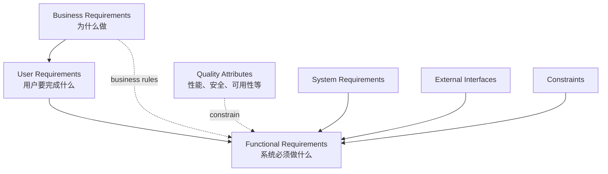
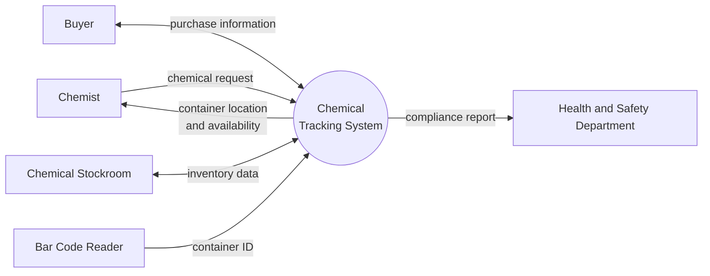
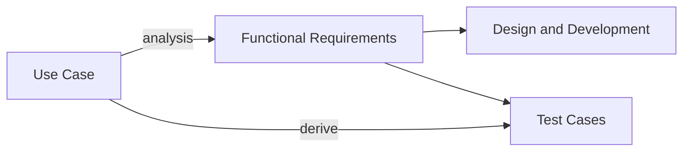

## REQUIREMENT DEVELOPMENT

上一节课从 **WHAT、WHY、WHO** 三个问题认识了软件需求，这一节开始讨论怎样把需求真正开发出来。

需求不是一次“收集”完成的。更准确的说法是 **elicitation（获取）**：需求分析师要通过对话、观察和分析去发现用户没有直接说出的需求，有时还需要与用户一起发明新的解决办法。

### Three Levels of Software Requirements

软件需求可以分为三个层次：

1. **Business Requirements（业务需求）**：组织为什么要做这个产品，希望解决什么业务问题；
2. **User Requirements（用户需求）**：用户希望借助系统完成哪些任务；
3. **Functional Requirements（功能需求）**：系统必须提供哪些具体行为来支撑用户任务。

它们通常分别落实到不同文档：

- 业务需求进入 **Vision and Scope Document**；
- 用户需求进入 **User Requirements Document**；
- 功能需求、质量属性、外部接口和约束进入 **Software Requirements Specification（SRS）**。

> 上层需求回答方向，下层需求回答实现责任。三层之间应当能够相互追溯。

## CLEARLY DEFINED BUSINESS REQUIREMENTS

### Business Objectives

业务目标说明项目究竟要解决什么问题，或抓住什么市场机会。只有“做一个系统”还不够，目标最好能够量化，例如：

- 提升任务完成效率；
- 增加活跃用户或业务收入；
- 降低采购、库存或人工处理成本；
- 减少错误率或合规风险。

量化指标能帮助团队在项目结束时判断：我们交付的不只是功能，而是真正的业务价值。

### Product Vision

产品愿景描述产品未来可能成为怎样的产品，以及它将为哪些用户带来什么价值。它比功能清单更高层，也允许在项目早期保留一定模糊性。

以化学品跟踪系统为例，愿景不是简单地说“提供查询和录入功能”，而是：为化学家提供申请、查找、共享与追踪化学品的一站式服务，在保证安全和合规的同时减少浪费与重复采购。

### Project Scope

项目范围明确 **做什么与不做什么**，是控制 **scope creep（范围蔓延）** 的前提。

- 给系统划定边界；
- 写清限制与排除项；
- 帮助团队承诺优先级；
- 让客户与开发团队对交付内容形成共同预期。

课程项目同样受到时间和人力限制。范围不是越大越好，而是要在有限资源内覆盖最有价值的目标。

#### Four Techniques for Scope Definition

1. **Context Diagram**：把系统视为黑盒，展示它与外部实体之间的数据流；
2. **Use Case Diagram**：展示参与者以及他们希望系统完成的主要任务；
3. **Feature Roadmap**：把功能沿版本时间线分配，说明 1.0、2.0 等版本的演进；
4. **System Event**：列出外部触发以及系统应当给出的响应。

### Context Diagram

上下文图关心的是系统边界，而不是系统内部结构。

画上下文图时需要注意：

- 只画外部实体与目标系统之间的交互，不画外部实体彼此之间的业务流程；
- 把待开发的系统放在中心，始终以它为观察对象；
- 数据流使用名词或名词短语命名，而不是写成操作步骤；
- 人、硬件设备和其他软件系统都可以成为外部实体；
- 使用一致的图形符号，避免图例本身造成歧义。

## A COLLABORATIVE PARTNERSHIP WITH CUSTOMERS

### User Classes

一个产品通常面对多个不同的用户类别。可以从以下维度进行划分：

- 使用频率；
- 使用的功能；
- 要完成的任务；
- 教育背景与技能水平；
- 权限或安全级别。

同一类别内部应当具有相近的需求。如果一个群体的大部分需求都与其他人不同，就应当把它识别为独立的用户类别。

用户类别需要尽早识别并记录在 SRS 中，但它们并不总是同等重要：

- **Favored user classes**：对业务目标最关键，需求冲突时通常优先考虑；
- **Disfavored user classes**：会使用系统，但优先级较低；
- **Ignored user classes**：本次范围内不重点支持。

划分的意义不是给用户贴标签，而是在需求冲突时有明确的业务判断依据，同时防止只有声音最大、权限最高的用户被听见。

### Product Champion

仅仅识别用户类别还不够，每个重要类别还需要一名 **Product Champion（产品代表）**。

- 他是该用户类别与开发团队之间的主要接口；
- 能代表一线用户，而不是凭空想象用户会需要什么；
- 具备足够的领域知识，也愿意积极参与需求工作；
- 能协调同一类别内部相互冲突的意见；
- 在用户需求层面参与关键决策。

> 开发人员不应因为“更懂技术”就自动担任产品代表。技术经验无法替代真实的用户视角。

## UNDERSTANDING USER REQUIREMENTS

### The Use Case Approach

**Use Case（用例）** 是系统为一个或多个参与者提供可观察、可衡量价值时所执行的一组交互序列。

用例描述：

- 用户的目标；
- 用户眼中的系统；
- 一组与任务相关的活动。

它不应该描述：

- 用户界面的具体布局；
- 内部数据结构与架构；
- 与用户目标无关的每一次点击；
- 过早确定的技术实现方案。

### The Right Level of Abstraction

用例既不能过于抽象，也不能过于具体。

- `Do Stuff` 太抽象，无法指导实现；
- “把一个 2.5 磅的包裹从某地址寄往纽约某地址”太具体，只是一次场景；
- `Prepare Shipping Label` 或 `Ship Package` 才是可以复用、能够产生用户价值的用例。

可以从具体故事向上归纳用例，也可以从抽象目标向下展开成功与失败场景。判断粒度是否合适的标准是：它能否表达一个完整的用户目标，并为后续功能分析提供稳定边界。

### Use Cases, Scenarios and Actors

- **Actor（参与者）**：位于系统之外、与系统交互以获得结果的实体；它可以是人，也可以是另一个系统；
- **Scenario（场景）**：用例的一条具体执行路径；
- 一个用例通常包含一个基本成功场景，以及若干备选或失败场景。

例如“在线下单”是一个用例；正常支付成功、库存不足、支付失败，则是其中不同的场景。

### Use Cases and Functional Requirements

关于二者的关系有两种观点：

1. **Use Cases are Functional Requirements**：把用例直接作为需求交付物；
2. **Use Cases reveal Functional Requirements**：用例用于发现功能需求，再由需求分析师把它们明确写入 SRS。

第二种方式通常更稳妥。用例能帮助团队理解用户任务，但单独的用例往往不足以覆盖异常处理、数据校验、权限判断和质量属性等实现细节。

显式写出功能需求还有一个重要价值：建立从业务目标、用户需求到实现和测试的 **traceability（可追溯性）**。

### How to Name Use Cases

用例名采用 **active verb + object（主动动词 + 对象）**，并从参与者的目标出发。

Good examples:

- Reserve Rental Car
- Print Invoice
- Check Flight Status

Not so good examples:

- Enter PIN：只是完成取款目标中的一步；
- Submit Form 37：依赖界面或表单编号；
- Process Deposit：没有明确表达参与者的目标。

名称应当通用、清晰，并保持合适的抽象层次。

## USE CASES AND USER STORIES

用户故事通常采用以下形式：

> As a `<type of user>`, I want `<some goal>` so that `<some reason>`.

例如：

> As a small business owner, I want to create an invoice so that I can bill a customer.

用户故事是对未来对话的简短占位符，不是完整的需求说明。它会通过后续讨论被细化，并最终产生验收测试。用例则更强调参与者与系统之间完整的交互序列，通常会形成结构化的用例规约。

| | Use Case | User Story |
|---|---|---|
| 关注点 | 完成一个用户目标的交互 | 用户需要某项能力的原因 |
| 详细程度 | 包含基本流与备选流 | 保持简短，细节留给对话 |
| 常见产物 | 用例规约、功能需求、测试 | 细化后的故事、验收测试 |
| 适用方式 | 传统或较正式的需求过程 | 敏捷、迭代式开发 |

无论选择哪种方式，目的都不是写出“漂亮的需求文档”，而是确保团队正在构建正确的产品。

## WHEN USE CASES FIT

用例特别适合用户与系统交互频繁的信息系统、Web 应用和业务软件，因为这些系统能够清楚地识别参与者、目标和交互。

对于实时控制系统、计算密集型系统或内部算法复杂而用户交互很少的系统，用例的表达能力有限，需要结合状态机、数据模型、算法模型等其他工具。

### Benefits of a Usage-Centric Approach

- 使用用户熟悉的语言讨论需求；
- 揭示用户完成任务真正需要的能力；
- 帮助需求分析师理解业务领域；
- 避免构建用户不需要的功能；
- 可以尽早推导功能测试；
- 有助于为功能需求确定实现优先级。

> 用例、用户故事和 SRS 都只是手段。真正的目标始终是理解用户，并交付能够产生价值的软件。
