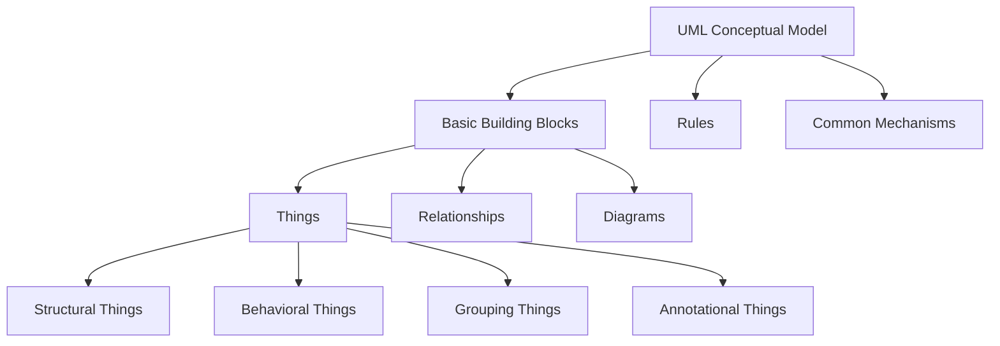
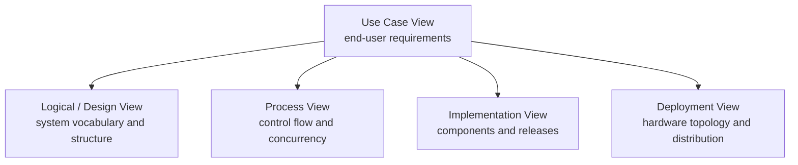

## WHY MODELING MATTERS

当系统只有几百行代码时，开发者也许还能把主要逻辑记在脑中；当规模达到几十万、几百万行时，仅靠阅读代码就很难理解系统。

AI 可以更快地产生代码，却不会自动保证代码具有清晰的结构。输入越含糊，得到的实现越可能“看起来正确”，而不是确实满足需求。因此，能够准确表达需求、结构与行为，比单纯提高编码速度更重要。

> 图首先是给人看的。人能形成一致理解之后，计算机才有机会准确地实现它。

### The Goal of Software Engineering

软件工程的目标不只是“把软件做出来”，而是：

> 在有限的时间与成本内，开发出高质量、可维护的软件，并满足用户的真实需要。

这里需要区分 **customer needs** 与 **system requirements**。用户表达的是问题、目标和期望，系统需求则是分析这些需要之后形成的工程描述；两者不应被简单画上等号。

### Development Models

- **Waterfall Model**：需求、概要设计、详细设计、编码和测试依次展开；结构清楚，但要求前期需求足够稳定；
- **Prototyping**：先制作可交互的界面或原型，让用户尽早发现理解偏差；
- **Spiral / Evolutionary Model**：在多轮迭代中评估风险并持续改进；
- **Incremental Model**：先建立整体架构，再分批交付最核心或最受关注的功能；
- **Fountain Model**：强调面向对象开发活动之间的重叠与迭代。

原型的价值不在于“看上去像成品”，而在于把长篇文字变成用户可以直接判断的体验。它能更早暴露需求理解上的偏差，但也需要额外时间梳理页面与交互逻辑。

## THE INHERENT COMPLEXITY OF SOFTWARE

软件的复杂性具有几个来源：

- **Simple hardware and complex software**：硬件体系结构相对稳定，变化和差异大量转移到软件层；
- **Intellectual activity, hard to describe**：软件是逻辑与思维的产物，看不见、摸不着；
- **Interaction grows geometrically**：模块越多，潜在交互与依赖增长越快；
- **Change, change, change**：业务、平台、数据库、硬件和法律规则都在变化；
- **Difficult maintenance**：一次局部修改可能产生新的缺陷。

软件与机械产品也有明显差异。机械零件存在可接受的加工误差，软件逻辑中的一个边界错误却可能长期隐藏，并在特定条件下造成严重后果。软件也很少拥有能够像标准零件一样随时替换的“通用配件”。

Fred Brooks 在 *No Silver Bullet* 中指出：不存在一种技术能够让软件开发的本质复杂度突然消失。工程方法能做的，是让复杂度可见、可分解、可控制。

### Controlling Complexity

面向对象方法通过几种基本思想控制复杂度：

- **Decomposition**：把复杂系统分解为更小的问题；
- **Abstraction**：保留当前视角真正关心的特征；
- **Modularity**：用高内聚、低耦合的模块组织系统；
- **Encapsulation**：隐藏内部实现，只暴露稳定接口。

它把客观世界中的实体及其关系映射为对象与关系，因此通常更容易理解，也更能适应局部变化。

## MODEL AND MODELING

模型是现实世界的抽象与简化。模型不是越详细越好，而是应该保留当前目的所需的信息。

同一个电阻可以在电路图中被简化为一个符号，也可以在精密分析中被描述为包含寄生电感和电容的等效模型。二者没有绝对的对错，关键在于模型能否回答当前问题。

软件建模同样如此：

- 面向用户时，关注参与者和目标；
- 分析业务时，关注领域对象及其关系；
- 设计系统时，关注模块、接口与协作；
- 部署系统时，关注软件制品与运行节点。

建模不是为了多写文档，而是为了 **specify、visualize、construct、document**：明确系统、让结构可见、辅助构造实现，并记录关键决策。

## UML: UNIFIED MODELING LANGUAGE

**UML（Unified Modeling Language，统一建模语言）** 是一种为软件密集型系统建立蓝图的标准语言。

### UML Is a Language, Not a Process

UML 是建模语言，不是编程语言，也不是软件开发流程。

- 它提供词汇、语法和语义，说明一个模型可以由哪些元素构成；
- 它能告诉我们怎样表达类、关系、交互和状态；
- 它不会规定项目第一步必须画哪张图，也不会决定何时进入编码。

“什么时候画、画到多细、先画什么”属于开发过程和方法论的问题。

### Four Roles of UML

#### Visualizing

图形能够减少自然语言中的歧义，也更容易帮助不同背景的人建立共同理解。对于复杂问题，**a picture is worth a thousand words**。

#### Specifying

UML 不只是随手画图。规范的符号和关系可以形成准确、完整且较少歧义的模型，使需求、分析和设计之间保持一致。

#### Constructing

UML 不是可直接运行的编程语言，但模型可以支持代码骨架生成，即 **forward engineering（正向工程）**。

反过来，也可以从已有代码恢复类、接口与依赖关系，形成更容易理解的模型，这称为 **reverse engineering（逆向工程）**。逆向工程通常更困难，因为它不仅要看到代码“做了什么”，还要恢复设计者“为什么这样做”。

#### Documenting

UML 可以记录需求、体系结构、设计、源代码组织、测试与部署决策。文档的价值是让后来者不必从海量代码中重新猜测系统逻辑。

### Characteristics of UML

- 由 OMG 推动形成统一标准；
- 面向对象，适合表达对象、类与协作；
- 图形化表达能力强；
- 独立于具体软件开发过程；
- 概念显式、结构清楚，便于沟通；
- 具有扩展机制，可以融入特定领域知识。

## THE CONCEPTUAL MODEL OF UML

UML 的概念模型可以记成三部分：

### Things

#### Structural Things

结构事物是模型中的“名词”，描述系统相对静态的部分，例如：

- Class
- Interface
- Component
- Node
- Use Case

#### Behavioral Things

行为事物是模型中的“动词”，描述系统随时间发生的变化：

- **Interaction**：对象之间交换消息形成的协作；
- **State Machine**：对象在事件驱动下发生的状态迁移；
- **Activity**：计算或业务过程按步骤推进的行为。

行为必须依附于结构。例如“加速”是车或发动机的行为，脱离相关对象便没有完整语义。

#### Grouping and Annotational Things

- **Grouping Things** 用于组织模型元素，最常见的是 Package；
- **Annotational Things** 用于解释、标注或补充模型中的元素。

### Relationships

UML 中常见的四类关系：

| Relationship | Meaning |
|---|---|
| Dependency | 一个元素的变化可能影响另一个元素，是相对较弱的使用关系 |
| Association | 类之间稳定的结构联系，可进一步表达聚合或组合 |
| Generalization | 一般与特殊之间的继承关系，即“is-a” |
| Realization | 一个元素定义契约，另一个元素负责实现，如类实现接口 |

#### Aggregation vs. Composition

二者都描述整体与部分：

- **Aggregation（聚合）**：部分可以脱离整体独立存在，生命周期不必一致；
- **Composition（组合）**：部分强依附于整体，生命周期通常一致。

例如，点云少一个点仍然是点云，更接近聚合；四边形缺少一个顶点便不再是四边形，更接近组合。

### Diagrams

图是从某一视角对系统进行的投影。同一个系统需要多张图，不是因为重复，而是因为每张图回答的问题不同。

| Diagram | Main Question |
|---|---|
| Use Case Diagram | 谁使用系统，希望系统提供什么价值？ |
| Class Diagram | 系统有哪些类，类之间如何关联？ |
| Object Diagram | 某一时刻具体对象及其关系是什么？ |
| Sequence Diagram | 消息按怎样的时间顺序交换？ |
| Communication Diagram | 对象如何通过连接协作？ |
| State Machine Diagram | 事件如何驱动对象改变状态？ |
| Activity Diagram | 业务或算法按哪些步骤流转？ |
| Component Diagram | 实现由哪些组件组成，它们怎样依赖？ |
| Deployment Diagram | 软件制品部署在哪些硬件节点上？ |
| Package Diagram | 模型元素如何分组与组织？ |

类图是最常用的图之一，因为理解系统往往要先回答：有哪些核心类，哪些关系紧密，哪些彼此独立。对象图则像一次 **snapshot（快照）**，展示系统在某一时刻的具体实例状态。

## RULES AND COMMON MECHANISMS

作为一门语言，UML 不只有词汇，还需要语法和语义规则，例如命名、作用域、可见性、完整性和执行规则。

UML 的常用机制包括：

- **Specification**：每个图形符号背后都有完整的语义说明；
- **Adornments**：在基础符号上增加可见性、多重性等细节；
- **Common Divisions**：区分类与对象、接口与实现等不同层次；
- **Extensibility Mechanisms**：为特定领域扩展 UML。

### Extensibility Mechanisms

UML 是通用建模语言，但银行、证券、ERP 等领域都有自己的术语、属性和约束。三种扩展机制可以把领域知识嵌入 UML：

1. **Stereotypes（构造型）**：扩展 UML 的词汇；
2. **Tagged Values（标记值）**：为元素增加新的属性；
3. **Constraints（约束）**：扩展或限制模型元素的语义。

扩展机制使 UML 能够从通用语言进一步形成面向特定领域的建模语言，而不必重新发明一整套表示方法。

## ARCHITECTURAL VIEWS

一个大型系统不能只靠一张图说明。经典的 **4+1 View Model** 从相互关联的视角描述体系结构：

- **Use Case View**：最终用户所能观察到的系统行为；
- **Logical / Design View**：系统的核心抽象、类与关系；
- **Process View**：控制流、并发与同步；
- **Implementation View**：组件、制品与版本组织；
- **Deployment View**：软件如何映射到物理节点。

不同利益相关方关心不同视角。用户关注系统能做什么，开发者关注怎样组织实现，运维人员关注系统部署在哪里。把这些视角联系起来，才能得到完整而可沟通的系统蓝图。

## UML IN THE AI ERA

AI 降低了生成代码的成本，也放大了错误需求和混乱设计的代价。模型并不会替代思考，它迫使我们在生成实现之前先回答几个问题：

- 我们究竟要解决什么问题？
- 系统边界在哪里？
- 核心对象及其关系是什么？
- 行为、状态与异常路径如何变化？
- 需求如何追溯到设计、代码和测试？

> 当写代码不再是主要瓶颈时，分析、表达与建模反而更重要。
