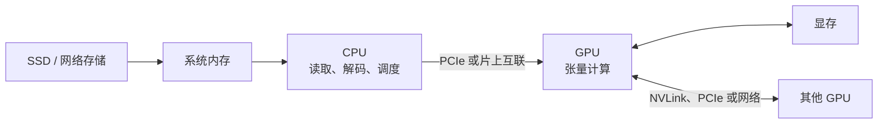
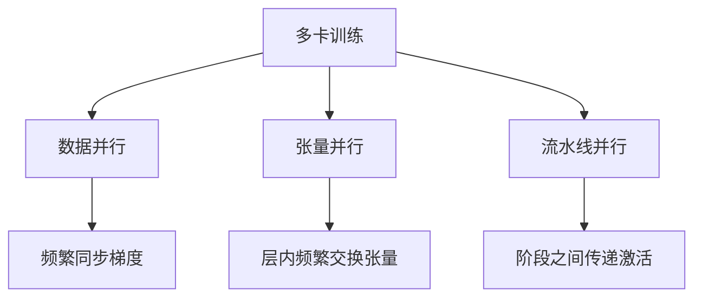

前面几篇一直围着 GPU 转，很容易留下一个错觉：只要显卡够强，其他配件差不多能用就行。

真跑起来并不是这样。数据还躺在磁盘里时，GPU 再强也碰不到它。CPU 要先读取、解码和整理，系统内存要装得下缓冲区，数据还得经过 PCIe。到了多卡训练，几张卡之间又要不停通信。

整台机器更像一条流水线。最慢的那一段，最后会变成所有人的等待时间。

## 一批数据是怎么走到 GPU 的

一个简化的数据批次可能经历：

1. 从本地 SSD 或网络存储读取样本；
2. CPU 解码、分词、裁剪或增强数据；
3. 数据进入系统内存中的缓冲区；
4. 通过 PCIe 或其他互联复制到 GPU；
5. GPU 完成前向、反向和参数更新；
6. 多卡任务交换梯度、参数或中间激活。

这条链不用每一段都同样快，但至少不能差得太离谱。看到 GPU 利用率只有 30%，先别急着怪 Kernel，也许它只是在等下一批数据。

可以把一个训练 step 拆成时间线。假设 GPU 计算要 80 ms，CPU 准备下一批数据要 50 ms。如果两件事串行发生，一步就是 130 ms；若数据准备能和上一批 GPU 计算重叠，理想情况下整步会更接近 80 ms。

反过来，如果 CPU 预处理要 120 ms，GPU 只算 80 ms，那么即使重叠得很好，GPU 每一步仍要空等约 40 ms。此时换一张计算更快的 GPU，等待占比只会更高。

## CPU 并没有退居二线

CPU 常负责：

- 操作系统、Python 代码与任务调度；
- 数据读取、解压、图像或音频解码；
- tokenizer 和数据整理；
- 启动 GPU Kernel、管理通信；
- 执行没有 GPU 实现或规模过小的算子。

CPU 核心越多并不一定越快。如果数据已经预处理好，而程序瓶颈完全在 GPU，多加 CPU 核心帮助有限。反过来，如果 dataloader 一直喂不满 GPU，升级 GPU 反而可能让等待比例更高。

数据加载线程也不是开得越多越好。线程太少时，解码和预处理跟不上；太多时，又会争抢 CPU、内存带宽和文件系统，甚至因为频繁切换而变慢。

比较稳妥的办法是观察等待时间，再逐步增加 worker 数量。图像任务常卡在 JPEG 解码和数据增强，语言模型训练则可能卡在分词、大量小文件或网络存储。瓶颈不同，CPU 配置也不会有一个通用答案。

## “内存还有很多”解决不了显存不够

独立 GPU 通常有自己的显存。系统内存容量更大、价格更低，但 GPU 通过 PCIe 访问或从系统内存搬数据，通常比访问本地显存慢得多。

Unified Memory 或统一地址空间可以让编程更方便，也可以在特定系统上利用共享物理内存，但它不意味着层级差异消失。若工作集频繁在不同位置迁移，缺页和搬运成本仍会暴露出来。

所以把一部分内容挪到系统内存，确实可能让程序从“跑不了”变成“能跑”。但“能跑”和“跑得还能接受”，中间可能差得很远。

集成 GPU 或采用统一物理内存的系统会有所不同：CPU 和 GPU 可能不需要经过传统独立显卡那样的显式复制。但共享同一片内存不代表带宽无限，也不代表 CPU 和 GPU 同时访问时没有竞争。

所以讨论“统一内存”时，最好分清是在说统一地址空间、自动迁移机制，还是 CPU 与 GPU 真的共享物理内存。这几件事听起来相近，性能含义却不同。

## PCIe 为什么重要

在常见独立 GPU 系统中，CPU 与 GPU 主要通过 PCIe 连接。它承担输入数据、结果和部分多卡通信。

优化通常遵循三个朴素原则：

- 让中间结果尽量留在 GPU 上，避免来回复制；
- 把很多小传输合并成较大的传输；
- 在条件允许时，让数据传输和 GPU 计算异步重叠。

CUDA 的异步主机到设备复制通常需要 pinned memory（页锁定内存）。它能提升或支持异步传输，但页锁定内存是有限资源，过量使用会影响系统，不应无脑开启到最大。

小传输还有额外问题：每次发起复制都有固定开销。把一万个很小的 Tensor 分别送往 GPU，通常不如先整理成较大的连续批次再传。

数据传输和计算要真正重叠，还需要硬件支持并行 copy 与 compute，并把操作放进合适的 stream。只是把 API 名字换成异步，并不保证时间线上真的重叠；中间一次不必要的同步就可能把流水线重新拉直。

~~~mermaid
flowchart LR
    subgraph 串行
        A1[复制批次 A] --> A2[计算批次 A] --> B1[复制批次 B] --> B2[计算批次 B]
    end
    subgraph 重叠
        C1[复制批次 B] -.与计算并行.-> C2[计算批次 A]
    end
~~~

## 卡越多，互相说话的时间也越多

单卡放不下模型或训练太慢时，可以使用多卡。但多一张卡不会自动得到线性加速，因为卡之间需要通信。

- 数据并行主要复制模型、拆分 batch，并同步梯度；
- 张量并行把一层计算拆到多卡，通信通常更频繁；
- 流水线并行把不同层放到不同设备，要在阶段间传递激活。

同一机箱内可能通过 PCIe、NVLink 或其他专用互联通信；跨节点则依赖网卡与交换网络。专用互联通常能提供更高带宽或更低延迟，但是否受益取决于并行策略与通信量。

以数据并行为例，每张卡都保存一份模型，各自计算不同样本，反向传播后再做梯度 All-Reduce。若梯度本身有 10 GB，通信量就不可能因为“只同步一次”而忽略。

环形 All-Reduce 中，每个参与者发送的数据量大致是：

$$
2\frac{N-1}{N}S
$$

其中 $N$ 是设备数，$S$ 是待归约数据大小；接收的数据量也大致相同。设备增加时，每张卡的通信量不会降到零，通信能否与反向计算重叠就很关键。

拓扑也会影响结果。两张卡看起来都插在同一台机器里，数据路径却可能经过不同的 PCIe Switch、不同 CPU 插槽，甚至跨 NUMA 节点。多卡程序如果忽略设备亲和性，带宽和延迟可能比规格表预期差很多。

## 存储也可能拖慢训练

大量小文件、远程对象存储、实时解码和随机读取都可能让数据管线跟不上。常见改进包括：

- 把许多小样本打包成适合顺序读取的分片；
- 使用本地缓存和预取；
- 提前完成昂贵但不变化的预处理；
- 用性能分析确认 CPU、I/O 和 GPU 各自的等待时间。

不要只凭 `GPU Utilization` 一个瞬时数字下结论。它告诉我们 GPU 在采样窗口内是否忙，却不直接告诉我们为什么不忙。

## 如果 GPU 总在摸鱼，我会先查什么

当 GPU 没跑满时，可以按下面的顺序问：

1. 单步时间主要花在数据加载、主机到设备传输，还是 GPU 计算？
2. CPU 是否满载，存储吞吐是否打满？
3. 数据复制能否与计算重叠？
4. 多卡时间是否主要消耗在通信和同步？
5. GPU 内部到底是计算受限还是访存受限？

先测量，再升级硬件，往往比直接换一张更贵的 GPU 有效。

测量时也不要只看一个总耗时。我更愿意把时间至少拆成数据加载、主机到设备复制、前向、反向、优化器更新和多卡通信。只有知道哪一段占比最大，优化才有方向。

现在再看一台 AI 计算机，我不会只把中间那张显卡框出来。GPU 决定核心张量计算有多强，CPU、内存、存储和互联则决定这份算力能不能一直有活干。少了后面这些，再漂亮的峰值也只能留在规格表里。

## 参考资料

- [NVIDIA：CUDA Data Transfer Between Host and Device](https://docs.nvidia.com/cuda/cuda-c-best-practices-guide/index.html#data-transfer-between-host-and-device)
- [NVIDIA：CUDA Programming Guide](https://docs.nvidia.com/cuda/cuda-programming-guide/index.html)
- [PyTorch：Distributed Data Parallel](https://docs.pytorch.org/docs/stable/notes/ddp.html)

## 小结

一台 AI 计算机不是“GPU 加上一些配件”，而是一条数据和任务不断流动的管线。存储负责把样本送进来，CPU 解码和调度，系统内存保存缓冲，互联把数据交给 GPU，多卡之间还要继续交换梯度或激活。

GPU 空闲并不自动说明 GPU Kernel 有问题。数据加载太慢、小传输太多、复制与计算没有重叠、NUMA 位置不合适，都会让算力等在原地。

多卡也不是简单相加。并行策略决定交换什么，互联决定交换得多快，拓扑则决定数据实际走哪条路。卡越多，计算能力越强，通信问题通常也越值得认真处理。

真正排查时，先把一步训练或一次推理拆开计时。哪一段时间最长，就先研究哪一段。只看显卡利用率和峰值算力，很容易把钱花在并不缺的地方。

---

**Next Page：** [如何选择 AI 硬件：先算显存，再谈算力](<../06-how-to-choose-ai-hardware/>)
