# Learnings on full chain of AI

这段时间我一直在想一个问题：

如果我想真正把 AI 学明白，应该从哪里开始？

直接看 Transformer，当然可以。  
直接跑一个大模型，也可以。  
甚至现在随便找一个 API，十分钟就能做出一个“AI 应用”。

但这些东西越往后学，我越觉得有个问题绕不开：

**很多概念我知道它是什么，但不知道它为什么会变成今天这个样子。**

比如为什么 AI 训练这么依赖 GPU？  
为什么神经网络里几乎到处都是矩阵乘法？  
为什么 Transformer 能替代 RNN？  
为什么 Attention 一到长上下文就很吃显存？  
为什么 FlashAttention 明明没有改变 Attention 的数学公式，却能快那么多？  
LoRA 为什么偏偏是“低秩”？  
GPT 所谓的“预测下一个 Token”，为什么最后能表现出这么复杂的能力？

这些问题单独看都能找到答案，但如果零零散散地学，很容易变成“知道很多名词，但脑子里没有地图”。

所以我想重新来一遍。

不是从“怎么调用一个模型”开始，而是从更底层的地方开始，一路走到现在的大模型、VLM、推理模型和 Agent。

我也准备把这个过程完整记录下来。

这套博客与其说是“我要教别人 AI”，不如说更像：

> **我拿写博客这件事，逼自己把 AI 真正学懂。**

---

## Knowledge Chain of AI

现在学的的AI知识都太多太散了，别说知识网络，连串成线都难。因此我要从头到尾的重新学一遍，就有了下面这张图。

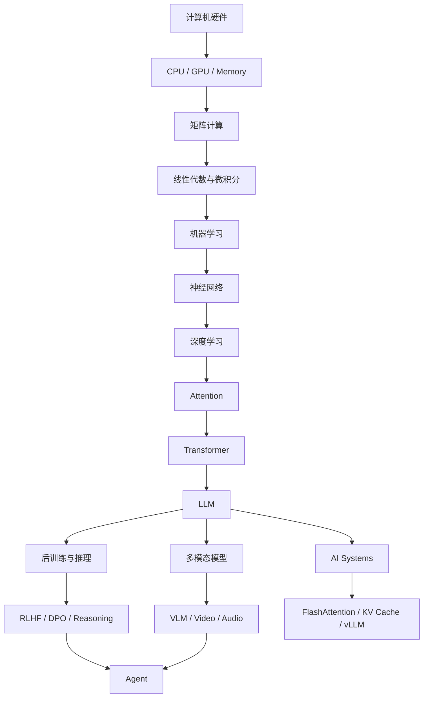

这也是我接下来整个学习计划的主线。

---

# AI 的硬件基础

以前学算法的时候，我其实很容易忽略硬件。

代码能跑就行。

但越接触大模型，我越觉得硬件这层不能一直跳过去。

因为到了现在，很多所谓“算法问题”，其实已经和硬件绑得非常紧。

比如一个最普通的神经网络层：

$$
y=Wx+b
$$

数学上没什么特别的，就是一次矩阵乘法再加一个偏置。

可问题是，当 (W) 不再是一个几十乘几十的小矩阵，而是几千乘几千，而且这样的层有几十甚至上百层时，事情就完全不一样了。

这时真正需要考虑的是：

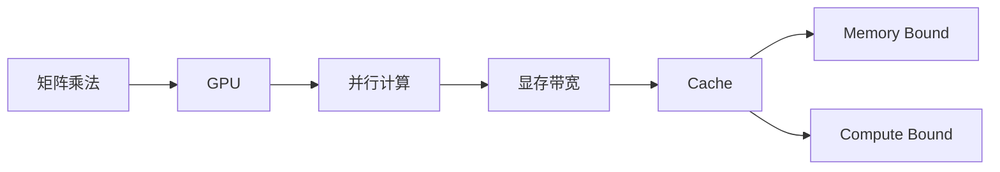

学习大模型当然没必要把自己逼成一个电路专家，但是我们必须去搞明白他的逻辑是什么，这样才能理解他的瓶颈在哪。我希望学完能去回答：

> 为什么今天的 AI 会长成这样，而不是只记住“GPU 比 CPU 快”。

---

# 数学

数学肯定躲不过去。

但我不想再走一条很容易把人学崩的路线：

> 先完整学完线性代数  
> 再完整学完概率论  
> 再完整学完微积分  
> 然后过了几个月，还没真正开始学 AI

我更想按“AI 会用到什么，就把什么学明白”的方式推进。

比如矩阵的秩。

如果单独学，它可能就是一个线性代数概念。

但放到 AI 里，它会一路连到 LoRA：

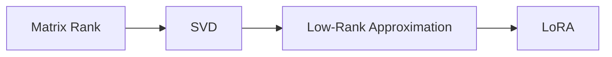

梯度也是一样。

我不只是想记住：

$$
\theta_{t+1}=\theta_t-\eta\nabla L  
$$

而是想真正弄明白：

- 梯度到底代表什么
    
- 为什么负梯度方向下降最快
    
- Chain Rule 为什么能让深层神经网络训练
    
- Backpropagation 到底是不是一个“特殊算法”
    

概率论和信息论也一样。

最后都应该能重新接回语言模型：

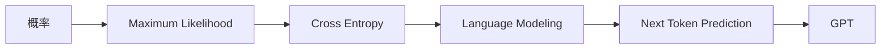

如果数学最后不能接回实际模型，那至少对我现在的目标来说，这部分就学得有点太远了。

---

# 机器学习

在进入神经网络以前，我还是准备把经典机器学习认真过一遍。

不是因为 Linear Regression、SVM 今天有多“时髦”，而是因为很多基本概念在这里更容易看清楚。

机器学习最核心的流程其实很朴素：

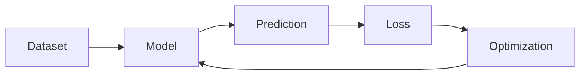

我想通过学习下面这些概念：

- Linear Regression
    
- Logistic Regression
    
- Softmax
    
- Decision Tree
    
- Random Forest
    
- SVM
    
- PCA
    
- K-Means
    

把这些东西弄明白：

什么是模型，什么是参数，什么是 loss，为什么优化 loss 就能让模型“学会”。

这一段学完以后，再进入神经网络，很多东西应该就不会显得那么神秘。

---

# 神经网络

这一部分里，最需要认真搞懂的是 Backpropagation。

因为以前很容易把它理解成：

> `loss.backward()` 一调用，梯度就出来了。

代码完全能用，但总觉得中间缺了一块。

所以学完希望能做到：

- 手算一个两层 MLP
    
- 自己画 Computational Graph
    
- 自己推 Chain Rule
    
- 用 NumPy 手写一次 backward
    
- 最后再回头看 PyTorch Autograd
    

我希望脑子里的关系变成这样：

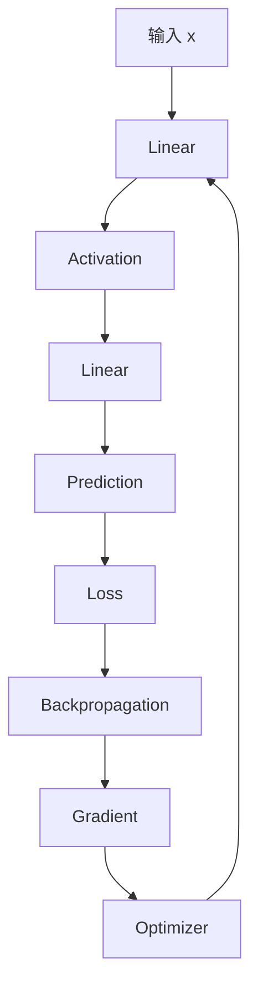

然后再往后学：

CNN、RNN、LSTM、Embedding。

CNN 我希望弄清楚计算机到底是怎么从像素里逐渐抽取特征的。

RNN 和 LSTM 我不会钻得特别深，因为它们对我最重要的意义，是帮我理解：

> Transformer 到底解决了什么问题。

---

# Transformer 

如果前面的内容都是铺路，那这里开始就是主线。

但我不想直接拿出：

$$
softmax\left(\frac{QK^T}{\sqrt{d_k}}\right)V  
$$

然后告诉自己“这就是 Attention”。

我更希望从问题开始。

- RNN 为什么难处理长距离信息？  
- Seq2Seq 为什么需要一个固定长度的向量压缩整个句子？
- 如果 Decoder 能直接去看 Encoder 的所有位置，会不会更好？  
- 如果要“看”，那应该看谁？
- 怎么表示“相关程度”？

然后再一点一点走到 Query、Key、Value。

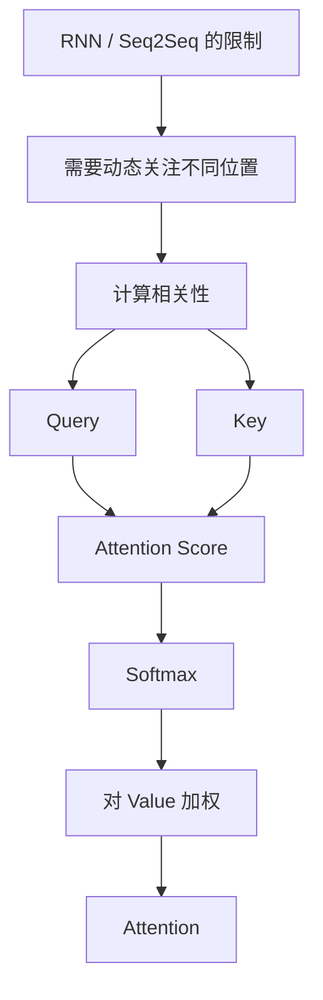

Attention 真正理解以后，再进入：

- Self-Attention
    
- Multi-Head Attention
    
- Positional Encoding
    
- Residual
    
- LayerNorm
    
- MLP
    
- Transformer Block
    

最后自己手写一个 Mini Transformer。

这部分我应该会花比其他章节更多的时间。

---

# 大语言模型

Transformer 理解以后，我想继续把 GPT 拆开。

因为 GPT 本身从结构上看，其实没有想象中那么神秘。

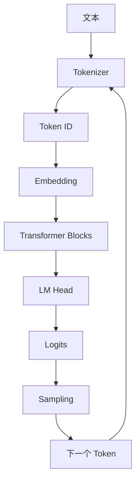

这里我会重点学：

- Tokenizer
    
- BPE
    
- Embedding
    
- Autoregressive Language Model
    
- Causal Mask
    
- Next Token Prediction
    
- Temperature
    
- Top-k
    
- Top-p
    
- Pretraining
    
- Scaling Law
    

最后希望自己真的能从零训练一个很小的 GPT。

不需要它有多聪明。

哪怕只能生成一些像样的字符或者简单文本都行。

重点是：

> 我想亲手走完整个流程。

---

# 现代大模型

包括很多现在每天都能看到的词：

- SFT
    
- RLHF
    
- DPO
    
- LoRA
    
- QLoRA
    
- MoE
    
- Reasoning
    
- RL
    
- Agent
    

我不想现在就急着追。

因为这些东西单独看都不难找到教程，但如果前面的 Pretraining、Transformer、Optimization 都没理解清楚，很容易最后变成只记住缩写。

比如 LoRA，我希望最后能把它和前面的数学重新连起来。

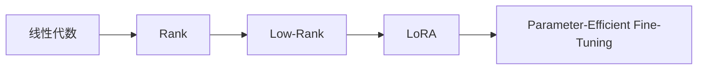

这时候前面的数学就不再是“学过然后忘掉”，而是真的回来用了。

---

# AI Systems 

这一部分是我比较想认真写好的。

因为现在很多 AI 教程到了 Transformer 就结束了。

最多再讲讲 LoRA、RAG、Agent。

但真正运行一个大模型时，还会遇到另一套问题。

比如：

> 为什么生成一个 Token 这么慢？

> KV Cache 到底占了多少显存？

> Attention 为什么长上下文越来越贵？

> FlashAttention 为什么有效？

> vLLM 为什么能让 Serving 吞吐更高？

所以这部分会重新回到最开始的硬件。

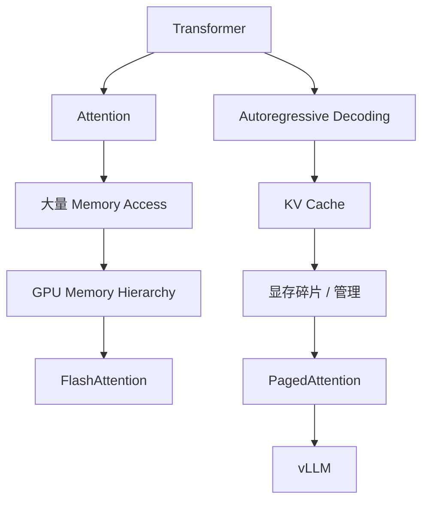

这也是我最喜欢的一种知识连接：

一开始学的 Cache、Memory、GPU，并没有在第一章结束以后消失。

绕了一大圈以后，它又重新出现在大模型里。

这种感觉比单独背“FlashAttention 是一种高效 Attention 算法”有意思得多。

---

# 多模态

语言模型之后，我还想继续学：

- ViT
    
- CLIP
    
- Diffusion
    
- VLM
    
- Video Model
    
- Audio Model
    

这里最有意思的地方是：

不同模态最后正在越来越多地被统一成类似的表示方式。

比如图片：

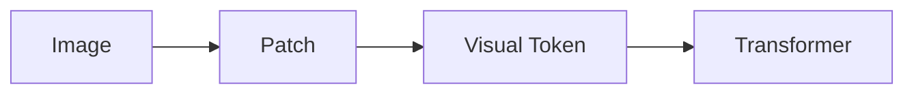

再到 VLM：

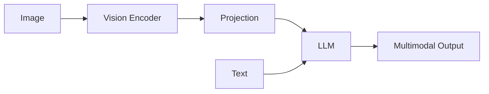

走到这里以后，就能慢慢理解今天所谓“多模态大模型”到底是怎么回事，而不是只知道它可以看图。

---

# 系列之外

因为 AI 这几年更新太快了。

如果把最新模型硬塞进主线，整套教程很快就会过时。

所以我准备把内容分成两部分。

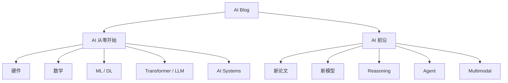

**“AI 从零开始”** 尽量写那些几年之后仍然值得看的东西。

而 **“AI 前沿”** 就拿来记录变化。

比如：

- 新模型架构
    
- Reasoning Model
    
- Agent
    
- Long Context
    
- Video Generation
    
- 新的推理优化
    
- 新的训练方法
    
- 新论文解读
    

这样主线不会被热点拖着跑。

---

# 怎么学，怎么写

这其实是我现在最关心的问题。

因为如果只是列一个 48 篇文章目录，其实很容易。

真正难的是：

> 我自己还没完全学会，怎么边学边写？

我的答案是，不等全部学完。

而是每个主题都走一遍固定流程：

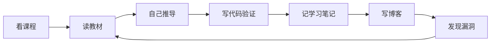

也就是说，博客本身就是学习的一部分。

每次写的时候，只要我发现：

> “这个地方我好像解释不出来。”

那基本就说明：

> 我其实还没有真的懂。

然后重新回去查资料、做实验、推公式。

我反而觉得这是写博客最大的价值。

---

# 每篇文章，我希望至少做到这几件事

以后判断“这个知识点学完没有”，我不会再用：

> 视频看完了。

或者：

> 论文读完了。

而是看自己能不能：

1. 不用公式把它讲明白
    
2. 用公式再讲一遍
    
3. 手算一个最小例子
    
4. 自己写一个最简单实现
    
5. 解释它为什么会失败
    
6. 知道后来的方法改了哪里
    

比如 Attention。

如果我只能背：

$$
softmax(QK^T)V  
$$

那还不算懂。

至少要能自己解释：

为什么需要 Q、K、V？  
为什么要除以 $\sqrt{d_k}$？  
为什么复杂度是 $O(n^2)$？  
为什么 FlashAttention 能优化它？

到了这里，我才会觉得这篇文章可以发。

---

# 写多少
整体上，我准备
第一版主线大概还是控制在 **40～50 篇**。

差不多分成：

|部分|数量|
|---|---|
|总览与基础|2|
|硬件|5～6|
|数学|5～6|
|机器学习|5～6|
|深度学习|6～7|
|Transformer / LLM|8～10|
|多模态|4～5|
|AI Systems|5～6|
|前沿|持续更新|

不过这只是一个大概的框架。

真开始写以后，我估计一定会发生变化。

有些内容可能一篇就够。

有些像 Backpropagation、Transformer、FlashAttention，写着写着可能发现根本塞不进一篇。

我不准备为了凑“48 篇”而硬拆。

---

# 计划

如果真的按照：

```
CPU
内存
矩阵
导数
概率
……
```

一路写，很可能写了两个月，博客首页还看不到一个 Transformer。

所以我的想法是：

**先把骨架写出来，再慢慢填。**

第一批先写：

- AI 到底是什么
    
- 一个大模型是怎么工作的
    
- CPU 和 GPU
    
- 矩阵
    
- Gradient Descent
    
- Neural Network
    
- Backpropagation
    
- Attention
    
- Transformer
    
- GPT
    
- LLM Training
    

这样至少整个网站很快就会有一条完整主线。

后面再慢慢往里面补。

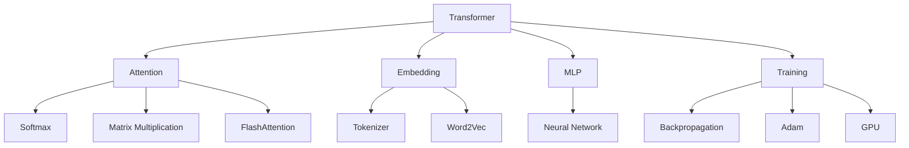

最后我希望整个博客不是一个线性的目录。

而是一张可以不断跳转的知识网络。

---

# 最后

我现在当然还远远没有把这些东西全学完。

所以这套博客不会是：

> “一个已经全懂的人开始给别人讲课。”

更像是：

> “我正在把这张地图一块一块拼起来，并且把自己踩过的坑留下来。”

我希望几年以后再回头看，它至少能记录清楚一件事：

我是怎么从“知道 Transformer、GPT、GPU 这些名字”，慢慢走到真正理解它们之间为什么会有关系的。

如果最后还有别人也能沿着这条路少绕一点弯，那就更好了。

---
作者的话：AI写的总览还挺长的，以后还会优化这个页面，但是感谢读者的耐心阅读和GPT老师的倾情付出。