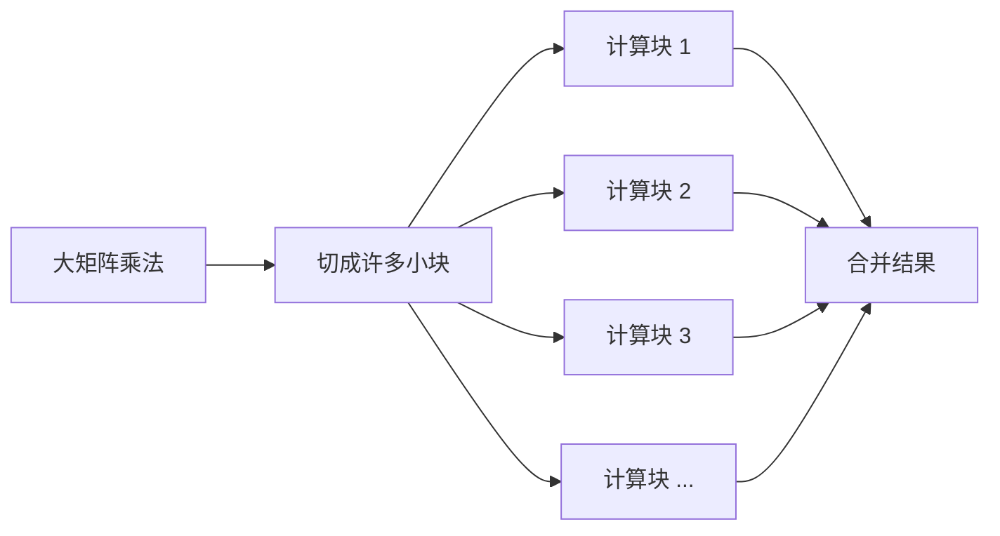

以前我只知道训练模型要用显卡。

至于为什么，我脑子里的解释大概就是：GPU 核心多，所以算得快。

这句话不能说错，但也没解释多少东西。CPU 也有很多核心，为什么不能多装几颗 CPU？游戏显卡原本是画图的，它又怎么成了 AI 的主力？

我后来发现，得先看看神经网络到底在算什么。

## 从一层神经网络开始

先看最常见的线性层：

$$
Y = WX + b
$$

若 $W$ 的形状是 $M\times K$，$X$ 的形状是 $K\times N$，那么结果 $Y$ 的形状就是 $M\times N$。先不考虑偏置，每个输出元素都要完成 $K$ 次乘法与累加。

例如：

- $W$ 是 $25\times100$；
- $X$ 是 $100\times5$；
- $Y$ 是 $25\times5$。

一共会得到 125 个输出元素，每个元素要做 100 次乘法和 99 次加法。也可以按硬件常用的口径，把一次乘加视为 2 次浮点运算，于是矩阵乘法大约包含：

$$
2MNK = 2\times25\times5\times100 = 25\,000\ \text{FLOPs}
$$

这个例子还很小。真实模型会把更大的矩阵乘法重复很多层、很多批次。卷积、Attention 中的线性投影，也都能转化为矩阵乘法或与之相近的张量运算。

拿 Transformer 里常见的线性投影来说，输入不再是一个向量，而是一批 token 的隐藏状态。假设一次送入 8 条序列，每条有 2048 个 token，隐藏维度是 4096，那么把 batch 和序列维合在一起，输入矩阵可以看成 $16384\times4096$。再乘一个 $4096\times4096$ 的权重矩阵，单是这一层的运算量就接近：

$$
2\times16384\times4096\times4096
\approx5.5\times10^{11}\ \text{FLOPs}
$$

这还只是一次线性变换。一个 Transformer Block 里有多次投影和前馈网络，模型里又有几十层。到了反向传播，还要为输入和权重计算梯度。

所以 AI 计算看起来复杂，落到硬件上却经常在重复同一类大活：矩阵乘法。

## 为什么这些计算能够并行

计算 $Y$ 中一个元素时，并不需要先知道另一个元素的结果。因此，许多输出元素可以同时算。

这里很像搬一仓库的箱子。CPU 像少量经验丰富的工人，擅长处理复杂、分支多、先后关系强的任务；GPU 像一支规模很大的搬运队，单个成员没那么灵活，但只要工作能切成许多相似的小份，就能提供很高的总吞吐。

这个比喻只能帮助入门，不能替代真实结构。CPU 也有 SIMD 向量指令和多核心，GPU 也能执行分支。两者差异不是“能不能算”，而是芯片面积和功耗被怎样分配：

| 侧重点 | CPU | GPU |
|---|---|---|
| 主要目标 | 低延迟、复杂控制、通用任务 | 高吞吐、大量并行任务 |
| 执行资源 | 少量强大的核心 | 大量并行执行单元 |
| 延迟处理 | 大缓存、分支预测、乱序执行 | 用大量可切换的线程隐藏等待 |
| 典型优势 | 操作系统、业务逻辑、串行程序 | 矩阵、图形、科学计算、深度学习 |

CPU 的强项是尽快完成一条复杂的指令流。它会猜分支、提前取指令，也会在前一条指令等待时寻找后面不依赖它的工作。为此，一个 CPU 核心本身就做得很复杂。

GPU 更在乎一段时间内一共做完多少工作。它没有必要让每个线程都拥有那么复杂的控制能力，而是同时保留大量线程。某一批线程在等显存时，调度器就换另一批已经就绪的线程上来。

所以“GPU 核心多”其实只是表面。更准确地说，是 GPU 把硬件资源更多地留给了吞吐，而 CPU 把更多资源留给了低延迟和通用控制。

## 并行也有不同层次

矩阵里不同输出元素可以并行，这叫数据并行。但训练模型时，并行不只发生在矩阵内部。

- 一个矩阵可以切成很多 tile，分给不同线程块；
- 一个 batch 里的样本可以同时计算；
- 多张 GPU 可以各算一部分 batch，再同步梯度；
- 单卡放不下时，还能把同一层矩阵拆到多张卡上。

这些层次并不是免费的。切得越散，需要同步和通信的地方通常也越多。单卡上的线程要等待彼此，多卡还要经过 PCIe、NVLink 或网络交换数据。

这也是为什么 GPU 数量翻倍，训练速度通常不会刚好翻倍。多出来的计算能力，可能有一部分花在了通信和等待上。

## 计算不只发生在算术单元里

只盯着 FLOPS 很容易误判性能。一次运算至少经历两类工作：

1. 把权重和输入搬到计算单元附近；
2. 完成乘法、加法等计算。

于是任务可能有两种瓶颈：

- **计算受限（compute-bound）**：算术单元已经忙满，继续提高带宽也帮助不大；
- **访存受限（memory-bound）**：算术单元在等数据，再多计算能力也用不满。

常用的判断量叫**算术强度**：

$$
\text{算术强度}=\frac{\text{完成的运算次数}}{\text{搬运的数据字节数}}
$$

大批量矩阵乘法会反复使用已经读入的数据，算术强度通常较高；逐元素操作或批量很小的矩阵向量乘法，往往更受带宽限制。这也解释了为什么“峰值算力翻倍”不等于“所有模型都快一倍”。

可以做一个很粗的对比。

如果对一万个 FP32 元素各加一次 1，每个元素只做一次加法，却至少要读入 4 字节再写回 4 字节。忽略其他开销，算术强度只有：

$$
\frac{1\ \text{FLOP}}{8\ \text{Bytes}}=0.125\ \text{FLOP/Byte}
$$

矩阵乘法则不一样。一小块 $A$ 和 $B$ 搬到片上后，可以交叉组合出很多结果。同一份数据会被用上多次，运算量增长得比搬运量快得多。

这不是说矩阵乘法一定 compute-bound。矩阵太瘦、batch 太小，或者实现没有做好分块时，它照样可能卡在带宽上。算子叫什么名字并不能直接决定瓶颈，真正决定它的是形状、精度和数据复用。

## 训练和生成 token 也不是同一种负载

训练时通常会放入较大的 batch，权重读进来后能服务很多 token，矩阵也更容易做得饱满。此时计算吞吐往往很重要。

大模型逐 token 生成时，情况会变。下一个 token 必须等上一个 token 出来，单个请求很难把这个方向并行展开。每一步都要读取大量权重，却只产生很少的新结果，显存带宽的重要性就会上升。

提高并发或 batch 可以让一份权重同时服务更多序列，改善总吞吐。但请求要排队，KV Cache 也会变大。于是“每秒一共生成多少 token”和“一个人等多久看到第一个 token”成了两个不同目标。

## GPU 不是万能答案

下面这些情况未必适合 GPU：

- 工作规模很小，启动 GPU 任务和搬运数据的开销反而更大；
- 任务包含大量难以预测的分支，线程很难做同一件事；
- 前后步骤依赖很强，无法形成足够的并行度；
- 数据频繁在 CPU 和独立 GPU 之间来回移动；
- 算法或框架没有适配对应的硬件与软件生态。

因此更准确的说法是：

> GPU 适合 AI，不是因为它在任何单次计算上都更快，而是因为它能以很高的吞吐量执行大规模、规则、可并行的张量运算。

## 参考资料

- [NVIDIA：Matrix Multiplication Background](https://docs.nvidia.com/deeplearning/performance/dl-performance-matrix-multiplication/index.html)
- [NVIDIA：CUDA C++ Best Practices Guide](https://docs.nvidia.com/cuda/cuda-c-best-practices-guide/index.html)
- [AMD：HIP Programming Model](https://rocm.docs.amd.com/projects/HIP/en/latest/understand/programming_model.html)

## 小结

GPU 适合 AI，起点确实是矩阵乘法多、可以并行，但完整解释不能停在“核心数量多”。

神经网络给出了大量形状相近的张量运算，GPU 又把更多硬件资源用在并行执行和吞吐上。数据准备好时，它能同时推进很多工作；一批线程等数据时，还能切换到另一批线程。

不过算力只是半件事。数据能不能被及时送到执行单元，同一份数据能复用多少次，同样会决定最后速度。训练和逐 token 推理的瓶颈也可能不同。

下一篇再把 GPU 拆开。Thread、Warp、Block 和 SM 第一次看像一串黑话，其实它们只是在回答两件事：工作怎么分组，以及硬件怎么把这些工作接过去。

[[02-GPU如何执行程序]]