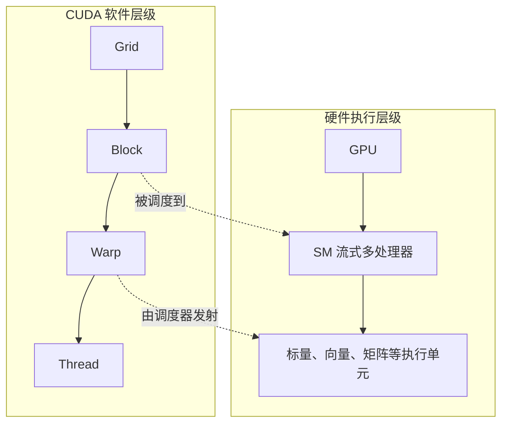
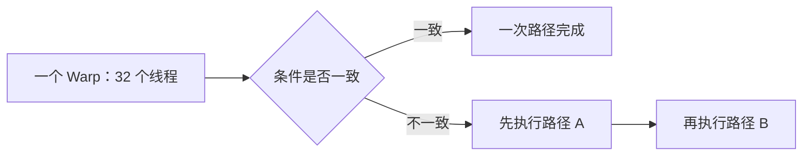

第一次打开 GPU 架构图，我的感受基本就是：每个词都认识，连起来一个也看不懂。

Thread、Warp、Block、Grid、SM、CUDA Core……这些东西有的是程序里的分组，有的是芯片上的部件，很多介绍却把它们画在同一张图里。只要一开始混了，后面越看越乱。

所以这篇先不追具体芯片里有多少个单元，只做一件事：把程序里的工作，和真正接住这些工作的硬件对上。

下面主要沿用 NVIDIA CUDA 的叫法，因为现在 AI 资料里最常见。但 **CUDA 是 NVIDIA 的编程平台，不是 GPU 的通用名称**。AMD 有 work-item、wavefront 和 Compute Unit 等对应概念，具体宽度也不一定相同。

## 先把两张图拆开

左边是程序员怎样分活，右边是芯片怎样接活：



- **Thread（线程）**：程序员看到的最小执行实例，每个线程有自己的索引和寄存器状态；
- **Block（线程块）**：一组能够共享片上 Shared Memory、能够同步的线程；
- **Grid（网格）**：一次 Kernel 启动产生的全部线程块；
- **SM（Streaming Multiprocessor）**：GPU 上承载线程块并执行 warp 的主要物理单元。

GPC、TPC 之类的结构先放一边。它们不是不重要，只是现在塞进来除了增加缩写，暂时帮不上忙。理解 CUDA 程序，先抓住 SM 就够了。

## 一段代码怎么变成很多线程

Kernel 就是在 GPU 上运行的函数。CPU 准备数据、发出启动命令，GPU 随后让许多线程执行同一份代码。代码虽然相同，每个线程拿到的编号和数据却不同。

下面用伪代码表示向量加法：

```cpp
kernel add(a, b, c) {
    int i = current_thread_id();
    c[i] = a[i] + b[i];
}
```

代码只写了一次，第 0 个线程处理第 0 个元素，第 1 个线程处理第 1 个元素，以此类推。真正的 CUDA 代码还要把 block 和 thread 的索引合起来算，这里暂时不展开。

假设一共有 1000 个元素，每个 block 放 256 个线程，那么至少需要 4 个 block。前三个 block 各处理 256 个元素，最后一个 block 只用前 232 个线程。

最后那 24 个线程不能真的去访问数组，否则就会越界，所以 Kernel 里通常会有一道判断：

~~~cpp
int i = blockIdx.x * blockDim.x + threadIdx.x;
if (i < n) {
    c[i] = a[i] + b[i];
}
~~~

这个例子里，Grid、Block 和 Thread 不再只是名词。Grid 覆盖整批数据，Block 决定工作怎样分组，Thread 的索引则决定它具体处理哪个元素。

## 写的是 Thread，真正成组执行的是 Warp

在 NVIDIA GPU 上，SM 会把线程按连续编号组成 **32 个线程一组的 warp**。调度器选择已经准备好的 warp 发射指令。

这并不等于“32 个线程永远完全锁步”。现代架构保存了更细粒度的线程执行状态；但从性能角度看，一个 warp 仍然以共同指令为基本组织方式。

如果同一个 warp 中一半线程走 `if`，另一半走 `else`，硬件通常需要分别执行两条路径，并在执行每条路径时屏蔽另一部分线程。这叫**分支发散**。



所以问题不在于代码里出现了条件判断，而在于**同一个 warp 里的线程是不是经常走向不同的分支**。

比如一个 warp 有 32 个线程。若 0～15 号线程走第一条路径，16～31 号线程走第二条路径，硬件需要分别处理两边。执行第一条路径时后半组暂时不工作，执行第二条路径时前半组暂时不工作。

如果分支条件刚好按 warp 划分，例如前 32 个线程全部走第一条路径，后 32 个线程全部走第二条路径，两个 warp 各自内部仍然一致，就不会产生同样的分支浪费。

因此，判断分支发散时，不能只问“代码里有没有条件”，还要看数据怎样分布到线程上。

## 数据没到时，GPU 在干什么

显存访问往往要等待很久。CPU 常用大缓存、乱序执行和复杂预测减少单个线程的等待；GPU 的办法更直接：让一个 SM 同时保留许多 warp。

当 warp A 等数据时，调度器可以去执行已经就绪的 warp B。只要同时驻留的 warp 足够多，算术单元就不必跟着空等。这叫**延迟隐藏**，不是把延迟消灭了。

一个 SM 能同时容纳多少活跃 warp，受多项资源共同限制：

- 每个 block 的线程数；
- 每个线程使用的寄存器数；
- 每个 block 使用的 Shared Memory；
- 硬件本身允许的 block、warp 和线程上限。

这些限制共同影响 occupancy（占用率）。占用率太低，可能没有足够的 warp 去遮住等待；但它也不是越高越好。数据访问乱、指令之间互相等待时，把占用率堆到 100% 也不会凭空变快。

这里可以想一个简化例子。假设一个 SM 有固定数量的寄存器。一个线程用 32 个寄存器时，可能同时容纳很多线程；如果改成每线程 128 个寄存器，在寄存器总量不变的情况下，能够驻留的线程数就会明显减少。

反过来，强行压低寄存器用量也不一定更好。原本放在寄存器里的临时值可能被挤到 local memory，访问代价反而上升。占用率、寄存器和访存之间经常需要实测，而不是只追一个满格数字。

## Block 为什么不能随便切

同一个 Block 里的线程可以使用 Shared Memory，也可以用同步原语等所有线程到达某个位置。这让它们能够合作搬运数据、计算一块矩阵。

不同 Block 则应该尽量独立。一个 Block 在执行时会驻留在一个 SM 上，不会被拆成两半分给两个 SM；但先后不同的 Block 可以被调度到任何可用的 SM。

这条限制换来的是可扩展性。硬件有 20 个 SM，Block 就分批执行；硬件有 100 个 SM，同一套 Kernel 可以同时展开更多 Block。程序不需要把具体 SM 编号写死。

## 矩阵乘法如何映射到这些线程

高性能矩阵乘法通常不是让每个线程直接从显存读完整的一行和一列，而是把输出矩阵切成 tile：

1. 一个或几个 block 负责一个输出 tile；
2. 线程协作把输入 tile 搬到 Shared Memory 或寄存器附近；
3. 同一份数据被重复用于多次乘加；
4. 算完后再写回显存。


“分块”同时提高了数据复用和并行度，是后面理解 Tensor Core、显存带宽与 FlashAttention 的共同基础。

拿一个很小的 $4\times4$ 输出块来说，一个 Block 可以先合作读入 $A$ 的一块和 $B$ 的一块，再由不同线程负责输出中的不同位置。读进来的一个 $A$ 元素会参与多个列的结果，一个 $B$ 元素也会参与多个行的结果。

如果直接从显存反复读，很多数据会被搬运多次。放进 Shared Memory 后再复用，显存流量就能降下来。当然，Shared Memory 容量有限，线程之间还要同步，所以 tile 也不是越大越好。

## 参考资料

- [NVIDIA：CUDA Programming Guide](https://docs.nvidia.com/cuda/cuda-programming-guide/index.html)
- [NVIDIA：CUDA C++ Best Practices Guide](https://docs.nvidia.com/cuda/cuda-c-best-practices-guide/index.html)
- [AMD ROCm：HIP Programming Model](https://rocm.docs.amd.com/projects/HIP/en/latest/understand/programming_model.html)

## 小结

CUDA 程序里，Kernel 启动一个 Grid，Grid 被分成多个 Block，Block 里面又有许多 Thread。到了 NVIDIA GPU 上，线程还会按 32 个一组组成 Warp。硬件把 Block 放到 SM 上，再由 SM 里的调度器选择已经就绪的 Warp 执行。

这几层不能直接和物理核心一一对应。Thread 是一份执行状态，Block 是能够共享与同步的协作范围，Warp 是重要的执行分组，SM 才是承载这些工作的硬件单元。

性能问题也从这套关系里长出来：同一 Warp 走不同分支会发散；寄存器或 Shared Memory 用得太多，会减少同时驻留的线程；占用率太低可能遮不住访存延迟，但占用率满了也不代表程序一定快。

下一篇继续补上数据这半张图。线程开始计算以后，权重为什么不能一直直接从显存拿，L2、Shared Memory 和寄存器又各自在解决什么问题？

---

**Next Page：** [显存与带宽：为什么“数据搬运”常比计算更重要](<../03-显存与带宽/>)
