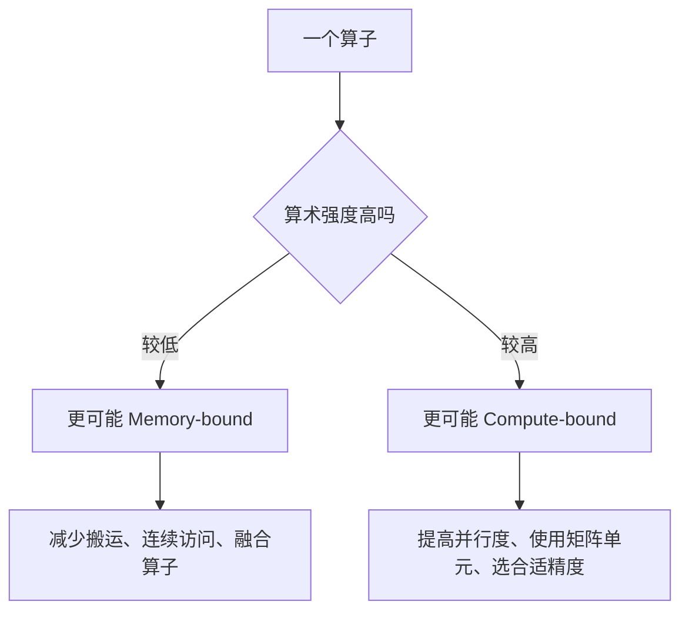
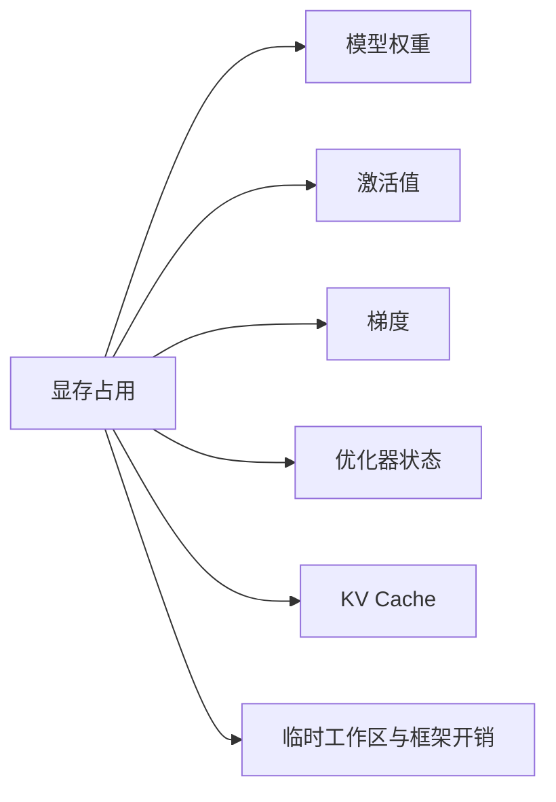

我以前看显卡参数，最先找的永远是算力。至于显存带宽，只觉得数字越大越好，具体好在哪里并没有认真想过。

后来才发现，在很多 AI 任务里，“把数字送过去”甚至比“把数字算出来”更麻烦。运算单元再快，权重和输入还堵在路上，它也只能干等。

## 先别把三个概念混在一起

- **容量**：一共能放多少数据，例如模型权重、激活值和 KV Cache；
- **带宽**：单位时间最多能搬多少数据，常用 GB/s 或 TB/s 表示；
- **延迟**：发起一次访问后，多久能拿到第一份数据。

还是拿仓库来比喻：容量是仓库有多大，带宽是门口的路一小时能过多少辆车，延迟是派出一辆车后多久能到。仓库扩建了，不代表路也跟着变宽；路很宽，也不代表第一辆车来得快。

带宽和延迟还会以不同方式影响程序。连续搬一大批数据时，更关心道路一共能通过多少；只取一个很小的值，而且下一步必须等它回来时，单次延迟就更显眼。

GPU 不能让远处的显存突然变得和寄存器一样快。它主要用两种办法缓解问题：一是让常用数据逐级靠近计算单元，二是在一批线程等待时切换到另一批线程。前者依赖存储层级和数据复用，后者依赖足够的并发。

## 数据不会从显存一步跳进计算单元

不同架构的具体容量会变，但基本思路相近：越靠近执行单元的存储越快、越小，也越需要程序和编译器精心管理。

这里还有个很容易踩的坑：CUDA 里的 global、shared、local 说的是程序看到的内存空间；HBM/GDDR、L2、L1 和寄存器说的是物理实现。两套名字有关联，但不能逐字对号入座。尤其是 local memory，名字听起来很近，实际数据却可能落在较慢的设备内存里。

可以先按“谁能看见、活多久”来理解几个常见空间：

| 空间 | 通常由谁使用 | 大致生命周期 | 最容易忽略的地方 |
|---|---|---|---|
| Registers | 单个线程 | 线程执行期间 | 数量有限，压力过大可能溢出 |
| Shared Memory | 同一 Block | Block 执行期间 | 需要线程协作和同步 |
| Global Memory | 整个 Grid 及主机程序 | 显式释放前 | 容量大，但离执行单元远 |
| L1/L2 Cache | 硬件自动缓存 | 由硬件管理 | 命中率取决于访问局部性 |

寄存器最快也最紧张。Shared Memory 比较像程序员可以主动安排的片上暂存区。L1、L2 则更多由硬件帮忙缓存。显存容量最大，但一次访问要走更远的路。

## 好不容易搬来一次，就别只用一次

再看矩阵乘法 $C=AB$。如果每做一次乘加都重新从显存读取两个数，数据搬运会非常浪费。更好的办法是把矩阵切块：

1. 从显存读入 $A$ 和 $B$ 的一小块；
2. 放到 Shared Memory 或寄存器中；
3. 让多个线程反复使用这批数据；
4. 得到一块输出后再写回显存。

假设一个数从显存读入一次后参与了 16 次乘加，那么相同的显存流量换来了更多计算，算术强度就提高了。

用一个 $32\times32$ 的矩阵乘法做简化说明。若完全不复用，每个输出元素都要读取 32 个 $A$ 元素和 32 个 $B$ 元素。1024 个输出加起来，会产生大量重复读取。

如果把 $A$ 和 $B$ 各自的 $32\times32$ 小块先读进片上存储，那么每块只需要从显存读取一次，就能支持整块输出的计算。暂不考虑写回和缓存细节，输入读取从“每个输出各读一遍”变成“整个 tile 共同读一遍”。

真实 Kernel 会继续把数据分层放到 Shared Memory 和寄存器里，还会处理对齐、双缓冲和异步拷贝。细节复杂，但目的没有变：让昂贵的远距离搬运尽量少发生。

## 算得慢，还是喂不饱

Roofline 模型用一个很朴素的公式描述性能上限：

$$
\text{可达性能}\leq\min(\text{峰值算力},\ \text{显存带宽}\times\text{算术强度})
$$

这个式子当然没有把启动、同步、缓存命中等问题全算进去。不过拿它做第一步判断已经很好用：到底该继续挤计算性能，还是该想办法少搬一点数据？

假设一块设备的显存带宽是 1 TB/s，某种精度下的峰值算力是 100 TFLOPS。两者相除得到一个很粗的分界：

$$
\frac{100\ \text{TFLOPs}}{1\ \text{TB/s}}
=100\ \text{FLOPs/Byte}
$$

算术强度明显低于 100 FLOPs/Byte 的算子，即使把计算单元做得再强，也更容易先碰到带宽上限；明显高于这个值，才更有机会碰到计算上限。

这里用的是理论峰值，真实分界会随精度、频率和实现变化。但这个计算很好地说明了为什么同一个算子换到另一块 GPU 上，瓶颈也可能跟着变。

## 同一个模型，训练和推理也不一样

训练通常批量较大，同一批权重会服务许多样本，矩阵乘法的形状也更饱满，因此较容易把计算单元喂满。

单用户、逐 token 的大模型推理则不同。每生成一个 token，都可能需要读取大量权重，但每份权重只参与少量计算。此时速度常常更依赖显存带宽。提高 batch 可以增加权重复用并改善吞吐量，却也会增加排队时间和 KV Cache 占用。

所以别人说“这张卡推理更快”时，我现在会多问一句：是单个请求更快，每秒生成的 token 更多，还是一口气服务更多人？这几个答案未必相同。

大模型推理内部还可以分成两个阶段。

Prefill 会一次处理整段输入，很多 token 能并行参与矩阵计算，形状通常比较大。Decode 则每轮只为每条序列增加一个 token，还要读取模型权重和已有 KV Cache。前者更容易利用矩阵算力，后者往往更容易感受到显存带宽和访存延迟。

同一块硬件在 prefill 和 decode 阶段的利用率可能完全不同，所以只报一个平均 token/s，常常会把问题藏起来。

## 什么是合并访问

一个 warp 中相邻线程如果读取相邻地址，硬件可以把请求合并成较少的内存事务，这叫 coalesced access（合并访问）。如果线程到处跳着读，同样的数据量可能需要更多事务，有效带宽就会下降。

Shared Memory 也不是自动变快的魔法。它需要额外搬运和同步；访问模式不合适还可能发生 bank conflict。优化的目标始终是**减少不必要的数据移动，并让必要的移动更连续、更可复用**。

## 为什么按权重算明明够，运行时还是爆显存

运行模型时，显存里不只有权重：

训练需要保留反向传播所需的激活、梯度和优化器状态，通常远比“参数量 × 每参数字节数”大。推理不需要梯度和优化器状态，但长上下文与高并发会让 KV Cache 持续增长。

所以按“参数量乘每参数字节数”算出来的，只是刚把权重放进去的下限，不是整套程序的预算。最后一篇再认真算这笔账。

写到这里，我对“显存”的理解已经不再是一根容量条了。它背后其实是两件事：数据放不放得下，以及能不能及时送到计算单元。前者决定程序能不能跑，后者常常决定它跑得快不快。

## 参考资料

- [NVIDIA：GPU Performance Background](https://docs.nvidia.com/deeplearning/performance/dl-performance-gpu-background/index.html)
- [NVIDIA：Matrix Multiplication Background](https://docs.nvidia.com/deeplearning/performance/dl-performance-matrix-multiplication/index.html)
- [NVIDIA：CUDA Memory Optimizations](https://docs.nvidia.com/cuda/cuda-c-best-practices-guide/index.html#memory-optimizations)

## 小结

显存不能只看容量。容量决定模型和运行时状态能不能放下，带宽决定大批数据能多快通过，延迟则影响一次访问要等多久。

GPU 用寄存器、Shared Memory、L1 和 L2 把常用数据留在更近的位置，再用大量可切换线程遮住无法避免的等待。矩阵分块的价值也在这里：同一份数据搬来一次，尽量多用几次。

Roofline 模型把这件事压成了一个判断：算术强度低时更可能卡在带宽，算术强度高时才更可能卡在计算。训练、prefill 和 decode 的矩阵形状不同，瓶颈自然也不一定相同。

下一次看到“显存占满”或“GPU 没跑满”，至少要把两个问题分开：到底是东西放不下，还是数据来不及送到计算单元？

[[04-Tensor-Core与数值精度]]