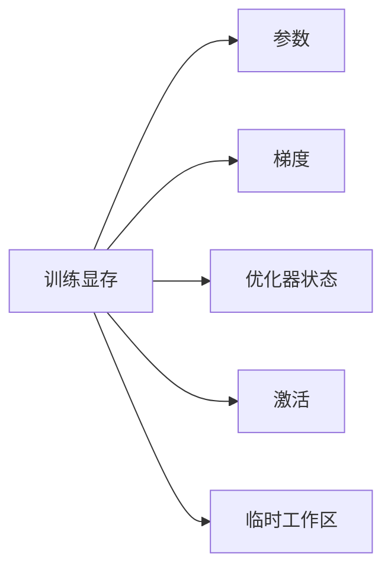
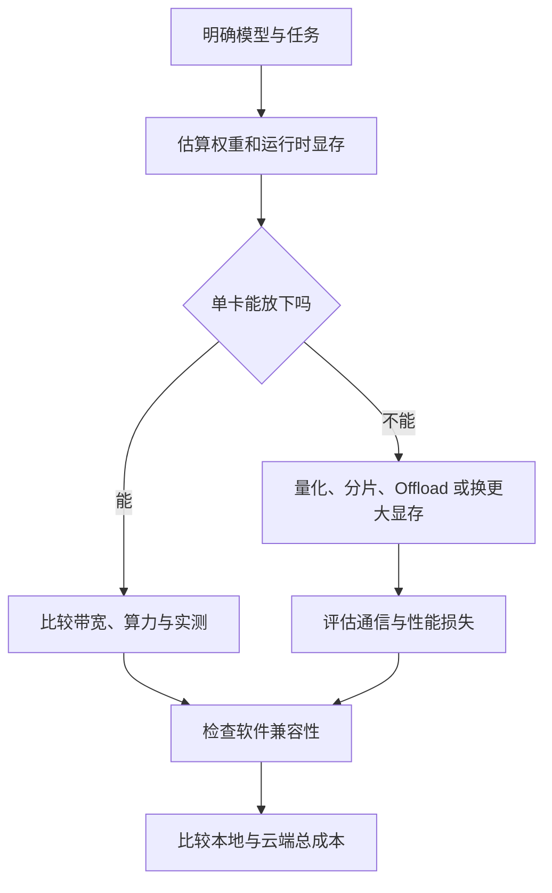

写了五篇，终于可以回到最现实的问题：到底该买什么？

如果直接报一个显卡型号，这篇文章大概过半年就会失效。而且本地聊天、LoRA 微调、从头训练和线上服务，本来就不该用同一把尺子量。

所以这里不列购物清单。我更想把选硬件时真正要算的几笔账留下来：先弄清任务，再看能不能放下，之后才轮到速度和价格。

## 先别打开显卡参数对比页

至少写下这些条件：

- 是训练、微调还是推理？
- 模型有多少参数，使用什么数据类型或量化格式？
- 上下文长度、batch 和并发大概多大？
- 更关心首 token 延迟、生成速度还是总吞吐？
- 是否必须在本地运行，能否接受云端按量付费？
- 框架和关键算子是否支持目标硬件？

这些问题还答不上来时，比较显卡往往只是看谁的柱状图更长。

## 推理时，先算权重能不能放下

模型权重的理论下限很简单：

$$
\text{权重占用}\approx\text{参数量}\times\text{每个参数的字节数}
$$

例如一个 7B 参数模型：

| 权重格式 | 理论权重体积 |
|---|---:|
| FP32，4 字节 | 约 28 GB |
| FP16/BF16，2 字节 | 约 14 GB |
| INT8，1 字节 | 约 7 GB |
| 4 bit，0.5 字节 | 约 3.5 GB |

这只是权重本身。实际运行还要加上：

- KV Cache；
- 临时 Tensor 和算子工作区；
- 量化比例、零点等元数据；
- 框架、图优化和内存碎片开销。

所以“7B 的 4 bit 权重约 3.5 GB”不等于 4 GB 显存就一定能顺利运行。

量化模型还会保存 scale、zero point 或其他分组元数据，某些运行时也会保留反量化缓冲。因此 4 bit 权重的实际文件和显存占用通常不会刚好等于每参数 0.5 字节。

估算时我会给权重之外留出明显余量，而不是让理论值贴着显存上限。余量到底要多少取决于推理框架、上下文和并发，最可靠的方法仍然是用目标模型做一次实测。

## 聊得越长，KV Cache 越占地方

自回归模型为了避免每生成一个 token 都重算全部历史，会保存各层的 Key 和 Value。对常见 Transformer，粗略估算可以写成：

$$
\text{KV Cache}\approx 2\times L\times T\times B\times H_{kv}\times D\times S
$$

其中：

- $2$ 表示 Key 和 Value；
- $L$ 是层数；
- $T$ 是上下文 token 数；
- $B$ 是 batch 或并发序列数；
- $H_{kv}$ 是 KV head 数；
- $D$ 是每个 head 的维度；
- $S$ 是每个元素的字节数。

使用 MQA 或 GQA 的模型会减少 $H_{kv}$，因此 KV Cache 明显小于传统多头注意力。真正计算时应读取模型配置，不能只凭总参数量猜。

假设一个模型有 32 层、8 个 KV head，每个 head 维度是 128，KV 使用 FP16。单条序列每增加一个 token，大约要增加：

$$
2\times32\times8\times128\times2
=131\,072\ \text{Bytes}
$$

也就是约 128 KiB。若上下文长 8192 token，单条序列的 KV Cache 大约是 1 GiB。并发 8 条相同长度的序列，就接近 8 GiB。

这个例子也说明，模型权重完全不变，显存仍会随着上下文和并发增长。线上服务调大并发时，最先顶满的未必是权重，而可能是 KV Cache。

## 到了训练，权重反而只是一部分

训练比推理多出梯度、优化器状态和反向传播所需的激活。以常见 Adam 类优化器和混合精度训练为例，每个参数可能涉及：

- 低精度参数副本；
- FP32 主参数或更新副本；
- 梯度；
- 一阶与二阶优化器状态；
- 另外随 batch、序列长度和网络深度增长的激活。

不同框架和实现是否保留 FP32 主副本、梯度使用什么精度，都可能不同。因此网上常见的“每参数固定多少字节”只能作为量级估算。

一个常见的混合精度 AdamW 粗算是：

| 内容 | 每参数字节数 |
|---|---:|
| FP16/BF16 参数 | 2 |
| FP32 主参数副本 | 4 |
| FP32 梯度 | 4 |
| Adam 一阶、二阶状态 | 8 |
| 合计 | 约 18 |

按这个口径，7B 参数光是这些持久状态就接近 126 GB，还没算激活、临时工作区和碎片。具体框架可能不保留某一份副本，梯度精度也可能不同，所以 18 字节不是硬规则，但足以说明：能做推理的卡，离完整训练往往还差很远。

激活又是另一笔账。它会随 batch、序列长度、隐藏维度和层数变化。梯度检查点可以少存一部分激活，在反向传播时重新计算；省下显存的代价就是多做计算。

常见节省手段包括梯度检查点、参数高效微调、低精度训练，以及把参数、梯度和优化器状态分片到多张卡。它们会用额外计算、通信或实现复杂度换容量。

LoRA 之所以能把微调门槛降下来，是因为大部分原模型权重被冻结，只训练插入的低秩参数。需要保存的梯度和优化器状态会少很多。

不过前向和反向仍要经过原模型，激活也不会凭空消失。QLoRA 再把基础模型以低比特形式加载，可以继续省权重显存，但算子支持、反量化开销和训练稳定性仍然要考虑。

## 放得下以后，再讨论快不快

容量够用后，再根据工作负载判断哪些规格重要：

| 场景 | 更应关注 |
|---|---|
| 单请求 LLM 推理 | 显存带宽、低 batch 性能、软件实现 |
| 高并发批量推理 | 显存容量、带宽、矩阵吞吐、调度框架 |
| 微调 | 容量、低精度训练支持、带宽 |
| 多卡训练 | 单卡算力、互联带宽、网络与分布式软件 |
| 视觉数据训练 | GPU 外，还要关注 CPU 解码、内存和存储 |

厂商公布的峰值 TFLOPS 通常建立在特定精度、稀疏性和理想矩阵形状上。不同页面的数字如果条件不同，不能直接比较。最可靠的方法仍然是找到与自己模型、batch、上下文和框架接近的基准测试。

对大模型推理，至少要分开看：

- TTFT：从请求到第一个 token 的时间；
- TPOT：后续每个 token 平均要等多久；
- 单请求生成速度；
- 整个服务在目标并发下的总吞吐；
- 达到这些性能时实际占了多少显存和功耗。

一个系统可能总吞吐很高，却让单个请求排队很久；也可能单用户很快，一加并发就迅速掉速。只看一个 token/s 很难判断它是否适合自己的场景。

## 最容易漏掉的是软件

硬件只有被软件调用时才产生价值。购买或租用前至少确认：

- 操作系统与驱动是否稳定支持；
- PyTorch、推理框架和关键扩展能否安装；
- 需要的低精度格式与算子是否真的可用；
- 多卡通信库是否支持目标拓扑；
- 社区遇到问题时是否有足够资料可查。

“理论上支持”和“我的项目可以稳定复现”之间，经常隔着驱动、编译器、算子和版本组合。

消费级 GPU、数据中心 GPU 和其他加速器之间，不只是算力和显存容量不同。错误校验、虚拟化、多实例、长期满载散热、远程管理和厂商支持，也可能影响生产环境。

个人学习通常不需要为所有企业功能付费；但长期运行的服务若因为一次显存错误或驱动问题停机，稳定性本身就会变成成本。

## 三种常见需求怎么落地

**只是本地运行模型。** 先按目标量化格式计算权重，再加最长上下文下的 KV Cache 和运行时余量。单用户场景通常不用为了多卡互联买复杂平台，显存容量和带宽更直接。

**做 LoRA 或 QLoRA 微调。** 除了模型权重，还要估激活、可训练参数、梯度和优化器状态。序列长度和 micro-batch 对显存影响很大，最好拿目标训练脚本试跑，而不是只看别人微调过同参数量模型。

**从头训练或做多卡服务。** 这时整机与集群问题会迅速变重要。GPU 互联、CPU 与内存比例、存储吞吐、网卡、机房供电和散热，都可能成为预算的一部分。

## 买回来，还是用多少租多少

可以用总成本而不是单价比较：

$$
\text{本地总成本}=\text{硬件}+\text{整机配套}+\text{电费}+\text{维护}+\text{折旧}
$$

$$
\text{云端总成本}=\text{实例时长}+\text{存储}+\text{网络}+\text{空闲浪费}
$$

- 需求零散、型号经常变化、需要偶尔使用多卡：云端通常更灵活；
- 长期稳定高利用率、数据不便离开本地：购买可能更合算；
- 学习和开发：一张能放下目标模型的本地卡，加上按需租用更大实例，往往比一步到位更稳妥。

## 我会按这个顺序做决定

这张图里最想强调的其实只有顺序：**先保证能放下，再保证数据喂得上，最后才追求峰值算力。**

## 参考资料

- [Hugging Face：GPU Memory Usage](https://huggingface.co/docs/transformers/main/model_memory_anatomy)
- [NVIDIA：Deep Learning Performance Guide](https://docs.nvidia.com/deeplearning/performance/index.html)
- [PyTorch：CUDA Semantics](https://docs.pytorch.org/docs/stable/notes/cuda.html)

## 小结

选 AI 硬件时，第一步不是比较型号，而是把任务写清楚。模型多大、用什么精度、上下文和并发是多少、要推理还是训练，这些条件会直接改变显存预算。

推理时，权重只是下限，KV Cache 会随上下文和并发增长。训练还要增加梯度、优化器状态和激活，完整训练与 LoRA 微调的需求也不能混在一起。

确认放得下以后，再看瓶颈更靠近算力、带宽、CPU、存储还是互联。基准测试也要接近自己的模型形状、精度和并发，否则峰值数字很难直接转化成使用体验。

最后才是成本。购买适合长期稳定使用，云端适合弹性和偶发的大规模需求，很多个人项目则适合本地开发加按需租用。

写完这几篇以后，我对“哪张卡最强”反而没那么感兴趣了。更有用的问题是：它能不能放下我的任务，能不能把数据持续喂给计算单元，软件能不能稳定调用它，以及为了这些能力要付出多少总成本。

---

**Next Page：** [返回 AI 扫盲计划](<../../AI扫盲计划/>)
